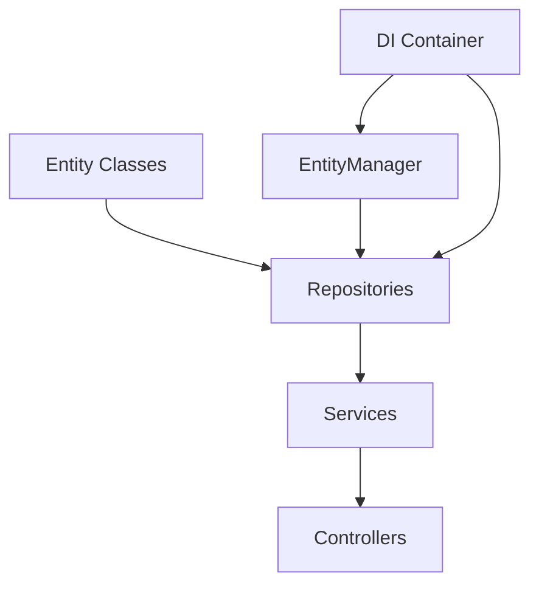

# Doctrine ORM Integration

## Overview

This document describes the Doctrine ORM integration in the Oracle application. Doctrine ORM is a powerful Object-Relational Mapping library for PHP that provides a flexible and powerful way to work with databases.

## Why Doctrine ORM?

- **Object-Oriented Approach**: Work with PHP objects instead of writing SQL queries
- **Database Abstraction**: Support for multiple database systems (MySQL, SQLite, PostgreSQL, etc.)
- **Schema Management**: Automatic schema generation and migration
- **Query Builder**: Powerful query builder for complex queries
- **Caching**: Built-in caching mechanisms for improved performance
- **Transactions**: Support for database transactions
- **Events**: Event system for entity lifecycle events
- **Validation**: Built-in validation support
- **Inheritance**: Support for class inheritance mapping

## Architecture

The Doctrine ORM integration follows a clean architecture approach:



### Components

1. **Entity Classes**: PHP classes that represent database tables
2. **Repositories**: Classes that provide methods to access and manipulate entities
3. **EntityManager**: Central service that manages entities and their persistence
4. **Dependency Injection**: Container that provides the EntityManager and repositories to services and controllers

## Implementation

### Entity Classes

Entity classes are defined in the `src/Entities` directory. They use Doctrine annotations to define the mapping between the class and the database table.

Example:

```php
<?php

namespace App\Entities;

use Doctrine\ORM\Mapping as ORM;

/**
 * @ORM\Entity(repositoryClass="App\Repositories\Doctrine\SenderNameRepository")
 * @ORM\Table(name="sender_names")
 */
class SenderName
{
    /**
     * @ORM\Id
     * @ORM\GeneratedValue
     * @ORM\Column(type="integer")
     */
    private int $id;

    /**
     * @ORM\Column(type="string", length=255)
     */
    private string $name;

    // Getters and setters...
}
```

### Repositories

Repositories are defined in the `src/Repositories/Doctrine` directory. They extend the `BaseRepository` class and implement the `DoctrineRepositoryInterface` interface.

Example:

```php
<?php

namespace App\Repositories\Doctrine;

use App\Entities\SenderName;
use App\Repositories\Interfaces\DoctrineRepositoryInterface;
use Doctrine\ORM\EntityManagerInterface;

class SenderNameRepository extends BaseRepository implements DoctrineRepositoryInterface
{
    public function __construct(EntityManagerInterface $entityManager)
    {
        parent::__construct($entityManager, SenderName::class);
    }

    // Custom repository methods...
}
```

### Base Repository

The `BaseRepository` class provides common methods for all repositories:

- `findById($id)`: Find an entity by its ID
- `findAll(?int $limit = null, ?int $offset = null)`: Find all entities
- `findBy(array $criteria, ?array $orderBy = null, ?int $limit = null, ?int $offset = null)`: Find entities by criteria
- `findOneBy(array $criteria)`: Find one entity by criteria
- `count(array $criteria = [])`: Count entities
- `save($entity)`: Save an entity
- `delete($entity)`: Delete an entity
- `deleteById($id)`: Delete an entity by its ID
- `beginTransaction()`: Begin a transaction
- `commit()`: Commit a transaction
- `rollback()`: Rollback a transaction
- `clear()`: Clear the entity manager
- `getEntityManager()`: Get the entity manager

### EntityManager

The EntityManager is configured in the `src/bootstrap-doctrine.php` file and is provided by the dependency injection container.

```php
<?php

use Doctrine\ORM\EntityManager;
use Doctrine\ORM\ORMSetup;

// Create configuration
$config = ORMSetup::createAttributeMetadataConfiguration(
    [__DIR__ . '/Entities'],
    $_ENV['APP_ENV'] === 'dev',
    null,
    new \Symfony\Component\Cache\Adapter\ArrayAdapter()
);

// Database connection parameters
$dbParams = [
    'driver' => $_ENV['DB_DRIVER'] ?? 'pdo_sqlite',
    'path' => $_ENV['DB_PATH'] ?? __DIR__ . '/../var/database.sqlite',
];

// Create EntityManager
return EntityManager::create($dbParams, $config);
```

### Dependency Injection

The EntityManager and repositories are registered in the dependency injection container in the `src/config/di.php` file:

```php
<?php

use Doctrine\ORM\EntityManagerInterface;
use DI\ContainerBuilder;
use function DI\factory;

$definitions = [
    // EntityManager
    EntityManagerInterface::class => factory(function () {
        return require __DIR__ . '/../bootstrap-doctrine.php';
    }),

    // Repositories
    App\Repositories\Doctrine\SenderNameRepository::class => factory(function (Container $container) {
        return new App\Repositories\Doctrine\SenderNameRepository(
            $container->get(EntityManagerInterface::class)
        );
    }),
];
```

## Usage

### Creating an Entity

```php
<?php

use App\Entities\SenderName;

// Create a new entity
$senderName = new SenderName();
$senderName->setName('Test Sender Name');
$senderName->setUserId(1);
$senderName->setStatus('pending');

// Save the entity
$senderNameRepository->save($senderName);
```

### Finding Entities

```php
<?php

// Find all entities
$senderNames = $senderNameRepository->findAll();

// Find entities by criteria
$pendingSenderNames = $senderNameRepository->findBy(['status' => 'pending']);

// Find one entity by criteria
$senderName = $senderNameRepository->findOneBy(['name' => 'Test Sender Name']);

// Find an entity by its ID
$senderName = $senderNameRepository->findById(1);
```

### Updating an Entity

```php
<?php

// Find an entity
$senderName = $senderNameRepository->findById(1);

// Update the entity
$senderName->setStatus('approved');

// Save the entity
$senderNameRepository->save($senderName);
```

### Deleting an Entity

```php
<?php

// Find an entity
$senderName = $senderNameRepository->findById(1);

// Delete the entity
$senderNameRepository->delete($senderName);

// Or delete by ID
$senderNameRepository->deleteById(1);
```

### Using Transactions

```php
<?php

// Begin a transaction
$senderNameRepository->beginTransaction();

try {
    // Perform operations
    $senderName = new SenderName();
    $senderName->setName('Test Sender Name');
    $senderName->setUserId(1);
    $senderName->setStatus('pending');
    $senderNameRepository->save($senderName);

    // Commit the transaction
    $senderNameRepository->commit();
} catch (\Exception $e) {
    // Rollback the transaction
    $senderNameRepository->rollback();
    throw $e;
}
```

## Schema Management

### Creating the Schema

The schema can be created using the SchemaTool:

```php
<?php

use Doctrine\ORM\Tools\SchemaTool;

// Get the entity manager
$entityManager = $container->get(EntityManagerInterface::class);

// Get the metadata
$metadataFactory = $entityManager->getMetadataFactory();
$metadata = $metadataFactory->getAllMetadata();

// Create the schema
$schemaTool = new SchemaTool($entityManager);
$schemaTool->createSchema($metadata);
```

### Updating the Schema

The schema can be updated using the SchemaTool:

```php
<?php

use Doctrine\ORM\Tools\SchemaTool;

// Get the entity manager
$entityManager = $container->get(EntityManagerInterface::class);

// Get the metadata
$metadataFactory = $entityManager->getMetadataFactory();
$metadata = $metadataFactory->getAllMetadata();

// Update the schema
$schemaTool = new SchemaTool($entityManager);
$schemaTool->updateSchema($metadata);
```

## Testing

A test script is provided in `scripts/doctrine-test.php` to test the Doctrine ORM integration:

```php
<?php

require_once __DIR__ . '/../vendor/autoload.php';

use App\Entities\SenderName;
use App\Repositories\Doctrine\SenderNameRepository;
use Doctrine\ORM\EntityManagerInterface;

// Create DI container
$containerBuilder = new \DI\ContainerBuilder();
$containerBuilder->addDefinitions(require __DIR__ . '/../src/config/di.php');
$container = $containerBuilder->build();

// Get the entity manager
$entityManager = $container->get(EntityManagerInterface::class);

// Get the sender name repository
$senderNameRepository = $container->get(SenderNameRepository::class);

// Create a new sender name
$senderName = new SenderName();
$senderName->setUserId(1);
$senderName->setName('Test Sender Name');
$senderName->setStatus('pending');

// Save the sender name
$senderNameRepository->save($senderName);
```

## Migration Strategy

To migrate from the current PDO-based repositories to Doctrine ORM repositories, we will follow a gradual approach:

1. **Create Entity Classes**: Define entity classes for all database tables
2. **Create Repositories**: Create Doctrine repositories for all entities
3. **Update Services**: Update services to use the new repositories
4. **Test**: Test the new implementation with a small subset of the application
5. **Migrate**: Gradually migrate the rest of the application to use the new repositories

This approach allows us to migrate the application without disrupting the existing functionality.

## Conclusion

Doctrine ORM provides a powerful and flexible way to work with databases in PHP. By using Doctrine ORM, we can improve the maintainability, testability, and performance of the Oracle application.
