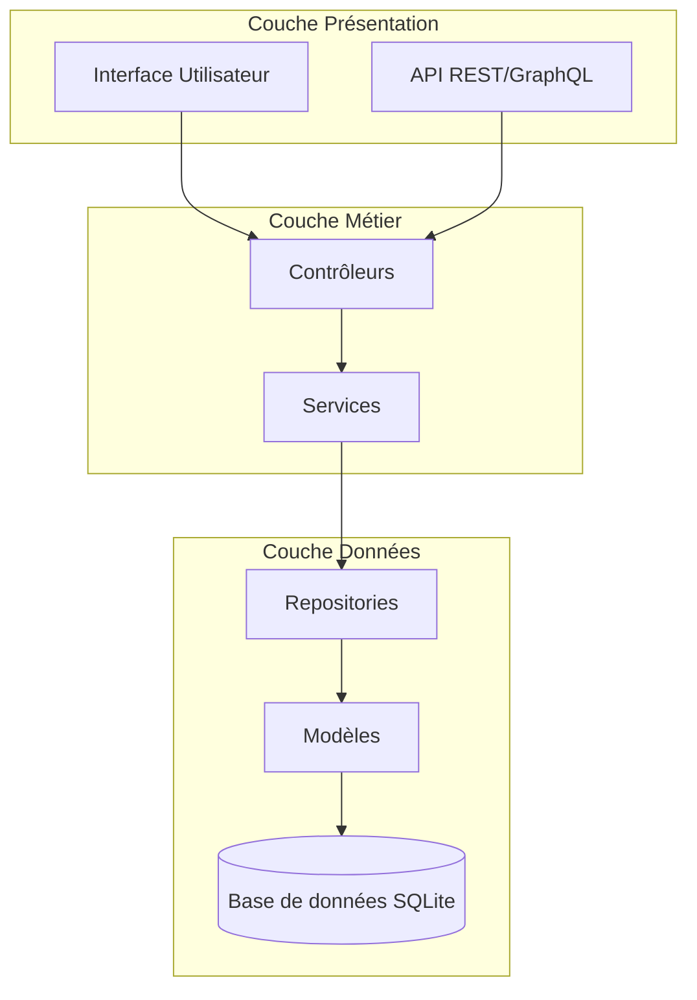
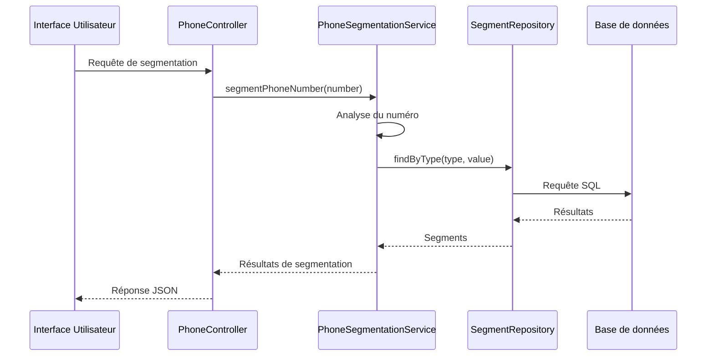
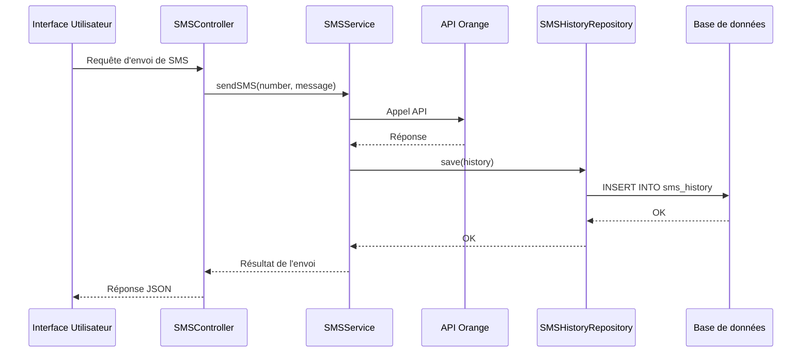

# Architecture globale du projet Oracle

## Vue d'ensemble

Oracle est construit selon une architecture en couches clairement séparées, suivant les principes SOLID et le modèle MVC (Modèle-Vue-Contrôleur). Cette architecture permet une séparation claire des responsabilités et facilite la maintenance et l'évolution du système.

## Architecture en couches

### Couche Présentation

La couche présentation est responsable de l'interaction avec les utilisateurs et les systèmes externes. Elle comprend :

- **Interface Utilisateur** : Interface web développée avec Vue.js et Quasar Framework, permettant aux utilisateurs d'interagir avec l'application.
- **API REST** : API traditionnelle exposant des endpoints spécifiques pour chaque opération.
- **API GraphQL** : API moderne permettant aux clients de demander exactement les données dont ils ont besoin.

### Couche Métier

La couche métier contient la logique métier de l'application. Elle est composée de :

- **Contrôleurs** : Responsables de la réception des requêtes HTTP, de leur validation et de la délégation aux services appropriés.
- **Services** : Encapsulent la logique métier complexe et orchestrent les opérations impliquant plusieurs repositories ou entités.

### Couche Données

La couche données gère l'accès et la persistance des données. Elle comprend :

- **Modèles** : Représentent les entités du système et encapsulent la logique métier liée à ces entités.
- **Repositories** : Fournissent une abstraction pour l'accès aux données, encapsulant la logique d'accès à la base de données.
- **Base de données** : SQLite est utilisé comme système de gestion de base de données pour sa simplicité et sa portabilité.

## Composants clés

### Modèles principaux

- **PhoneNumber** : Représente un numéro de téléphone avec ses attributs (numéro, nom, civilité, prénom, etc.).
- **Segment** : Représente un segment technique d'un numéro de téléphone (code pays, opérateur, etc.).
- **CustomSegment** : Représente un segment personnalisé défini par l'utilisateur.
- **User** : Représente un utilisateur du système avec ses informations d'authentification et ses crédits SMS.
- **SMSHistory** : Représente un enregistrement d'historique d'envoi de SMS.

### Services principaux

- **PhoneSegmentationService** : Gère la segmentation des numéros de téléphone individuels.
- **BatchSegmentationService** : Gère la segmentation par lot de plusieurs numéros.
- **SMSService** : Gère l'envoi de SMS et l'enregistrement dans l'historique.
- **AuthService** : Gère l'authentification et l'autorisation des utilisateurs.
- **ImportExportService** : Gère l'import et l'export de données.

### Repositories principaux

- **PhoneNumberRepository** : Gère les opérations CRUD pour les numéros de téléphone.
- **SegmentRepository** : Gère les opérations CRUD pour les segments techniques.
- **CustomSegmentRepository** : Gère les opérations CRUD pour les segments personnalisés.
- **UserRepository** : Gère les opérations CRUD pour les utilisateurs.
- **SMSHistoryRepository** : Gère les opérations CRUD pour l'historique des SMS.

## Interactions entre les composants

### Flux de segmentation d'un numéro

### Flux d'envoi de SMS

## Patterns de conception utilisés

Oracle utilise plusieurs patterns de conception pour structurer son code et faciliter la maintenance :

- **Repository Pattern** : Pour abstraire l'accès aux données.
- **Service Pattern** : Pour encapsuler la logique métier complexe.
- **Factory Pattern** : Pour créer des objets complexes.
- **Strategy Pattern** : Pour encapsuler différentes stratégies de segmentation.
- **Observer Pattern** : Pour notifier les composants intéressés lors d'événements.
- **Dependency Injection** : Pour fournir les dépendances aux classes.

## Avantages de cette architecture

1. **Séparation des préoccupations** : Chaque couche a une responsabilité claire et distincte.
2. **Testabilité** : Les composants peuvent être testés indépendamment.
3. **Maintenabilité** : Les modifications dans une couche n'affectent pas les autres couches.
4. **Évolutivité** : De nouvelles fonctionnalités peuvent être ajoutées sans modifier le code existant.
5. **Réutilisabilité** : Les composants peuvent être réutilisés dans différentes parties de l'application.

## Conclusion

L'architecture en couches d'Oracle offre une base solide pour le développement et l'évolution du projet. Elle permet une séparation claire des responsabilités, facilitant ainsi la maintenance et l'extension du système. Les patterns de conception utilisés renforcent cette architecture en fournissant des solutions éprouvées aux problèmes courants de conception logicielle.

Dans les sections suivantes, nous explorerons en détail chaque couche et ses composants, ainsi que les technologies utilisées pour les implémenter.
