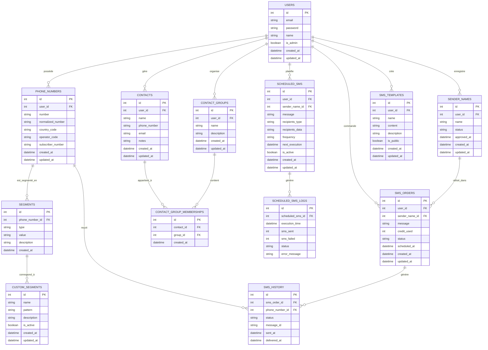

# Diagrammes d'architecture

Cette page présente les diagrammes d'architecture du projet Oracle, offrant une représentation visuelle des différents aspects du système.

## Vue d'ensemble de l'architecture

Le diagramme suivant illustre la vue d'ensemble de l'architecture du projet Oracle, montrant les principales couches et leurs interactions.

## Diagramme de composants

Le diagramme suivant montre les principaux composants du système et leurs relations.

## Diagramme de séquence pour la segmentation de numéros

Le diagramme suivant illustre la séquence d'opérations pour la segmentation d'un numéro de téléphone.

## Diagramme de séquence pour l'envoi de SMS

Le diagramme suivant illustre la séquence d'opérations pour l'envoi d'un SMS.

## Diagramme de séquence pour l'authentification

Le diagramme suivant illustre la séquence d'opérations pour l'authentification d'un utilisateur.

## Diagramme de classes pour les services de segmentation

Le diagramme suivant illustre les classes impliquées dans la segmentation des numéros de téléphone.

## Diagramme de classes pour les services SMS

Le diagramme suivant illustre les classes impliquées dans l'envoi de SMS.

## Diagramme entité-relation de la base de données

Le diagramme suivant illustre les relations entre les tables de la base de données.

## Diagramme de déploiement

Le diagramme suivant illustre l'architecture de déploiement du projet Oracle.

## Diagramme d'activité pour l'importation de numéros

Le diagramme suivant illustre le processus d'importation de numéros de téléphone.

## Conclusion

Ces diagrammes fournissent une représentation visuelle des différents aspects de l'architecture du projet Oracle. Ils aident à comprendre la structure du système, les interactions entre les composants, et les flux de données.

Les diagrammes sont maintenus à jour avec l'évolution du projet pour assurer qu'ils reflètent fidèlement l'architecture actuelle du système.
