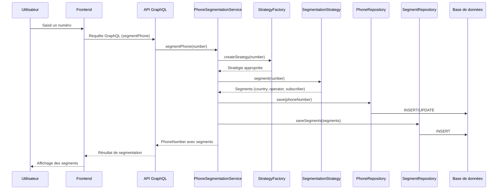
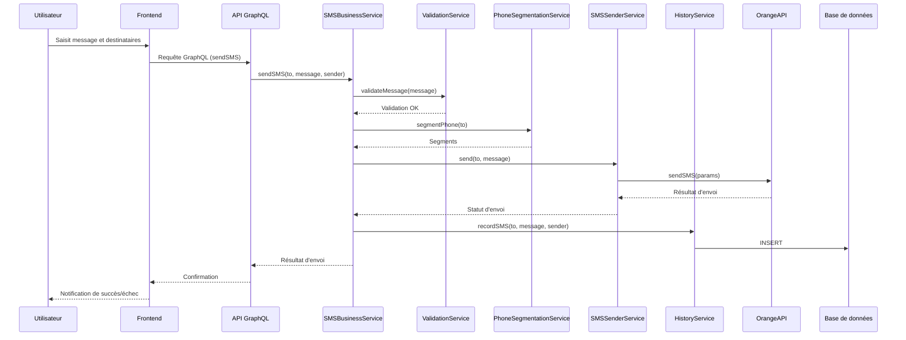
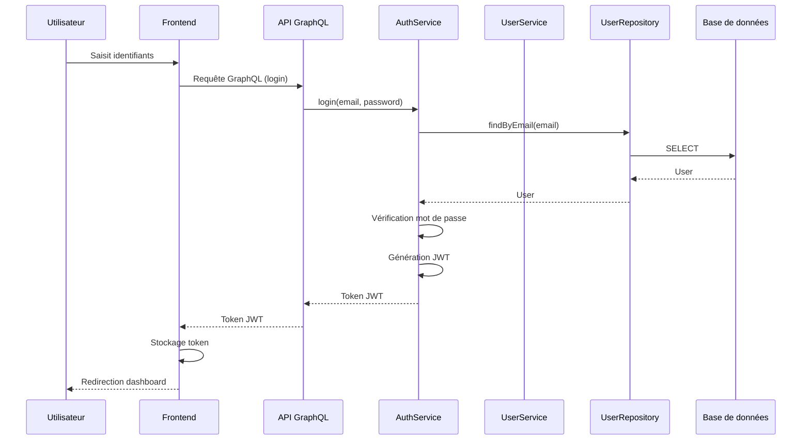
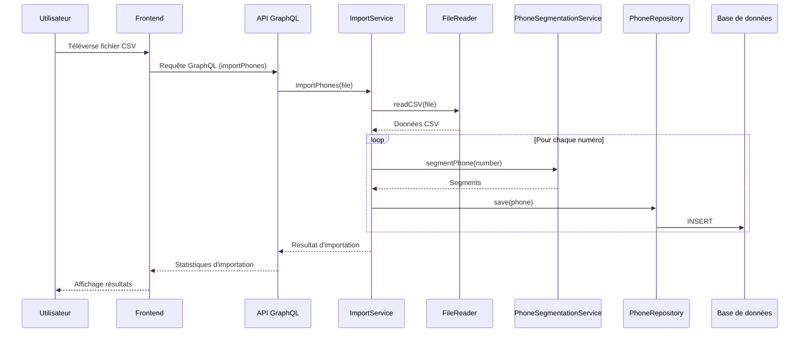
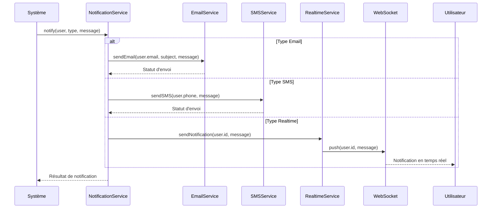

# Flux de données

Cette page présente les principaux flux de données dans l'application Oracle. Elle décrit comment les données circulent entre les différentes couches et composants du système, depuis leur saisie par l'utilisateur jusqu'à leur stockage et leur traitement.

## Vue d'ensemble

L'application Oracle gère plusieurs types de flux de données :

1. **Flux de segmentation de numéros** : Traitement des numéros de téléphone pour les segmenter en composants (code pays, code opérateur, numéro d'abonné)
2. **Flux d'envoi de SMS** : Processus d'envoi de SMS aux destinataires
3. **Flux d'authentification** : Gestion des connexions et des autorisations
4. **Flux d'importation/exportation** : Traitement des fichiers CSV pour l'importation et l'exportation de numéros
5. **Flux de notification** : Envoi de notifications aux utilisateurs et administrateurs

## Flux de segmentation de numéros

Le flux de segmentation de numéros est l'un des processus centraux de l'application Oracle. Il permet d'analyser et de catégoriser les numéros de téléphone.

### Étapes du flux



### Description détaillée

1. **Saisie utilisateur** : L'utilisateur saisit un numéro de téléphone dans l'interface.
2. **Transmission au backend** : Le frontend envoie une requête GraphQL au backend.
3. **Service de segmentation** : Le `PhoneSegmentationService` reçoit la demande et normalise le numéro.
4. **Sélection de stratégie** : Une stratégie de segmentation appropriée est sélectionnée en fonction du format du numéro.
5. **Segmentation** : La stratégie segmente le numéro en ses composants (code pays, code opérateur, numéro d'abonné).
6. **Persistance** : Le numéro et ses segments sont sauvegardés dans la base de données.
7. **Retour des résultats** : Les segments sont retournés au frontend pour affichage.

### Exemple de code

```php
// Dans le contrôleur GraphQL
/**
 * @Mutation
 * @param string $number
 * @return PhoneNumber
 */
public function segmentPhone(string $number): PhoneNumber
{
    return $this->segmentationService->segmentPhone($number);
}

// Dans le service de segmentation
public function segmentPhone(string $number): PhoneNumber
{
    // Normaliser le numéro
    $normalizedNumber = $this->normalizeNumber($number);

    // Sélectionner la stratégie appropriée
    $strategy = $this->strategyFactory->createStrategy($normalizedNumber);

    // Segmenter le numéro
    $segments = $strategy->segment($normalizedNumber);

    // Créer et sauvegarder le numéro
    $phone = new PhoneNumber();
    $phone->number = $number;
    $phone->normalized_number = $normalizedNumber;
    $phone->country_code = $segments['countryCode'];
    $phone->operator_code = $segments['operatorCode'];
    $phone->subscriber_number = $segments['subscriberNumber'];

    $this->phoneRepository->save($phone);

    // Créer et sauvegarder les segments
    foreach ($segments as $type => $value) {
        $segment = new Segment();
        $segment->phone_number_id = $phone->id;
        $segment->type = $type;
        $segment->value = $value;
        $this->segmentRepository->save($segment);
    }

    return $phone;
}
```

## Flux d'envoi de SMS

Le flux d'envoi de SMS permet aux utilisateurs d'envoyer des messages à des destinataires individuels ou à des groupes.

### Étapes du flux



### Description détaillée

1. **Saisie utilisateur** : L'utilisateur saisit le message et sélectionne les destinataires.
2. **Transmission au backend** : Le frontend envoie une requête GraphQL au backend.
3. **Validation** : Le message est validé (longueur, caractères spéciaux, etc.).
4. **Segmentation** : Les numéros de téléphone sont segmentés pour vérification.
5. **Envoi** : Le message est envoyé via l'API Orange.
6. **Enregistrement** : L'envoi est enregistré dans l'historique.
7. **Retour des résultats** : Le statut d'envoi est retourné au frontend.

### Exemple de code

```php
// Dans le contrôleur GraphQL
/**
 * @Mutation
 * @param string $to
 * @param string $message
 * @param string $sender
 * @return boolean
 */
public function sendSMS(string $to, string $message, string $sender): bool
{
    return $this->smsBusinessService->sendSMS($to, $message, $sender);
}

// Dans le service métier
public function sendSMS(string $to, string $message, string $sender): bool
{
    // Valider le message
    if (!$this->validationService->validateMessage($message)) {
        throw new ValidationException('Message invalide');
    }

    // Segmenter le numéro pour vérification
    $segments = $this->segmentationService->segmentPhone($to);

    // Envoyer le SMS
    $success = $this->senderService->send($to, $message);

    // Enregistrer l'historique
    if ($success) {
        $this->historyService->recordSMS($to, $message, $sender);
    }

    return $success;
}
```

## Flux d'authentification

Le flux d'authentification gère les connexions des utilisateurs et les autorisations d'accès aux fonctionnalités de l'application.

### Étapes du flux



### Description détaillée

1. **Saisie utilisateur** : L'utilisateur saisit son email et son mot de passe.
2. **Transmission au backend** : Le frontend envoie une requête GraphQL au backend.
3. **Recherche utilisateur** : Le service d'authentification recherche l'utilisateur par son email.
4. **Vérification** : Le mot de passe est vérifié (hachage).
5. **Génération token** : Un token JWT est généré avec les informations de l'utilisateur.
6. **Stockage** : Le frontend stocke le token pour les requêtes futures.
7. **Redirection** : L'utilisateur est redirigé vers son tableau de bord.

### Exemple de code

```php
// Dans le contrôleur GraphQL
/**
 * @Mutation
 * @param string $email
 * @param string $password
 * @return string
 */
public function login(string $email, string $password): string
{
    return $this->authService->login($email, $password);
}

// Dans le service d'authentification
public function login(string $email, string $password): string
{
    // Rechercher l'utilisateur
    $user = $this->userRepository->findByEmail($email);

    if (!$user) {
        throw new AuthenticationException('Utilisateur non trouvé');
    }

    // Vérifier le mot de passe
    if (!password_verify($password, $user->password)) {
        throw new AuthenticationException('Mot de passe incorrect');
    }

    // Générer le token JWT
    $payload = [
        'sub' => $user->id,
        'email' => $user->email,
        'name' => $user->name,
        'is_admin' => $user->is_admin,
        'exp' => time() + 3600 // Expiration dans 1 heure
    ];

    return $this->jwtEncoder->encode($payload);
}
```

## Flux d'importation/exportation

Le flux d'importation/exportation permet aux utilisateurs d'importer des numéros de téléphone depuis des fichiers CSV et d'exporter des données vers des fichiers CSV.

### Étapes du flux d'importation



### Description détaillée

1. **Téléversement** : L'utilisateur téléverse un fichier CSV.
2. **Transmission au backend** : Le frontend envoie une requête GraphQL au backend.
3. **Lecture du fichier** : Le service d'importation lit le fichier CSV.
4. **Traitement des numéros** : Chaque numéro est segmenté et validé.
5. **Persistance** : Les numéros valides sont sauvegardés dans la base de données.
6. **Retour des résultats** : Les statistiques d'importation sont retournées au frontend.

### Exemple de code

```php
// Dans le contrôleur GraphQL
/**
 * @Mutation
 * @param UploadedFileInterface $file
 * @return ImportResult
 */
public function importPhones(UploadedFileInterface $file): ImportResult
{
    return $this->importService->importPhones($file);
}

// Dans le service d'importation
public function importPhones(UploadedFileInterface $file): ImportResult
{
    // Lire le fichier CSV
    $data = $this->fileReader->readCSV($file);

    $result = new ImportResult();
    $result->total = count($data);

    // Traiter chaque ligne
    foreach ($data as $row) {
        try {
            // Extraire le numéro
            $number = $row['phone'] ?? null;

            if (!$number) {
                $result->skipped++;
                continue;
            }

            // Segmenter le numéro
            $phone = $this->segmentationService->segmentPhone($number);

            // Sauvegarder le numéro
            $this->phoneRepository->save($phone);

            $result->imported++;
        } catch (Exception $e) {
            $result->failed++;
            $result->errors[] = "Ligne {$result->total}: {$e->getMessage()}";
        }
    }

    return $result;
}
```

## Flux de notification

Le flux de notification permet d'envoyer des notifications aux utilisateurs et aux administrateurs, que ce soit par email, SMS ou en temps réel dans l'interface.

### Étapes du flux



### Description détaillée

1. **Déclenchement** : Un événement système déclenche une notification.
2. **Service de notification** : Le service de notification reçoit la demande.
3. **Sélection du canal** : Le canal approprié est sélectionné (email, SMS, temps réel).
4. **Envoi** : La notification est envoyée via le canal sélectionné.
5. **Retour des résultats** : Le statut d'envoi est retourné au système.

### Exemple de code

```php
// Dans un service métier
public function approveOrder(int $orderId): void
{
    // Logique d'approbation
    $order = $this->orderRepository->findById($orderId);
    $order->status = 'approved';
    $this->orderRepository->save($order);

    // Notifier l'utilisateur
    $user = $this->userRepository->findById($order->user_id);
    $this->notificationService->notify(
        $user,
        NotificationType::EMAIL,
        'Votre commande a été approuvée',
        [
            'order_id' => $orderId,
            'amount' => $order->amount,
            'date' => date('Y-m-d')
        ]
    );
}

// Dans le service de notification
public function notify(User $user, string $type, string $message, array $data = []): bool
{
    switch ($type) {
        case NotificationType::EMAIL:
            return $this->emailService->sendEmail(
                $user->email,
                $message,
                $this->templateRenderer->render('emails/notification', $data)
            );

        case NotificationType::SMS:
            return $this->smsService->sendSMS(
                $user->phone,
                $this->templateRenderer->render('sms/notification', $data)
            );

        case NotificationType::REALTIME:
            return $this->realtimeService->sendNotification(
                $user->id,
                [
                    'message' => $message,
                    'data' => $data,
                    'timestamp' => time()
                ]
            );

        default:
            throw new InvalidArgumentException('Type de notification non supporté');
    }
}
```

## Conclusion

Les flux de données dans l'application Oracle sont conçus pour être clairs, efficaces et maintenables. Ils suivent les principes de l'architecture en couches et des patterns de conception utilisés dans le projet.

Chaque flux est implémenté de manière à :

- Séparer clairement les responsabilités
- Faciliter les tests unitaires et d'intégration
- Permettre l'évolution et l'extension des fonctionnalités
- Assurer la cohérence et l'intégrité des données

La compréhension de ces flux est essentielle pour le développement et la maintenance de l'application Oracle.
