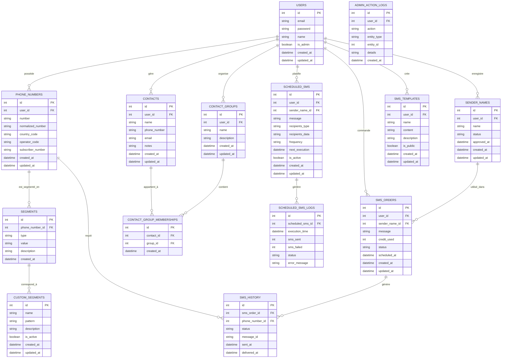

# Base de données

Cette page présente la structure de la base de données du projet Oracle, y compris le schéma, les tables, les relations et les considérations de conception.

## Vue d'ensemble

Le projet Oracle utilise une base de données relationnelle pour stocker les données de l'application. Deux options sont supportées :

1. **SQLite** : Utilisé principalement pour le développement et les tests
2. **MySQL** : Recommandé pour les environnements de production

La structure de la base de données est conçue pour être compatible avec les deux systèmes, avec des scripts de migration spécifiques lorsque nécessaire.

## Schéma de la base de données

Le schéma de la base de données est organisé autour des entités principales suivantes :

- **Utilisateurs** : Informations sur les utilisateurs du système
- **Numéros de téléphone** : Numéros de téléphone et leurs segments
- **Segments** : Composants des numéros de téléphone (code pays, code opérateur, etc.)
- **SMS** : Informations sur les SMS envoyés
- **Noms d'expéditeur** : Noms d'expéditeur enregistrés pour l'envoi de SMS

### Diagramme ER



## Description des tables

### Table `users`

Stocke les informations sur les utilisateurs du système.

| Colonne | Type | Description |
|---------|------|-------------|
| id | INTEGER | Identifiant unique (clé primaire) |
| email | VARCHAR(255) | Adresse email (unique) |
| password | VARCHAR(255) | Mot de passe haché |
| name | VARCHAR(255) | Nom complet |
| is_admin | BOOLEAN | Indique si l'utilisateur est un administrateur |
| created_at | DATETIME | Date de création |
| updated_at | DATETIME | Date de dernière mise à jour |

### Table `phone_numbers`

Stocke les numéros de téléphone importés ou saisis dans le système.

| Colonne | Type | Description |
|---------|------|-------------|
| id | INTEGER | Identifiant unique (clé primaire) |
| user_id | INTEGER | Identifiant de l'utilisateur propriétaire (clé étrangère) |
| number | VARCHAR(20) | Numéro de téléphone original |
| normalized_number | VARCHAR(20) | Numéro de téléphone normalisé |
| country_code | VARCHAR(5) | Code pays |
| operator_code | VARCHAR(5) | Code opérateur |
| subscriber_number | VARCHAR(15) | Numéro d'abonné |
| created_at | DATETIME | Date de création |
| updated_at | DATETIME | Date de dernière mise à jour |

### Table `segments`

Stocke les segments des numéros de téléphone.

| Colonne | Type | Description |
|---------|------|-------------|
| id | INTEGER | Identifiant unique (clé primaire) |
| phone_number_id | INTEGER | Identifiant du numéro de téléphone (clé étrangère) |
| type | VARCHAR(50) | Type de segment (country, operator, subscriber) |
| value | VARCHAR(50) | Valeur du segment |
| description | VARCHAR(255) | Description du segment |
| created_at | DATETIME | Date de création |

### Table `custom_segments`

Stocke les segments personnalisés définis par les utilisateurs.

| Colonne | Type | Description |
|---------|------|-------------|
| id | INTEGER | Identifiant unique (clé primaire) |
| name | VARCHAR(255) | Nom du segment personnalisé |
| pattern | VARCHAR(255) | Expression régulière pour la correspondance |
| description | VARCHAR(255) | Description du segment |
| is_active | BOOLEAN | Indique si le segment est actif |
| created_at | DATETIME | Date de création |
| updated_at | DATETIME | Date de dernière mise à jour |

### Table `sms_orders`

Stocke les commandes d'envoi de SMS.

| Colonne | Type | Description |
|---------|------|-------------|
| id | INTEGER | Identifiant unique (clé primaire) |
| user_id | INTEGER | Identifiant de l'utilisateur (clé étrangère) |
| sender_name_id | INTEGER | Identifiant du nom d'expéditeur (clé étrangère) |
| message | TEXT | Contenu du message |
| credit_used | INTEGER | Nombre de crédits utilisés |
| status | VARCHAR(50) | Statut de la commande (pending, processing, completed, failed) |
| scheduled_at | DATETIME | Date d'envoi planifiée |
| created_at | DATETIME | Date de création |
| updated_at | DATETIME | Date de dernière mise à jour |

### Table `sms_history`

Stocke l'historique des SMS envoyés.

| Colonne | Type | Description |
|---------|------|-------------|
| id | INTEGER | Identifiant unique (clé primaire) |
| sms_order_id | INTEGER | Identifiant de la commande SMS (clé étrangère) |
| phone_number_id | INTEGER | Identifiant du numéro de téléphone (clé étrangère) |
| status | VARCHAR(50) | Statut de l'envoi (sent, delivered, failed) |
| message_id | VARCHAR(255) | Identifiant du message chez le fournisseur |
| sent_at | DATETIME | Date d'envoi |
| delivered_at | DATETIME | Date de livraison |

### Table `sender_names`

Stocke les noms d'expéditeur enregistrés.

| Colonne | Type | Description |
|---------|------|-------------|
| id | INTEGER | Identifiant unique (clé primaire) |
| user_id | INTEGER | Identifiant de l'utilisateur (clé étrangère) |
| name | VARCHAR(11) | Nom d'expéditeur |
| status | VARCHAR(50) | Statut (pending, approved, rejected) |
| approved_at | DATETIME | Date d'approbation |
| created_at | DATETIME | Date de création |
| updated_at | DATETIME | Date de dernière mise à jour |

### Table `contacts`

Stocke les contacts des utilisateurs.

| Colonne | Type | Description |
|---------|------|-------------|
| id | INTEGER | Identifiant unique (clé primaire) |
| user_id | INTEGER | Identifiant de l'utilisateur (clé étrangère) |
| name | VARCHAR(255) | Nom du contact |
| phone_number | VARCHAR(20) | Numéro de téléphone |
| email | VARCHAR(255) | Adresse email |
| notes | TEXT | Notes sur le contact |
| created_at | DATETIME | Date de création |
| updated_at | DATETIME | Date de dernière mise à jour |

### Table `contact_groups`

Stocke les groupes de contacts.

| Colonne | Type | Description |
|---------|------|-------------|
| id | INTEGER | Identifiant unique (clé primaire) |
| user_id | INTEGER | Identifiant de l'utilisateur (clé étrangère) |
| name | VARCHAR(255) | Nom du groupe |
| description | TEXT | Description du groupe |
| created_at | DATETIME | Date de création |
| updated_at | DATETIME | Date de dernière mise à jour |

### Table `contact_group_memberships`

Stocke les appartenances des contacts aux groupes.

| Colonne | Type | Description |
|---------|------|-------------|
| id | INTEGER | Identifiant unique (clé primaire) |
| contact_id | INTEGER | Identifiant du contact (clé étrangère) |
| group_id | INTEGER | Identifiant du groupe (clé étrangère) |
| created_at | DATETIME | Date de création |

### Table `scheduled_sms`

Stocke les SMS planifiés.

| Colonne | Type | Description |
|---------|------|-------------|
| id | INTEGER | Identifiant unique (clé primaire) |
| user_id | INTEGER | Identifiant de l'utilisateur (clé étrangère) |
| sender_name_id | INTEGER | Identifiant du nom d'expéditeur (clé étrangère) |
| message | TEXT | Contenu du message |
| recipients_type | VARCHAR(50) | Type de destinataires (group, segment, list) |
| recipients_data | TEXT | Données des destinataires (JSON) |
| frequency | VARCHAR(50) | Fréquence d'envoi (once, daily, weekly, monthly) |
| next_execution | DATETIME | Prochaine date d'exécution |
| is_active | BOOLEAN | Indique si la planification est active |
| created_at | DATETIME | Date de création |
| updated_at | DATETIME | Date de dernière mise à jour |

### Table `scheduled_sms_logs`

Stocke les logs d'exécution des SMS planifiés.

| Colonne | Type | Description |
|---------|------|-------------|
| id | INTEGER | Identifiant unique (clé primaire) |
| scheduled_sms_id | INTEGER | Identifiant du SMS planifié (clé étrangère) |
| execution_time | DATETIME | Date d'exécution |
| sms_sent | INTEGER | Nombre de SMS envoyés |
| sms_failed | INTEGER | Nombre de SMS échoués |
| status | VARCHAR(50) | Statut de l'exécution |
| error_message | TEXT | Message d'erreur éventuel |

### Table `sms_templates`

Stocke les modèles de SMS.

| Colonne | Type | Description |
|---------|------|-------------|
| id | INTEGER | Identifiant unique (clé primaire) |
| user_id | INTEGER | Identifiant de l'utilisateur (clé étrangère) |
| name | VARCHAR(255) | Nom du modèle |
| content | TEXT | Contenu du modèle |
| description | TEXT | Description du modèle |
| is_public | BOOLEAN | Indique si le modèle est public |
| created_at | DATETIME | Date de création |
| updated_at | DATETIME | Date de dernière mise à jour |

### Table `admin_action_logs`

Stocke les logs des actions administratives.

| Colonne | Type | Description |
|---------|------|-------------|
| id | INTEGER | Identifiant unique (clé primaire) |
| user_id | INTEGER | Identifiant de l'utilisateur (clé étrangère) |
| action | VARCHAR(50) | Type d'action (create, update, delete, approve, reject) |
| entity_type | VARCHAR(50) | Type d'entité (user, sender_name, sms_order, etc.) |
| entity_id | INTEGER | Identifiant de l'entité |
| details | TEXT | Détails de l'action (JSON) |
| created_at | DATETIME | Date de création |

## Migrations

Les migrations de la base de données sont gérées par des scripts PHP et SQL. Les scripts de migration sont stockés dans le répertoire `src/database/migrations/`.

### Exemple de migration

```sql
-- Création de la table des utilisateurs
CREATE TABLE users (
    id INTEGER PRIMARY KEY AUTOINCREMENT,
    email VARCHAR(255) NOT NULL UNIQUE,
    password VARCHAR(255) NOT NULL,
    name VARCHAR(255) NOT NULL,
    is_admin BOOLEAN NOT NULL DEFAULT 0,
    created_at DATETIME NOT NULL,
    updated_at DATETIME NOT NULL
);

-- Création de la table des numéros de téléphone
CREATE TABLE phone_numbers (
    id INTEGER PRIMARY KEY AUTOINCREMENT,
    user_id INTEGER,
    number VARCHAR(20) NOT NULL,
    normalized_number VARCHAR(20) NOT NULL,
    country_code VARCHAR(5),
    operator_code VARCHAR(5),
    subscriber_number VARCHAR(15),
    created_at DATETIME NOT NULL,
    updated_at DATETIME NOT NULL,
    FOREIGN KEY (user_id) REFERENCES users(id)
);

-- Création des index
CREATE INDEX idx_phone_numbers_number ON phone_numbers(number);
CREATE INDEX idx_phone_numbers_user_id ON phone_numbers(user_id);
```

## Configuration de la base de données

La configuration de la base de données est définie dans le fichier `src/config/database.php`. Ce fichier contient les paramètres de connexion à la base de données, qui peuvent être surchargés par des variables d'environnement.

### Exemple de configuration

```php
<?php

return [
    'driver' => getenv('DB_DRIVER') ?: 'sqlite',
    'host' => getenv('DB_HOST') ?: 'localhost',
    'port' => getenv('DB_PORT') ?: '3306',
    'database' => getenv('DB_DATABASE') ?: __DIR__ . '/../../database.sqlite',
    'username' => getenv('DB_USERNAME') ?: 'root',
    'password' => getenv('DB_PASSWORD') ?: '',
    'charset' => 'utf8mb4',
    'collation' => 'utf8mb4_unicode_ci',
    'prefix' => '',
    'options' => [
        PDO::ATTR_ERRMODE => PDO::ERRMODE_EXCEPTION,
        PDO::ATTR_DEFAULT_FETCH_MODE => PDO::FETCH_ASSOC,
        PDO::ATTR_EMULATE_PREPARES => false,
    ],
];
```

## Accès à la base de données

L'accès à la base de données est géré par des repositories, qui implémentent le pattern Repository. Chaque entité a son propre repository, qui fournit des méthodes pour effectuer des opérations CRUD.

### Exemple de repository

```php
<?php

namespace App\Repositories;

use App\Models\PhoneNumber;
use PDO;

class PhoneNumberRepository
{
    private $pdo;
    
    public function __construct(PDO $pdo)
    {
        $this->pdo = $pdo;
    }
    
    public function findById(int $id): ?PhoneNumber
    {
        $stmt = $this->pdo->prepare('SELECT * FROM phone_numbers WHERE id = :id');
        $stmt->bindParam(':id', $id, PDO::PARAM_INT);
        $stmt->execute();
        
        $data = $stmt->fetch(PDO::FETCH_ASSOC);
        if (!$data) {
            return null;
        }
        
        return $this->hydrate($data);
    }
    
    public function findByNumber(string $number): ?PhoneNumber
    {
        $stmt = $this->pdo->prepare('SELECT * FROM phone_numbers WHERE number = :number');
        $stmt->bindParam(':number', $number, PDO::PARAM_STR);
        $stmt->execute();
        
        $data = $stmt->fetch(PDO::FETCH_ASSOC);
        if (!$data) {
            return null;
        }
        
        return $this->hydrate($data);
    }
    
    public function findAll(): array
    {
        $stmt = $this->pdo->query('SELECT * FROM phone_numbers');
        $data = $stmt->fetchAll(PDO::FETCH_ASSOC);
        
        $phoneNumbers = [];
        foreach ($data as $row) {
            $phoneNumbers[] = $this->hydrate($row);
        }
        
        return $phoneNumbers;
    }
    
    public function save(PhoneNumber $phone): void
    {
        if ($phone->id) {
            $this->update($phone);
        } else {
            $this->insert($phone);
        }
    }
    
    public function delete(PhoneNumber $phone): void
    {
        $stmt = $this->pdo->prepare('DELETE FROM phone_numbers WHERE id = :id');
        $stmt->bindParam(':id', $phone->id, PDO::PARAM_INT);
        $stmt->execute();
    }
    
    private function insert(PhoneNumber $phone): void
    {
        $stmt = $this->pdo->prepare('
            INSERT INTO phone_numbers (
                user_id, number, normalized_number, country_code, operator_code, subscriber_number, created_at, updated_at
            ) VALUES (
                :user_id, :number, :normalized_number, :country_code, :operator_code, :subscriber_number, :created_at, :updated_at
            )
        ');
        
        $now = date('Y-m-d H:i:s');
        
        $stmt->bindParam(':user_id', $phone->user_id, PDO::PARAM_INT);
        $stmt->bindParam(':number', $phone->number, PDO::PARAM_STR);
        $stmt->bindParam(':normalized_number', $phone->normalized_number, PDO::PARAM_STR);
        $stmt->bindParam(':country_code', $phone->country_code, PDO::PARAM_STR);
        $stmt->bindParam(':operator_code', $phone->operator_code, PDO::PARAM_STR);
        $stmt->bindParam(':subscriber_number', $phone->subscriber_number, PDO::PARAM_STR);
        $stmt->bindParam(':created_at', $now, PDO::PARAM_STR);
        $stmt->bindParam(':updated_at', $now, PDO::PARAM_STR);
        
        $stmt->execute();
        
        $phone->id = $this->pdo->lastInsertId();
    }
    
    private function update(PhoneNumber $phone): void
    {
        $stmt = $this->pdo->prepare('
            UPDATE phone_numbers SET
                user_id = :user_id,
                number = :number,
                normalized_number = :normalized_number,
                country_code = :country_code,
                operator_code = :operator_code,
                subscriber_number = :subscriber_number,
                updated_at = :updated_at
            WHERE id = :id
        ');
        
        $now = date('Y-m-d H:i:s');
        
        $stmt->bindParam(':id', $phone->id, PDO::PARAM_INT);
        $stmt->bindParam(':user_id', $phone->user_id, PDO::PARAM_INT);
        $stmt->bindParam(':number', $phone->number, PDO::PARAM_STR);
        $stmt->bindParam(':normalized_number', $phone->normalized_number, PDO::PARAM_STR);
        $stmt->bindParam(':country_code', $phone->country_code, PDO::PARAM_STR);
        $stmt->bindParam(':operator_code', $phone->operator_code, PDO::PARAM_STR);
        $stmt->bindParam(':subscriber_number', $phone->subscriber_number, PDO::PARAM_STR);
        $stmt->bindParam(':updated_at', $now, PDO::PARAM_STR);
        
        $stmt->execute();
    }
    
    private function hydrate(array $data): PhoneNumber
    {
        $phone = new PhoneNumber();
        $phone->id = $data['id'];
        $phone->user_id = $data['user_id'];
        $phone->number = $data['number'];
        $phone->normalized_number = $data['normalized_number'];
        $phone->country_code = $data['country_code'];
        $phone->operator_code = $data['operator_code'];
        $phone->subscriber_number = $data['subscriber_number'];
        $phone->created_at = $data['created_at'];
        $phone->updated_at = $data['updated_at'];
        
        return $phone;
    }
}
```

## Considérations de conception

### Normalisation

La base de données est conçue selon les principes de normalisation pour éviter la redondance des données et assurer l'intégrité référentielle. Les tables sont généralement en troisième forme normale (3NF).

### Indexation

Des index sont créés sur les colonnes fréquemment utilisées dans les clauses WHERE, JOIN et ORDER BY pour améliorer les performances des requêtes.

### Contraintes d'intégrité

Des contraintes d'intégrité référentielle sont définies pour assurer la cohérence des données. Les clés étrangères sont utilisées pour établir des relations entre les tables.

### Horodatage

La plupart des tables incluent des colonnes `created_at` et `updated_at` pour suivre la création et la dernière mise à jour des enregistrements.

### Soft Delete

Certaines tables implémentent le concept de "soft delete" en utilisant une colonne `deleted_at` pour marquer les enregistrements comme supprimés sans les supprimer physiquement de la base de données.

## Conclusion

La structure de la base de données du projet Oracle est conçue pour être flexible, évolutive et performante. Elle prend en charge les fonctionnalités actuelles de l'application et permet d'ajouter facilement de nouvelles fonctionnalités à l'avenir.

La compréhension de cette structure est essentielle pour le développement et la maintenance de l'application Oracle.
