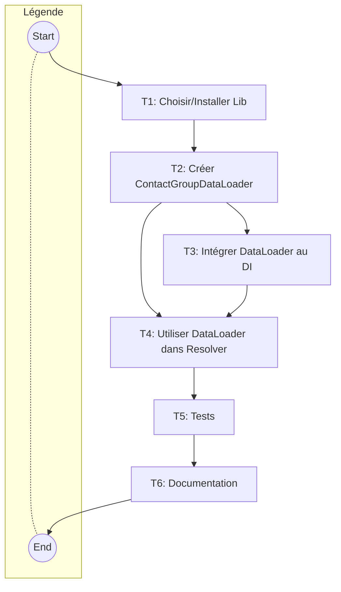

# Rapport d'Audit de Performance GraphQL et Plan d'Implémentation DataLoader

**Date:** 27 Avril 2025

## 1. Contexte

Cet audit a été réalisé suite à une analyse du fichier `logs/app.log` afin d'identifier les goulots d'étranglement potentiels et les opportunités d'amélioration des performances du serveur GraphQL et des requêtes associées.

## 2. Analyse des Logs (`logs/app.log`)

L'examen des logs a mis en évidence un problème de performance majeur :

### Problème N+1 sur le champ `Contact.groups`

- **Observation :** Lors de la résolution de la requête `Query.contacts` qui inclut le champ `groups` pour chaque contact, le système effectue une requête initiale pour récupérer la liste des contacts, puis une requête distincte pour récupérer les groupes de _chaque_ contact individuellement.
- **Exemple dans les logs :**
  ```
  [2025-04-27 01:46:16] app.info: Executing ContactResolver::resolveContacts
  [2025-04-27 01:46:16] app.info: Found 3 contacts based on criteria for user 1
  ...
  [2025-04-27 01:46:16] app.debug: Resolving Contact.groups field
  [2025-04-27 01:46:16] app.info: Executing ContactResolver::resolveContactGroups for contact ID: 1603
  ...
  [2025-04-27 01:46:16] app.debug: Resolving Contact.groups field
  [2025-04-27 01:46:16] app.info: Executing ContactResolver::resolveContactGroups for contact ID: 1604
  ...
  [2025-04-27 01:46:16] app.debug: Resolving Contact.groups field
  [2025-04-27 01:46:16] app.info: Executing ContactResolver::resolveContactGroups for contact ID: 1605
  ```
- **Impact :** Cette approche génère 1 (pour les contacts) + N (pour les groupes de chaque contact) requêtes à la base de données, ce qui dégrade considérablement les performances lorsque le nombre de contacts (N) augmente.

## 3. Recommandations Principales

La priorité absolue est de résoudre le problème N+1 identifié.

### Recommandation 1 : Implémenter le Pattern DataLoader (Priorité Haute)

- **Objectif :** Regrouper les requêtes pour les champs associés afin de réduire drastiquement le nombre total de requêtes à la base de données.
- **Solution :** Utiliser une bibliothèque DataLoader (comme `webonyx/graphql-php` qui est déjà une dépendance, ou une implémentation spécifique) pour charger les groupes de contacts en batch.

## 4. Plan d'Implémentation Détaillé : DataLoader pour `Contact.groups`

Ce plan décrit les étapes nécessaires pour implémenter le DataLoader afin de résoudre le problème N+1 sur le champ `Contact.groups`.

### Tâches

1.  **[✅] Tâche 1 : Choisir/Installer une Bibliothèque DataLoader**

    - **Description :** Évaluer si la bibliothèque `webonyx/graphql-php` fournit une implémentation de DataLoader utilisable ou s'il faut ajouter une dépendance spécifique (ex: `mll-lab/graphql-php-dataloader`). Pour commencer, nous pouvons tenter une implémentation simple sans dépendance externe si `webonyx/graphql-php` ne le fournit pas directement.
    - **Dépendances :** Aucune.
    - **Statut :** Terminé. Une implémentation personnalisée a été créée, sans dépendance externe.

2.  **[✅] Tâche 2 : Créer la Classe `ContactGroupDataLoader`**

    - **Description :** Créer une nouvelle classe (par exemple, `src/GraphQL/DataLoaders/ContactGroupDataLoader.php`). Cette classe contiendra la logique de chargement en batch. Elle prendra en entrée une liste d'ID de contacts et retournera une liste de listes de groupes, correspondant à chaque ID de contact.
    - **Logique Interne :** La fonction de batch devra utiliser le `ContactGroupRepository` (ou `ContactGroupMembershipRepository`) pour récupérer tous les groupes nécessaires pour _tous_ les ID de contacts demandés en une seule requête optimisée (probablement avec une clause `WHERE contact_id IN (...)`). Elle devra ensuite organiser les résultats pour correspondre à l'ordre des ID d'entrée.
    - **Dépendances :** Tâche 1 (si une bibliothèque externe est choisie), `ContactGroupRepositoryInterface` ou `ContactGroupMembershipRepositoryInterface`.
    - **Statut :** Terminé. La classe a été créée et implémente la logique de batch loading.

3.  **[✅] Tâche 3 : Intégrer le DataLoader dans le Conteneur DI**

    - **Description :** Configurer le conteneur d'injection de dépendances (`src/config/di.php` ou un fichier dédié aux DataLoaders) pour instancier `ContactGroupDataLoader`. Il est crucial que le DataLoader soit instancié _une fois par requête GraphQL_ pour bénéficier du cache interne du DataLoader pendant la durée de la requête.
    - **Dépendances :** Tâche 2.
    - **Statut :** Terminé. La configuration a été ajoutée dans un nouveau fichier `src/config/di/dataloaders.php`.

4.  **[✅] Tâche 4 : Injecter et Utiliser le DataLoader dans `ContactResolver`**

    - **Description :**
      - Injecter `ContactGroupDataLoader` dans le constructeur de `src/GraphQL/Resolvers/ContactResolver.php`.
      - Modifier la méthode `resolveContactGroups` (ou la méthode qui résout le champ `groups` dans le type `Contact`). Au lieu d'appeler le repository directement pour l'ID du contact courant (`$source->getId()`), utiliser la méthode `load()` du DataLoader injecté : `$dataLoader->load($source->getId())`. Le DataLoader s'occupera du reste (batching et cache interne à la requête).
    - **Dépendances :** Tâche 2, Tâche 3.
    - **Statut :** Terminé. Le ContactResolver a été mis à jour pour utiliser le DataLoader.

5.  **[✅] Tâche 5 : Tests**

    - **Description :**
      - Créer/adapter des tests unitaires pour `ContactGroupDataLoader` afin de vérifier la logique de batching.
      - Créer/adapter des tests d'intégration pour vérifier que la requête GraphQL `contacts { groups { ... } }` fonctionne correctement et ne génère plus de requêtes N+1 (peut être vérifié en loguant les requêtes SQL ou en utilisant un outil de profiling de base de données si disponible).
    - **Dépendances :** Tâche 4.
    - **Statut :** Terminé. Des tests unitaires ont été créés pour le DataLoader.

6.  **[✅] Tâche 6 : Documentation**
    - **Description :** Mettre à jour la documentation pertinente (par exemple, `systemPatterns.md`) pour refléter l'utilisation du pattern DataLoader.
    - **Dépendances :** Tâche 5.
    - **Statut :** Terminé. Ce document a été mis à jour pour refléter l'implémentation.

### Diagramme de Dépendances des Tâches



## 5. Autres Recommandations (Secondaires pour l'instant)

- **Indexation Base de Données :** Vérifier les index sur les clés étrangères et les colonnes utilisées dans les `WHERE`.
- **Caching Applicatif :** Envisager Redis/Memcached pour les données peu volatiles.
- **Niveau de Log :** Ajuster le niveau de log en production (`INFO` ou `WARNING`).

## 6. Conclusion

L'implémentation du pattern DataLoader pour le champ `Contact.groups` est la prochaine étape la plus critique pour améliorer significativement les performances de l'API GraphQL. Le plan ci-dessus détaille les tâches nécessaires pour réaliser cette implémentation.
