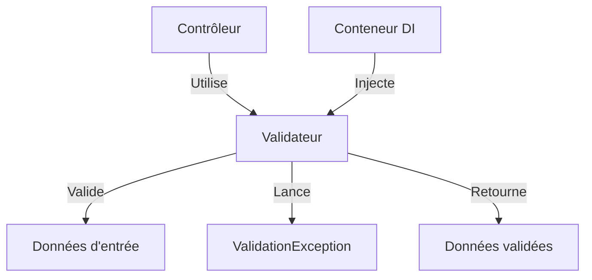

# Système de Validation - Oracle

## Vue d'ensemble

Le système de validation d'Oracle est conçu pour centraliser et standardiser la validation des données dans toute l'application. Il suit les principes SOLID, en particulier le principe de responsabilité unique (SRP), en séparant la logique de validation de la logique métier et des contrôleurs.

## Architecture



## Validateurs disponibles

| Validateur               | Description                             | Responsabilité                                                    |
| ------------------------ | --------------------------------------- | ----------------------------------------------------------------- |
| `UserValidator`          | Validation des utilisateurs             | Valide les données utilisateur (nom d'utilisateur, email, etc.)   |
| `SenderNameValidator`    | Validation des noms d'expéditeur        | Valide les demandes de nom d'expéditeur                           |
| `SMSOrderValidator`      | Validation des commandes de crédits SMS | Valide les commandes de crédits SMS                               |
| `CustomSegmentValidator` | Validation des segments personnalisés   | Valide les segments personnalisés et leurs expressions régulières |
| `PhoneNumberValidator`   | Validation des numéros de téléphone     | Valide les numéros de téléphone et leurs métadonnées              |

## Utilisation dans les contrôleurs

### Exemple avec PhoneNumberController

```php
public function createPhoneNumber(
    string $number,
    string $civility = '',
    string $firstName = '',
    string $name = '',
    string $company = '',
    string $sector = '',
    string $notes = ''
): PhoneNumber {
    // Récupérer le validateur depuis le conteneur DI
    $validator = $this->container->get(PhoneNumberValidator::class);

    try {
        // Valider les données
        $validatedData = $validator->validateCreate(
            $number,
            $civility,
            $firstName,
            $name,
            $company,
            $sector,
            $notes
        );
    } catch (ValidationException $e) {
        // Gérer l'exception de validation
        throw new \Exception($e->getMessage() . ': ' . json_encode($e->getErrors()));
    }

    // Utiliser les données validées
    $phoneNumber = new PhoneNumber(
        null,
        $validatedData['number'],
        $validatedData['civility'],
        $validatedData['firstName'],
        $validatedData['name'],
        $validatedData['company'],
        $validatedData['sector'],
        $validatedData['notes']
    );

    // Suite du traitement...
}
```

## Gestion des erreurs

Le système utilise une classe `ValidationException` dédiée pour gérer les erreurs de validation. Cette exception contient :

- Un message général décrivant l'erreur
- Un tableau associatif des erreurs spécifiques par champ

### Exemple de gestion d'erreur

```php
try {
    $validatedData = $validator->validateCreate($number, $civility, $firstName, $name);
} catch (ValidationException $e) {
    // Accéder au message général
    $message = $e->getMessage(); // "Validation du numéro de téléphone échouée"

    // Accéder aux erreurs spécifiques
    $errors = $e->getErrors(); // ["number" => "Le format du numéro n'est pas valide"]

    // Formater pour l'API
    throw new \Exception($message . ': ' . json_encode($errors));
}
```

## Configuration dans le conteneur DI

Les validateurs sont enregistrés dans le conteneur d'injection de dépendances (`src/config/di.php`) :

```php
// Validators
UserValidator::class => function (ContainerInterface $c) {
    return new UserValidator($c->get(UserRepository::class));
},

SenderNameValidator::class => function (ContainerInterface $c) {
    return new SenderNameValidator(
        $c->get(SenderNameRepository::class),
        $c->get(UserRepository::class)
    );
},

SMSOrderValidator::class => function (ContainerInterface $c) {
    return new SMSOrderValidator(
        $c->get(SMSOrderRepository::class),
        $c->get(UserRepository::class)
    );
},

CustomSegmentValidator::class => function (ContainerInterface $c) {
    return new CustomSegmentValidator(
        $c->get(CustomSegmentRepository::class),
        $c->get(RegexValidatorInterface::class)
    );
},

PhoneNumberValidator::class => function (ContainerInterface $c) {
    return new PhoneNumberValidator(
        $c->get(PhoneNumberRepository::class)
    );
},
```

## Tests

Chaque validateur dispose de tests unitaires qui vérifient :

- La validation des données valides
- Le rejet des données invalides avec les messages d'erreur appropriés
- La gestion des cas limites

### Exemple de test pour PhoneNumberValidator

```php
public function testValidateCreateWithInvalidNumber()
{
    // Données avec un numéro invalide
    $number = 'not-a-number';

    // Vérifier qu'une exception est levée
    $this->expectException(ValidationException::class);

    // Exécuter la méthode à tester
    $this->phoneNumberValidator->validateCreate($number);
}
```

## Bonnes pratiques

1. **Toujours utiliser les validateurs** pour valider les données d'entrée avant de les traiter
2. **Centraliser les règles de validation** dans les validateurs pour éviter la duplication
3. **Retourner des messages d'erreur clairs et spécifiques** pour aider les utilisateurs
4. **Tester tous les cas de validation** pour s'assurer que les règles sont correctement appliquées
5. **Utiliser l'injection de dépendances** pour accéder aux validateurs

## Avantages du système

1. **Séparation des responsabilités** : La logique de validation est séparée de la logique métier
2. **Réutilisabilité** : Les validateurs peuvent être utilisés dans différents contextes
3. **Testabilité** : Les validateurs sont faciles à tester de manière isolée
4. **Maintenabilité** : Les règles de validation sont centralisées et faciles à modifier
5. **Cohérence** : Les mêmes règles de validation sont appliquées partout dans l'application
