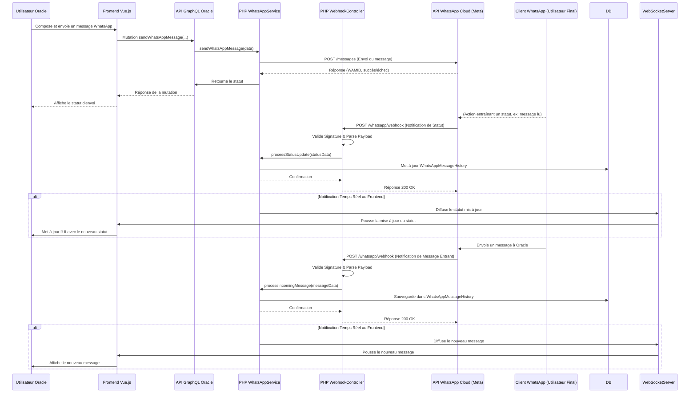

# Guide d'Intégration de l'API WhatsApp Cloud dans Oracle

> ⚠️ **IMPORTANT** : Pour comprendre la limitation critique de la fenêtre de 24 heures qui affecte l'envoi de messages, consultez le [Guide : Limitation de la fenêtre de 24 heures WhatsApp](./whatsapp-24h-window-limitation.md)

## 1. Introduction

Ce document sert de guide complet pour l'intégration de l'API WhatsApp Cloud, hébergée par Meta, au sein du projet Oracle. L'objectif est de permettre l'envoi et la réception de messages WhatsApp, y compris les messages en masse et la gestion des modèles de messages.

## 2. Prérequis et Configuration Initiale

Avant d'intégrer l'API WhatsApp Cloud, plusieurs éléments doivent être en place :

- **Compte Meta Developer** : Nécessaire pour créer et gérer des applications. S'inscrire sur [developers.facebook.com/apps](https://developers.facebook.com/apps).
- **Authentification à deux facteurs (2FA)** : Doit être activée pour le compte Meta Developer.
- **Application Meta (Type Business)** : Une application Meta de type "Business" doit être créée depuis le tableau de bord Meta Developer (`My Apps > Create App`).
- **Configuration WhatsApp sur l'App Meta** : Depuis le tableau de bord de l'application, ajouter le produit "WhatsApp" et le configurer.
- **Portefeuille Meta Business (Meta Business Portfolio)** : Un portefeuille d'entreprise est requis. Il peut être créé automatiquement ou un existant peut être lié lors de la configuration de WhatsApp sur l'application Meta. L'ID du portefeuille est visible dans l'URL de Meta Business Suite (`business_id=`).
- **Compte WhatsApp Business (WABA)** : Un WABA est nécessaire. L'ID peut être récupéré via l'API (voir section 6.1).
- **Numéro de Téléphone Professionnel WhatsApp** : Un numéro de téléphone dédié à l'entreprise.
  - Un numéro de test est fourni par Meta lors de la configuration initiale. Il peut envoyer des messages illimités à 5 destinataires maximum.
  - Pour la production, un numéro réel doit être enregistré et vérifié (par SMS/appel vocal). Voir la section "API Reference > Phone Numbers > Request Verification Code" et "Verify Code" de la collection Postman.
  - La migration d'un numéro existant (utilisé sur l'app WhatsApp standard ou Business) vers la plateforme API est possible mais entraîne la perte d'accès à l'application WhatsApp correspondante pour ce numéro.

### 2.1. Jetons d'Accès (Access Tokens)

- L'API supporte les jetons d'accès utilisateur et les jetons d'accès utilisateur système.
- **Jeton Utilisateur (User Access Token)** :
  - Peut être obtenu depuis le tableau de bord de l'application Meta (Panneau WhatsApp > Getting Started) ou via Graph API Explorer.
  - Expire généralement après 24 heures.
- **Jeton Utilisateur Système (System User Access Token)** :
  - Recommandé pour la production car plus longue durée de vie (jusqu'à 60 jours, ou permanent).
  - Nécessite la création d'un utilisateur système dans le Business Manager et l'attribution des permissions nécessaires à l'application.
- Le jeton doit être sauvegardé de manière sécurisée et utilisé pour authentifier les appels API (Header `Authorization: Bearer VOTRE_JETON`).
- **Débogueur de Jeton d'Accès** : [developers.facebook.com/tools/debug/accesstoken/](https://developers.facebook.com/tools/debug/accesstoken/) pour vérifier le type et les permissions d'un jeton.

### 2.2. Variables d'Environnement pour Oracle

Les informations suivantes, spécifiques à votre configuration Meta, devront être configurées comme variables d'environnement dans le projet Oracle :

- `WHATSAPP_API_VERSION` (ex: `v22.0`)
- `WHATSAPP_PHONE_NUMBER_ID` (ex: `660953787095211`)
- `WHATSAPP_WABA_ID` (ID du compte WhatsApp Business, ex: `664409593123173`)
- `WHATSAPP_ACCESS_TOKEN` (Jeton d'accès utilisateur système de longue durée. **NE PAS CODER EN DUR**. Disponible à `/Users/ns2poportable/Desktop/phone-numbers-seg/docs/Meta-API-Cloud-wha-business/mes-info-API-cloud-Meta.md`)
- `WHATSAPP_BUSINESS_PORTFOLIO_ID` (ID du portefeuille Meta Business, si nécessaire pour certaines opérations de gestion avancées)
- `WHATSAPP_APP_ID` (ID de l'application Meta, ex: `1193922949108494`)
- `WHATSAPP_WEBHOOK_VERIFY_TOKEN` (Chaîne secrète que vous définissez pour la vérification du Webhook par Meta)
- `WHATSAPP_WEBHOOK_CALLBACK_URL` (URL de l'endpoint Webhook que vous exposez dans Oracle)

Il est crucial de gérer ces informations de manière sécurisée, en particulier le `WHATSAPP_ACCESS_TOKEN`.

## 3. Envoi de Messages

L'envoi de messages se fait via des appels POST à l'endpoint `https://graph.facebook.com/{{Version}}/{{Phone-Number-ID}}/messages`.

### ⚠️ LIMITATION CRITIQUE : Fenêtre de 24 heures

**AVANT TOUT ENVOI, SACHEZ QUE :**
- **Les messages texte normaux (type: "text") ne peuvent être envoyés QUE dans les 24 heures suivant une interaction initiée par l'utilisateur**
- **Hors de cette fenêtre, vous DEVEZ utiliser des messages template pré-approuvés**
- **Si vous tentez d'envoyer un message texte sans conversation ouverte, vous recevrez une erreur**

**Exemples d'erreurs courantes :**
```json
{
  "error": {
    "message": "(#131030) Recipient is not a valid WhatsApp user or is outside the allowed window",
    "type": "OAuthException",
    "code": 131030
  }
}
```

**Pour éviter ces erreurs :**
1. Utilisez les webhooks pour tracker quand un utilisateur ouvre une conversation
2. Stockez le timestamp de la dernière interaction utilisateur
3. Avant d'envoyer un message texte, vérifiez si vous êtes dans la fenêtre de 24h
4. Si hors fenêtre, utilisez un template message à la place

### 3.1. Types de Messages Supportés

- Messages Texte
- Messages Média (Images, Vidéos, Audio, Documents, Stickers)
- Messages Interactifs (Boutons de réponse, Listes)
- Messages Basés sur des Modèles (Templates)
- Messages de Localisation
- Messages de Contact
- Messages de Réaction

### 3.2. Structure Générale d'un Objet Message

```json
{
  "messaging_product": "whatsapp",
  "recipient_type": "individual", // Optionnel, défaut "individual"
  "to": "NUMERO_DESTINATAIRE_WA_ID_OU_INTERNATIONAL",
  "type": "TYPE_DE_MESSAGE", // text, image, audio, document, video, sticker, location, contacts, interactive, template, reaction
  // ... autres champs spécifiques au type de message (ex: "text": {...}, "image": {...})
  "context": {
    // Optionnel, pour répondre à un message spécifique
    "message_id": "WAMID_DU_MESSAGE_AUQUEL_REPONDRE"
  }
}
```

### 3.3. Envoi de Messages Texte (`type: "text"`)

- Nécessite un objet `text` :
  ````json
  "text": {
      "preview_url": false, // Optionnel, true pour afficher un aperçu de l'URL si le body contient une URL.
      "body": "Contenu du message texte. Peut contenir des URLs et du formatage (gras: *texte*, italique: _texte_, barré: ~texte~, monospace: ```texte```)."
  }
  ````
- Limite de 4096 caractères pour `body`.
- Les aperçus d'URL ne sont rendus que si l'entreprise a déjà envoyé un modèle de message à l'utilisateur, ou si l'utilisateur a initié la conversation.

### 3.4. Envoi de Messages Média (`type: "image" | "audio" | "document" | "video" | "sticker"`)

- Nécessite un objet média correspondant (ex: `image`, `audio`, `document`, `video`, `sticker`).
- Chaque objet média peut utiliser un `id` (pour un média préalablement uploadé) ou un `link` (URL HTTPS directe vers le média).

  ```json
  // Exemple pour une image par ID
  "image": {
      "id": "ID_MEDIA_UPLOADED",
      "caption": "Légende optionnelle pour image, document, video." // Non applicable pour audio ou sticker
  }
  // Exemple pour un document par URL
  "document": {
      "link": "URL_HTTPS_DU_DOCUMENT",
      "caption": "Légende optionnelle.",
      "filename": "NomDeFichier.pdf" // Optionnel, pour les documents
  }
  ```

- **Upload de Média** :
  - Se fait via `POST https://graph.facebook.com/{{Version}}/{{Phone-Number-ID}}/media` en `form-data`.
  - Paramètres : `messaging_product: "whatsapp"`, `file: @CHEMIN_FICHIER_LOCAL`.
  - Retourne un `id` de média à utiliser pour l'envoi.
  - **Types et Limites de Taille Supportés** :
    - Audio (`audio/aac`, `audio/mp4`, `audio/mpeg`, `audio/amr`, `audio/ogg` (opus codecs)): 16MB
    - Document (divers, incl. `text/plain`, `application/pdf`, MS Office, OpenOffice): 100MB
    - Image (`image/jpeg`, `image/png`): 5MB
    - Sticker (`image/webp`): Statique 100KB (512x512px), Animé 500KB (512x512px).
    - Vidéo (`video/mp4`, `video/3gp` - H.264 & AAC codec): 16MB
- **Téléchargement de Média Reçu** :
  - Obtenir l'URL du média via `GET https://graph.facebook.com/{{Version}}/{{Media-ID}}`.
  - Télécharger le fichier depuis l'URL obtenue (URL valide 5 minutes, nécessite le jeton d'accès dans le header `Authorization: Bearer VOTRE_JETON`).

### 3.5. Envoi de Messages Interactifs (`type: "interactive"`)

- Nécessite un objet `interactive`.
- `interactive.type` peut être :
  - **`list`** (Messages à liste) :
    - `header` (optionnel, type `text`)
    - `body` (requis, type `text`)
    - `footer` (optionnel, type `text`)
    - `action` (requis) :
      - `button` (requis, texte du bouton pour ouvrir la liste)
      - `sections` (requis, tableau d'objets `section`, min 1, max 10)
        - Chaque `section` a un `title` (optionnel si une seule section) et un tableau `rows`.
        - Chaque `row` a `id`, `title`, `description` (optionnel). Max 10 rows par section.
  - **`button`** (Boutons de réponse) :
    - `header` (optionnel, type `text`, `video`, `image`, `document`)
    - `body` (requis, type `text`)
    - `footer` (optionnel, type `text`)
    - `action` (requis) :
      - `buttons` (requis, tableau d'objets `button`, max 3)
        - Chaque `button` a `type: "reply"`, et un objet `reply` avec `id` et `title`.
  - **`product`** (Message Produit Unique) :
    - `body` (optionnel, type `text`)
    - `footer` (optionnel, type `text`)
    - `action` (requis) :
      - `catalog_id` (requis)
      - `product_retailer_id` (requis)
  - **`product_list`** (Message Multi-Produits) :
    - `header` (requis, type `text`)
    - `body` (requis, type `text`)
    - `footer` (optionnel, type `text`)
    - `action` (requis) :
      - `catalog_id` (requis)
      - `sections` (requis, tableau d'objets `section`)
        - Chaque `section` a `title` et `product_items` (tableau d'objets `{ "product_retailer_id": "..." }`). Max 30 produits au total.
  - **`catalog_message`** (Message Catalogue) :
    - `body` (requis, type `text`)
    - `footer` (optionnel, type `text`)
    - `action` (requis) :
      - `name: "catalog_message"`
      - `parameters: { "thumbnail_product_retailer_id": "..." }` (optionnel, pour afficher une miniature de produit spécifique)

### 3.6. Envoi de Messages Basés sur des Modèles (`type: "template"`)

- Nécessite un objet `template`.
  ```json
  "template": {
      "name": "NOM_DU_MODELE_PRE_APPROUVE",
      "language": {
          "code": "CODE_LANGUE_LOCALE" // ex: "fr", "en_US". Doit correspondre à une traduction approuvée du modèle.
      },
      "components": [ // Optionnel, requis si le modèle a des variables ou des boutons dynamiques.
          // {
          //   "type": "header" | "body" | "button",
          //   // ... autres paramètres spécifiques au composant
          // }
      ]
  }
  ```
- **Composants (`components`)** :
  - **`type: "header"`** :
    - `parameters`: Tableau d'objets `parameter`. Pour les headers média, un seul paramètre de type `image`, `video`, ou `document` avec l'objet média correspondant (`id` ou `link`). Pour le texte, un paramètre de type `text`.
  - **`type: "body"`** :
    - `parameters`: Tableau d'objets `parameter` de type `text`, `currency`, ou `date_time` pour remplacer les variables `{{1}}`, `{{2}}`, etc. dans le corps du modèle.
  - **`type: "button"`** :
    - `sub_type: "quick_reply" | "url"`
    - `index`: "0", "1", "2", etc. (chaîne de caractères) correspondant au bouton dans le modèle.
    - `parameters`: Tableau d'objets `parameter`.
      - Pour `quick_reply`: `type: "payload"`, `payload: "DEVELOPER_DEFINED_PAYLOAD"`.
      - Pour `url`: `type: "text"`, `text: "PARTIE_VARIABLE_DE_L_URL"`.
- **Objets Paramètre (`parameter`)** :
  - `type: "text"`, `text: "valeur"`
  - `type: "currency"`, `currency: { "fallback_value": "...", "code": "USD", "amount_1000": 123450 }` (123.45 USD)
  - `type: "date_time"`, `date_time: { "fallback_value": "...", "day_of_week": 1, ... }`
  - `type: "image" | "video" | "document"`, `image: { "id": "..." ou "link": "..." }`

### 3.7. Envoi de Messages de Localisation (`type: "location"`)

- Nécessite un objet `location`:
  ```json
  "location": {
      "latitude": "LATITUDE_DE_LA_LOCALISATION",
      "longitude": "LONGITUDE_DE_LA_LOCALISATION",
      "name": "Nom de la localisation (optionnel)",
      "address": "Adresse de la localisation (optionnel, affiché si name est présent)"
  }
  ```

### 3.8. Envoi de Messages de Contact (`type: "contacts"`)

- Nécessite un tableau `contacts` (généralement un seul contact par message).
- Chaque objet contact a une structure complexe incluant `name` (requis), `addresses` (optionnel), `birthday` (optionnel), `emails` (optionnel), `org` (optionnel), `phones` (optionnel), `urls` (optionnel).
  ```json
  "contacts": [{
      "name": {
          "formatted_name": "Nom Complet Formaté",
          "first_name": "Prénom", // Au moins un des champs optionnels de name est requis avec formatted_name
          // ... autres champs de name
      }
      // ... autres champs de contact
  }]
  ```

### 3.9. Envoi de Messages de Réaction (`type: "reaction"`)

- Nécessite un objet `reaction`.
  ```json
  "reaction": {
      "message_id": "WAMID_DU_MESSAGE_AUQUEL_REAGIR",
      "emoji": "EMOJI_DE_REACTION" // Un seul emoji. "" pour supprimer la réaction.
  }
  ```
- Ne peut pas réagir à un message qui a déjà une réaction.

### 3.10. Envoi de Messages en Masse

- L'API est conçue pour l'envoi à grande échelle.
- **Considérations Importantes** :
  - **Opt-In Utilisateur** : Obligatoire avant d'envoyer des messages proactifs initiés par l'entreprise (généralement des modèles de messages).
  - **Limites de Qualité et de Messagerie (Messaging Limits & Quality Rating)** : Basées sur la qualité des messages envoyés et la réception par les utilisateurs. Impacte le nombre de conversations uniques initiables par jour (tiers de messagerie).
  - **Limites de Débit (Throughput)** : Par défaut ~80 messages/seconde (mps) combinés (envoi+réception). Peut augmenter automatiquement jusqu'à 1000 mps en fonction de l'utilisation et de la qualité.
  - **Limites de Taux d'Appel API (Rate Limits)** : Limites sur le nombre d'appels API par heure, calculé comme `1800000 * Nombre de Numéros Enregistrés sous le WABA`. Une erreur `80007` est retournée si la limite est atteinte.
- Pour l'envoi en masse, il faudra itérer sur la liste des destinataires et envoyer les messages individuellement via l'API, en respectant scrupuleusement ces limites pour éviter les blocages ou la dégradation de la qualité du numéro.
- Utiliser des modèles de messages pré-approuvés pour les campagnes sortantes.

## 4. Réception de Messages (Webhooks)

Les Webhooks sont utilisés pour recevoir des notifications en temps réel, telles que les messages entrants et les mises à jour de statut des messages envoyés.

### 4.1. Configuration du Webhook

1.  **Créer un Endpoint Webhook** : Une URL publique HTTPS sur le serveur Oracle capable de recevoir des requêtes POST (pour les notifications) et GET (pour la vérification).
2.  **Configurer dans l'Application Meta** :
    - Dans le tableau de bord de l'application Meta > WhatsApp > Configuration.
    - Fournir l'URL de Callback et un Jeton de Vérification (Verify Token). Ce jeton sera utilisé par Meta pour vérifier l'endpoint.
3.  **Souscrire aux Événements** :
    - Dans la section Webhooks de l'application Meta, cliquer sur "Manage".
    - S'abonner au champ `messages` pour recevoir les notifications de messages et de statuts.
4.  **Souscrire l'Application au WABA** (pour les BSP ou si plusieurs WABA) :
    - POST à `https://graph.facebook.com/{{Version}}/{{WABA-ID}}/subscribed_apps`.

### 4.2. Vérification de l'Endpoint Webhook

- Meta enverra une requête GET à l'URL de callback avec les paramètres :
  - `hub.mode=subscribe`
  - `hub.challenge=VALEUR_CHALLENGE`
  - `hub.verify_token=VOTRE_JETON_DE_VERIFICATION`
- L'endpoint doit répondre avec `VALEUR_CHALLENGE` (statut 200 OK) si le `hub.verify_token` correspond à celui configuré.

### 4.3. Traitement des Notifications Webhook (Requêtes POST)

- Les notifications sont envoyées en JSON via des requêtes POST.
- **Structure Générale** :
  ```json
  {
    "object": "whatsapp_business_account",
    "entry": [
      {
        "id": "WHATSAPP_BUSINESS_ACCOUNT_ID", // ID du compte WhatsApp Business
        "changes": [
          {
            "value": {
              "messaging_product": "whatsapp",
              "metadata": {
                "display_phone_number": "NUMERO_AFFICHE", // Numéro de téléphone de l'entreprise
                "phone_number_id": "ID_NUMERO_TELEPHONE_RECEVEUR" // ID du numéro de téléphone de l'entreprise
              }
              // ... 'messages' (pour les messages entrants) ou 'statuses' (pour les mises à jour de statut)
            },
            "field": "messages" // Indique que la notification concerne les messages
          }
        ]
      }
    ]
  }
  ```
- Il est crucial de valider la signature de la requête (`X-Hub-Signature-256`) pour s'assurer que la notification provient bien de Meta.

### 4.4. Notifications de Messages Reçus

- L'objet `value` contiendra un tableau `messages`.
- Chaque objet message contient : `from` (WA ID de l'expéditeur), `id` (WAMID du message), `timestamp`, `type` (text, image, audio, etc.), et un objet spécifique au type.

#### 4.4.1. Exemple : Message Texte Reçu

```json
{
  "object": "whatsapp_business_account",
  "entry": [
    {
      "id": "WABA_ID",
      "changes": [
        {
          "value": {
            "messaging_product": "whatsapp",
            "metadata": {
              "display_phone_number": "16505551111",
              "phone_number_id": "PHONE_NUMBER_ID_ENTREPRISE"
            },
            "contacts": [
              {
                "profile": { "name": "Nom Utilisateur" },
                "wa_id": "WA_ID_UTILISATEUR"
              }
            ],
            "messages": [
              {
                "from": "WA_ID_UTILISATEUR",
                "id": "WAMID_MESSAGE_RECU",
                "timestamp": "1678886400",
                "text": { "body": "Bonjour Oracle !" },
                "type": "text"
              }
            ]
          },
          "field": "messages"
        }
      ]
    }
  ]
}
```

#### 4.4.2. Exemple : Message Média Reçu (Image)

```json
{
  "object": "whatsapp_business_account",
  "entry": [
    {
      "id": "WABA_ID",
      "changes": [
        {
          "value": {
            "messaging_product": "whatsapp",
            "metadata": {
              "display_phone_number": "16505551111",
              "phone_number_id": "PHONE_NUMBER_ID_ENTREPRISE"
            },
            "contacts": [
              {
                "profile": { "name": "Nom Utilisateur" },
                "wa_id": "WA_ID_UTILISATEUR"
              }
            ],
            "messages": [
              {
                "from": "WA_ID_UTILISATEUR",
                "id": "WAMID_MESSAGE_IMAGE_RECU",
                "timestamp": "1678886500",
                "image": {
                  "caption": "Belle photo !",
                  "mime_type": "image/jpeg",
                  "sha256": "HASH_SHA256_IMAGE",
                  "id": "MEDIA_ID_IMAGE"
                },
                "type": "image"
              }
            ]
          },
          "field": "messages"
        }
      ]
    }
  ]
}
```

- Pour télécharger le média, utiliser le `MEDIA_ID_IMAGE` (voir section 3.4).

#### 4.4.3. Exemple : Réponse à un Bouton Interactif

```json
{
  "object": "whatsapp_business_account",
  "entry": [
    {
      "id": "WABA_ID",
      "changes": [
        {
          "value": {
            "messaging_product": "whatsapp",
            "metadata": {
              "display_phone_number": "16505551111",
              "phone_number_id": "PHONE_NUMBER_ID_ENTREPRISE"
            },
            "contacts": [
              {
                "profile": { "name": "Nom Utilisateur" },
                "wa_id": "WA_ID_UTILISATEUR"
              }
            ],
            "messages": [
              {
                "from": "WA_ID_UTILISATEUR",
                "id": "WAMID_REPONSE_BOUTON",
                "timestamp": "1678886600",
                "interactive": {
                  "type": "button_reply",
                  "button_reply": {
                    "id": "ID_UNIQUE_BOUTON_1",
                    "title": "Oui"
                  }
                },
                "type": "interactive",
                "context": {
                  // Contexte du message original auquel l'utilisateur a répondu
                  "from": "PHONE_NUMBER_ID_ENTREPRISE_WA_ID",
                  "id": "WAMID_MESSAGE_ORIGINAL_AVEC_BOUTONS"
                }
              }
            ]
          },
          "field": "messages"
        }
      ]
    }
  ]
}
```

#### 4.4.4. Exemple : Réponse à une Liste Interactive

```json
{
  "object": "whatsapp_business_account",
  "entry": [
    {
      "id": "WABA_ID",
      "changes": [
        {
          "value": {
            "messaging_product": "whatsapp",
            "metadata": {
              "display_phone_number": "16505551111",
              "phone_number_id": "PHONE_NUMBER_ID_ENTREPRISE"
            },
            "contacts": [
              {
                "profile": { "name": "Nom Utilisateur" },
                "wa_id": "WA_ID_UTILISATEUR"
              }
            ],
            "messages": [
              {
                "from": "WA_ID_UTILISATEUR",
                "id": "WAMID_REPONSE_LISTE",
                "timestamp": "1678886700",
                "interactive": {
                  "type": "list_reply",
                  "list_reply": {
                    "id": "ID_UNIQUE_ITEM_LISTE_A",
                    "title": "Option A",
                    "description": "Description de l'option A"
                  }
                },
                "type": "interactive",
                "context": {
                  "from": "PHONE_NUMBER_ID_ENTREPRISE_WA_ID",
                  "id": "WAMID_MESSAGE_ORIGINAL_AVEC_LISTE"
                }
              }
            ]
          },
          "field": "messages"
        }
      ]
    }
  ]
}
```

#### 4.4.5. Autres Types de Messages Reçus

- **`location`**: Contient `location: { latitude: "...", longitude: "...", name: "...", address: "..." }`.
- **`contacts`**: Contient `contacts: [{ name: {...}, phones: [{phone: "...", type: "CELL"}], ... }]`.
- **`reaction`**: Contient `reaction: { message_id: "WAMID_MESSAGE_ORIGINAL", emoji: "👍" }`.
- **`system`**: Notification système, par exemple `system: { body: "L'utilisateur a changé son numéro de téléphone.", type: "user_changed_number" }`.
- **`unknown`**: Type de message non supporté par l'API.

#### 4.4.6. Contexte du Message (`context`)

- Si le message est une réponse ou transféré, un objet `context` sera présent.
  - `context.from`: WA ID de l'expéditeur du message original (si réponse).
  - `context.id`: WAMID du message original (si réponse).
  - `context.forwarded`: `true` si transféré.
  - `context.frequently_forwarded`: `true` si transféré de nombreuses fois.
  - `context.referred_product`: si le message est une demande concernant un produit d'un catalogue.

#### 4.4.7. Identité de l'Utilisateur (`identity`)

- Si `show_security_notifications` est activé dans les paramètres de l'app, un objet `identity` peut être présent, indiquant un changement potentiel d'identité de l'utilisateur. Contient `identity: { "acknowledged": true/false, "created_timestamp": "...", "hash": "..." }`.

#### 4.4.8. Référence Publicitaire (`referral`)

- Si le message provient d'un clic sur une publicité "Click to WhatsApp", un objet `referral` sera inclus avec des détails sur la publicité (ex: `source_url`, `source_type`, `source_id`, `headline`, `body`, `media_type`, `image_url`, `video_url`, `thumbnail_url`).

#### 4.4.9. Marquer comme Lu

- Il est recommandé de marquer les messages reçus comme lus via `POST https://graph.facebook.com/{{Version}}/{{Phone-Number-ID}}/messages` avec `{"messaging_product": "whatsapp", "status": "read", "message_id": "WAMID_DU_MESSAGE_RECU"}`. Cela mettra à jour l'interface WhatsApp de l'utilisateur.

### 4.5. Notifications de Statut des Messages Envoyés

- L'objet `value` contiendra un tableau `statuses`.
- Chaque objet statut contient : `id` (WAMID du message original envoyé par l'entreprise), `status` (`sent`, `delivered`, `read`, `failed`), `timestamp`, `recipient_id` (WA ID du destinataire).

#### 4.5.1. Exemple : Statut "Envoyé" (`sent`)

```json
{
  "object": "whatsapp_business_account",
  "entry": [
    {
      "id": "WABA_ID",
      "changes": [
        {
          "value": {
            "messaging_product": "whatsapp",
            "metadata": {
              "display_phone_number": "16505551111",
              "phone_number_id": "PHONE_NUMBER_ID_ENTREPRISE"
            },
            "statuses": [
              {
                "id": "WAMID_MESSAGE_ENVOYE",
                "recipient_id": "WA_ID_DESTINATAIRE",
                "status": "sent",
                "timestamp": "1678886800",
                "conversation": {
                  "id": "CONVERSATION_ID",
                  "origin": { "type": "business_initiated" } // ou user_initiated, referral_conversion
                },
                "pricing": {
                  "billable": true,
                  "pricing_model": "CBP", // Conversation-Based Pricing
                  "category": "business_initiated" // ou user_initiated, referral_conversion
                }
              }
            ]
          },
          "field": "messages"
        }
      ]
    }
  ]
}
```

#### 4.5.2. Exemple : Statut "Distribué" (`delivered`)

```json
{
  // ... structure similaire ...
  "statuses": [
    {
      "id": "WAMID_MESSAGE_ENVOYE",
      "recipient_id": "WA_ID_DESTINATAIRE",
      "status": "delivered",
      "timestamp": "1678886805",
      "conversation": {
        /* ... */
      },
      "pricing": {
        /* ... */
      }
    }
  ]
  // ...
}
```

#### 4.5.3. Exemple : Statut "Lu" (`read`)

```json
{
  // ... structure similaire ...
  "statuses": [
    {
      "id": "WAMID_MESSAGE_ENVOYE",
      "recipient_id": "WA_ID_DESTINATAIRE",
      "status": "read",
      "timestamp": "1678886900"
      // Pas de 'conversation' ou 'pricing' pour les statuts 'read'
    }
  ]
  // ...
}
```

#### 4.5.4. Exemple : Statut "Échoué" (`failed`)

```json
{
  // ... structure similaire ...
  "statuses": [
    {
      "id": "WAMID_MESSAGE_ENVOYE",
      "recipient_id": "WA_ID_DESTINATAIRE",
      "status": "failed",
      "timestamp": "1678886810",
      "errors": [
        {
          "code": 131026, // Code d'erreur spécifique
          "title": "Message Undeliverable",
          "message": "Message undeliverable because the recipient is unreachable or not a WhatsApp user.",
          "error_data": {
            "details": "User is not a WhatsApp user or is not reachable on WhatsApp."
          }
        }
      ]
    }
  ]
  // ...
}
```

- Consulter la documentation Meta pour la liste des codes d'erreur.
- Les informations `conversation` et `pricing` sont généralement présentes pour le premier statut `sent` d'une conversation facturable.

## 5. Gestion des Modèles de Messages (Message Templates)

### ⚠️ IMPORTANT : Limitation de la fenêtre de 24 heures

**L'API WhatsApp impose une limitation critique concernant l'envoi de messages texte :**
- **Les messages texte normaux ne peuvent être envoyés que dans une fenêtre de 24 heures après la dernière interaction initiée par l'utilisateur**
- **Après 24 heures, SEULS les messages template pré-approuvés peuvent être envoyés**
- **Cette fenêtre est appelée "customer service window" ou "fenêtre de service client"**

**Qu'est-ce qui ouvre une fenêtre de 24 heures ?**
- L'utilisateur envoie un message à votre numéro WhatsApp Business
- L'utilisateur clique sur un bouton de vos messages interactifs
- L'utilisateur répond à un message template que vous avez envoyé

**Conséquences pratiques :**
- Si aucune conversation n'est ouverte, vous DEVEZ utiliser un message template
- Les messages promotionnels ou informatifs spontanés DOIVENT être des templates
- Vous recevrez une erreur "Recipient is not a valid WhatsApp user or is outside the allowed window" si vous tentez d'envoyer un message texte hors fenêtre

**Stratégie recommandée :**
1. Toujours vérifier si une conversation est ouverte avant d'envoyer
2. Préparer des templates pour tous vos cas d'usage business
3. Utiliser les webhooks pour détecter quand un utilisateur initie une conversation

Les modèles de messages sont donc essentiels pour initier des conversations avec les utilisateurs (Business-Initiated Conversations) ou pour envoyer des messages après la fenêtre de 24 heures. Ils garantissent un contenu de haute qualité et évitent le spam.

### 5.1. Création et Approbation des Modèles

- **Processus de Création** :
  - Les modèles sont créés dans le **WhatsApp Manager** (accessible via Meta Business Suite).
  - Chaque modèle doit avoir un nom unique (alphanumérique et underscores), une catégorie (ex: Marketing, Utility, Authentication), et au moins une traduction de langue.
  - **Contenu du Modèle** :
    - **Header (Optionnel)** : Texte, Image, Vidéo, Document. Les variables ne sont pas autorisées dans les headers texte, mais les médias peuvent être dynamiques.
    - **Body (Requis)** : Texte. Peut contenir des variables `{{1}}`, `{{2}}`, etc. pour la personnalisation. Formatage (gras, italique, barré, monospace) autorisé.
    - **Footer (Optionnel)** : Texte court. Pas de variables.
    - **Boutons (Optionnel)** :
      - **Réponses Rapides (Quick Replies)** : Jusqu'à 3 boutons. Permettent à l'utilisateur de répondre rapidement avec un texte prédéfini. Le payload du bouton est renvoyé à l'entreprise via Webhook.
      - **Appels à l'Action (Call to Action)** : Jusqu'à 2 boutons.
        - **Visiter un site web (URL)** : Peut avoir une URL statique ou dynamique (avec une variable pour une partie de l'URL).
        - **Appeler un numéro de téléphone (Call Phone Number)** : Numéro de téléphone statique.
- **Processus d'Approbation** :
  - Chaque modèle (et chaque traduction) est soumis à l'approbation de Meta.
  - Le processus prend généralement de quelques minutes à quelques heures, parfois plus.
  - Meta vérifie la conformité avec ses politiques (pas de contenu promotionnel excessif dans les modèles transactionnels, pas de contenu interdit, etc.).
  - Les modèles rejetés peuvent être modifiés et soumis à nouveau.
- **Gestion via API** : L'API WhatsApp Business Management permet de gérer les modèles par programmation (création, suppression, récupération), mais la collection Postman actuelle se concentre sur l'API Cloud pour l'envoi/réception.

### 5.2. Structure des Composants (`components`) pour l'Envoi

Lors de l'envoi d'un message basé sur un modèle, l'objet `template` dans la requête API doit inclure un tableau `components` si le modèle contient des variables ou des boutons dynamiques.

- Chaque objet dans `components` définit le `type` (`header`, `body`, `button`), et les `parameters` pour remplir les variables.
- Pour les boutons, `sub_type` (`quick_reply` ou `url`) et `index` (position du bouton, commençant à "0") sont requis.

#### 5.2.1. Composant de Type `header`

- **Header Texte (avec variable, si supporté par le modèle - rare)** :
  ```json
  {
    "type": "header",
    "parameters": [
      { "type": "text", "text": "Valeur pour la variable du header" }
    ]
  }
  ```
- **Header Média (Image, Vidéo, Document)** : Le média doit être spécifié.
  ```json
  // Image par ID
  {
    "type": "header",
    "parameters": [
      { "type": "image", "image": { "id": "MEDIA_ID_PREALABLEMENT_UPLOADE" } }
    ]
  }
  // Document par URL
  {
    "type": "header",
    "parameters": [
      { "type": "document", "document": { "link": "URL_HTTPS_DU_DOCUMENT", "filename": "facture.pdf" } }
    ]
  }
  ```

#### 5.2.2. Composant de Type `body`

- Utilisé pour remplacer les variables `{{1}}`, `{{2}}`, etc. dans le corps du message.
- L'ordre des objets `parameter` dans le tableau correspond à l'ordre des variables.
  ```json
  {
    "type": "body",
    "parameters": [
      { "type": "text", "text": "John Doe" }, // Remplace {{1}}
      {
        "type": "currency",
        "currency": {
          "fallback_value": "€29.99",
          "code": "EUR",
          "amount_1000": 29990
        }
      }, // Remplace {{2}}
      {
        "type": "date_time",
        "date_time": {
          "fallback_value": "le 25 décembre 2023",
          "day_of_month": 25,
          "year": 2023,
          "month": 12,
          "hour": 14,
          "minute": 30
        }
      } // Remplace {{3}}
    ]
  }
  ```

#### 5.2.3. Composant de Type `button`

- **`sub_type: "quick_reply"`** :
  - `index`: Chaîne de caractères représentant l'index du bouton (ex: "0", "1").
  - Le `payload` est défini par le développeur et sera renvoyé dans la notification Webhook lorsque l'utilisateur clique sur le bouton.
  ```json
  {
    "type": "button",
    "sub_type": "quick_reply",
    "index": "0",
    "parameters": [{ "type": "payload", "payload": "ACTION_CONFIRMER_RDV_123" }]
  }
  ```
- **`sub_type: "url"`** :
  - `index`: Chaîne de caractères représentant l'index du bouton.
  - Le paramètre `text` remplace la partie variable de l'URL définie dans le modèle. Si l'URL du modèle est `https://example.com/tracker/{{1}}`, alors `text` sera la valeur de `{{1}}`.
  ```json
  {
    "type": "button",
    "sub_type": "url",
    "index": "1", // Deuxième bouton
    "parameters": [
      { "type": "text", "text": "ABX765" } // Si l'URL du modèle est https://monsite.com/details/{{1}}
    ]
  }
  ```

### 5.3. Exemples Complets d'Envoi de Modèles

#### 5.3.1. Modèle Simple (Corps avec une variable)

- **Nom du Modèle** : `hello_world`
- **Langue** : `en_US`
- **Contenu du Modèle (WhatsApp Manager)** :

  - Corps : `Hello {{1}}!`

- **Requête API** :
  ```json
  {
    "messaging_product": "whatsapp",
    "to": "WA_ID_DESTINATAIRE",
    "type": "template",
    "template": {
      "name": "hello_world",
      "language": { "code": "en_US" },
      "components": [
        {
          "type": "body",
          "parameters": [{ "type": "text", "text": "John" }]
        }
      ]
    }
  }
  ```

#### 5.3.2. Modèle avec Header Média, Corps avec Variables, et Boutons

- **Nom du Modèle** : `order_confirmation_detailed`
- **Langue** : `fr`
- **Contenu du Modèle (WhatsApp Manager)** :

  - Header (Image)
  - Corps : `Bonjour {{1}}, votre commande n°{{2}} d'un montant de {{3}} a été expédiée. Vous pouvez la suivre ici : {{4}}. Merci de votre confiance !`
  - Boutons :
    1. Réponse Rapide : "Voir ma facture" (Payload: `VIEW_INVOICE_{{2}}`)
    2. URL : "Suivre mon colis" (URL: `https://suivi.example.com/track?id={{4}}`)

- **Requête API** :
  ```json
  {
    "messaging_product": "whatsapp",
    "to": "WA_ID_DESTINATAIRE",
    "type": "template",
    "template": {
      "name": "order_confirmation_detailed",
      "language": { "code": "fr" },
      "components": [
        {
          "type": "header",
          "parameters": [
            {
              "type": "image",
              "image": { "link": "https://oracle.com/images/order_header.png" }
            }
          ]
        },
        {
          "type": "body",
          "parameters": [
            { "type": "text", "text": "Marie Dubois" }, // {{1}}
            { "type": "text", "text": "CMD12345" }, // {{2}}
            {
              "type": "currency",
              "currency": {
                "fallback_value": "49,90€",
                "code": "EUR",
                "amount_1000": 49900
              }
            }, // {{3}}
            { "type": "text", "text": "TRKXYZ789" } // {{4}} - Utilisé aussi dans le bouton URL
          ]
        },
        {
          "type": "button",
          "sub_type": "quick_reply",
          "index": "0",
          "parameters": [
            // Le payload peut être dynamique si le modèle le permet, sinon il est fixe.
            // Ici, on suppose que le payload du modèle est "VIEW_INVOICE_{{variable_payload_bouton}}"
            // Si le payload est fixe dans le modèle, ce paramètre n'est pas nécessaire.
            // Pour cet exemple, supposons que le payload est dynamique et lié à la variable {{2}} du corps.
            { "type": "payload", "payload": "VIEW_INVOICE_CMD12345" }
          ]
        },
        {
          "type": "button",
          "sub_type": "url",
          "index": "1",
          "parameters": [
            // La partie variable de l'URL (https://suivi.example.com/track?id=TRKXYZ789)
            { "type": "text", "text": "TRKXYZ789" }
          ]
        }
      ]
    }
  }
  ```
- **Note sur les Payloads de Boutons Dynamiques** : Si le payload d'un bouton de réponse rapide est défini avec une variable dans le WhatsApp Manager (ex: `PAYLOAD_PREFIX_{{1}}`), alors le `parameter` pour ce bouton dans la requête API doit fournir la valeur pour cette variable. La documentation de Meta est parfois ambiguë sur ce point ; il est souvent plus simple d'avoir des payloads statiques ou de construire le payload dynamiquement côté serveur Oracle en fonction du contexte. Pour l'exemple ci-dessus, nous avons supposé que le payload du bouton "Voir ma facture" pouvait être dynamiquement construit avec le numéro de commande.

## 6. Concepts Clés de l'API et Bonnes Pratiques

### 6.1. IDs Importants

- **Phone Number ID** : ID du numéro de téléphone WhatsApp de l'entreprise (ex: `660953787095211`). Utilisé dans l'URL pour envoyer des messages (`https://graph.facebook.com/vXX.X/PHONE_NUMBER_ID/messages`). Peut être obtenu via l'API `GET /{{WABA-ID}}/phone_numbers`.
- **WABA ID (WhatsApp Business Account ID)** : ID du compte professionnel WhatsApp (ex: `664409593123173`). Peut être trouvé dans le WhatsApp Manager ou via l'API `debug_token` (pour les WABA partagés via Embedded Signup) ou `GET /{{Business-ID}}/client_whatsapp_business_accounts`.
- **Message ID (WAMID)** : ID unique d'un message envoyé ou reçu. Retourné lors de l'envoi, présent dans les notifications Webhook. Utilisé pour le suivi et les réactions.
- **Media ID** : ID d'un média uploadé. Obtenu après un upload réussi via `POST /{{Phone-Number-ID}}/media`.
- **Business Portfolio ID (anciennement Business Manager ID)** : ID du portefeuille d'entreprise Meta.
- **App ID** : ID de l'application Meta (ex: `1193922949108494`).

### 6.2. Formatage des Numéros de Téléphone

- Pour le champ `to` lors de l'envoi, utiliser le numéro de téléphone au format international complet (ex: `+33612345678`) ou le WA ID de l'utilisateur (recommandé pour éviter les ambiguïtés).

### 6.3. Gestion des Erreurs

- L'API retourne des codes d'erreur standardisés. La collection Postman et la documentation Meta ([Error Codes](https://developers.facebook.com/docs/whatsapp/cloud-api/support/error-codes)) fournissent une liste détaillée.
- Une réponse d'erreur typique inclut `error.code`, `error.type`, `error.message`, `error.error_data.details`, `error.error_subcode`, et `fbtrace_id`.
- `fbtrace_id` est important à fournir lors de la communication avec le support Meta.
- Les erreurs de Webhook peuvent aussi survenir si l'endpoint n'est pas correctement configuré, ne répond pas à temps, ou si la signature n'est pas valide.

### 6.4. Sécurité et Conformité

- **HTTPS** : Tous les appels API et les callbacks Webhook doivent utiliser HTTPS avec TLS.
- **Politique Commerciale de WhatsApp** : Doit être strictement respectée ([WhatsApp Commerce Policy](https://www.whatsapp.com/legal/commerce-policy)).
- **Confidentialité des Données** :
  - Les messages sont chiffrés de bout-en-bout entre l'utilisateur et le Cloud API.
  - Meta agit en tant que processeur de données pour le compte de l'entreprise.
  - Les messages sont stockés temporairement (max 30 jours) par le Cloud API pour assurer la fonctionnalité de base (ex: retransmissions).
  - Meta n'utilise pas les données du Cloud API à des fins publicitaires.
- **SOC 2 Certification** : Le Cloud API est certifié SOC 2.
- **GDPR et autres réglementations régionales** : Meta fournit des clauses contractuelles types (SCCs) pour les transferts de données.

### 6.5. Pagination

- Les endpoints retournant des listes peuvent paginer les résultats.
- La réponse inclura des propriétés `paging.cursors.before` et `paging.cursors.after` (ou `previous` et `next` URLs) à utiliser pour naviguer.
- Si vous utilisez les liens `previous`/`next` directement dans Postman, sauvegardez la nouvelle requête avant de l'exécuter pour qu'elle puisse lire les variables d'environnement.

### 6.6. Considérations sur le Débit et les Limites

- **Throughput** : Jusqu'à 80 messages/seconde (mps) combinés (envoi/réception) par défaut, avec possibilité d'upgrade automatique jusqu'à 1000 mps.
- **Rate Limits (Appel API)** : Basé sur le nombre de numéros enregistrés sous le WABA (`1800000 * NombreDeNuméros / heure`). Une erreur `80007` est retournée si la limite est atteinte.
- **Messaging Limits (Qualité)** : Basé sur la qualité des messages et le nombre de destinataires uniques par jour. Voir [Quality Rating and Messaging Limits](https://developers.facebook.com/docs/whatsapp/api/rate-limits#quality-rating-and-messaging-limits).
- **Capacity Rate Limit** : Limite de débit par numéro de téléphone professionnel.
- **Test Message Rate Limit** : S'applique aux comptes WABA non vérifiés.

## 7. Intégration dans Oracle - Prochaines Étapes

L'intégration de l'API WhatsApp Cloud dans Oracle nécessitera des modifications et ajouts significatifs à travers les différentes couches de l'application.

### 7.1. Modifications de la Base de Données (Doctrine Entities & Schema)

1.  **`WhatsAppMessageHistory` Entity**:
    - Propriétés : `id` (PK), `wabaMessageId` (WAMID, unique), `oracleUserId` (FK vers User), `contactId` (FK vers Contact, optionnel), `phoneNumber` (numéro du destinataire/expéditeur), `direction` (enum: `INBOUND`, `OUTBOUND`), `type` (enum: `TEXT`, `IMAGE`, `TEMPLATE`, etc.), `content` (JSON ou TEXT, pour le corps du message, liens média, etc.), `status` (enum: `SENT`, `DELIVERED`, `READ`, `FAILED`, `RECEIVED`), `timestamp` (DateTime), `errorCode` (optionnel), `errorMessage` (optionnel), `conversationId` (optionnel), `pricingCategory` (optionnel).
    - Relations : `ManyToOne` avec `User`, `ManyToOne` avec `Contact`.
2.  **`WhatsAppTemplate` Entity** (si gestion interne des modèles Oracle en plus de Meta) :
    - Propriétés : `id` (PK), `metaTemplateName` (nom du modèle chez Meta), `oracleTemplateName` (nom interne), `category` (enum), `languageCode`, `bodyText` (structure du corps), `headerFormat` (enum: `NONE`, `TEXT`, `IMAGE`, `VIDEO`, `DOCUMENT`), `headerTextOrLink` (pour header texte ou lien média par défaut), `footerText` (optionnel), `componentsJson` (structure des composants pour variables et boutons).
    - Peut-être une table `WhatsAppTemplateVariables` pour définir les variables attendues par modèle.
3.  **`User` Entity (Modifications)** :
    - Ajouter `whatsappPhoneNumberId` (ID du numéro WhatsApp de l'utilisateur/entreprise si différent par utilisateur).
    - Ajouter `whatsappAccessToken` (si gestion de tokens multiples).
    - Ajouter `wabaId` (si gestion de WABA multiples).
4.  **`OrangeAPIConfig` Entity (Renommer ou Généraliser)** :
    - Pourrait être renommée en `MessagingPlatformConfig` ou une nouvelle entité `WhatsAppConfig` pourrait être créée pour stocker les `WHATSAPP_PHONE_NUMBER_ID`, `WHATSAPP_ACCESS_TOKEN`, `WHATSAPP_WEBHOOK_VERIFY_TOKEN` spécifiques à un utilisateur Oracle ou globalement.

### 7.2. Backend (PHP - Services, Repositories, GraphQL Resolvers, Webhook Controller)

1.  **`WhatsAppService`** :
    - **Responsabilités** :
      - Envoyer des messages (texte, média, templates, interactifs) via l'API Cloud.
      - Gérer l'upload de médias.
      - Formater les requêtes JSON pour l'API Meta.
      - Interagir avec `WhatsAppMessageHistoryRepository` pour sauvegarder les messages envoyés et leurs statuts.
      - Potentiellement interagir avec `WhatsAppTemplateRepository` si gestion interne.
    - **Dépendances** : `HttpClientInterface` (ex: Guzzle), `WhatsAppMessageHistoryRepository`, `LoggerInterface`, `OrangeAPIConfigRepository` (ou équivalent pour config WhatsApp).
2.  **`WhatsAppWebhookController`** :
    - **Endpoint Public** : `public/whatsapp/webhook.php` (ou via le routeur principal si existant).
    - **Méthode GET** : Pour la vérification de l'URL du Webhook (`hub.verify_token`, `hub.challenge`).
    - **Méthode POST** :
      - Valider la signature `X-Hub-Signature-256` de la requête.
      - Parser le payload JSON des notifications.
      - Traiter les messages entrants :
        - Identifier l'utilisateur Oracle (`phone_number_id` dans `metadata`).
        - Sauvegarder le message dans `WhatsAppMessageHistory` (`direction: INBOUND`).
        - Si c'est une réponse à un message interactif, extraire le `payload` ou l'ID du bouton/liste.
        - Notifier le frontend (ex: via WebSockets ou polling) ou déclencher d'autres logiques métier.
      - Traiter les mises à jour de statut :
        - Mettre à jour le statut du message correspondant dans `WhatsAppMessageHistory`.
        - Notifier le frontend.
    - **Dépendances** : `WhatsAppMessageHistoryRepository`, `LoggerInterface`, `UserService` (pour trouver l'utilisateur Oracle basé sur `phone_number_id`).
3.  **Repositories Doctrine** :
    - `WhatsAppMessageHistoryRepositoryInterface` et son implémentation Doctrine.
    - `WhatsAppTemplateRepositoryInterface` (si applicable) et son implémentation.
4.  **GraphQL Resolvers (Modifications et Ajouts)** :
    - **Mutations** :
      - `sendWhatsAppTextMessage(to: String!, body: String!, contextMessageId: String): WhatsAppSentMessage`
      - `sendWhatsAppImageMessage(to: String!, mediaId: String, mediaUrl: String, caption: String): WhatsAppSentMessage`
      - `sendWhatsAppTemplateMessage(to: String!, templateName: String!, languageCode: String!, components: [ComponentInput]): WhatsAppSentMessage`
      - (Autres mutations pour les différents types de messages)
    - **Queries** :
      - `whatsAppHistory(contactId: ID, phoneNumber: String, limit: Int, offset: Int): [WhatsAppMessage]`
      - `whatsAppTemplates: [WhatsAppTemplate]` (si gestion interne)
    - **Types GraphQL** : `WhatsAppMessage`, `WhatsAppTemplate`, `ComponentInput`, etc.
5.  **Configuration DI (`di.php`)** :
    - Enregistrer `WhatsAppService`, `WhatsAppWebhookController`, et les nouveaux repositories.
    - Injecter les configurations WhatsApp (jeton, IDs) dans `WhatsAppService`.

### 7.3. Frontend (Vue.js - Stores, Composants, Vues)

1.  **Nouveaux Stores Pinia** :
    - `whatsappStore.ts` :
      - Actions pour envoyer les différents types de messages WhatsApp (appelant les mutations GraphQL).
      - Action pour récupérer l'historique des messages WhatsApp.
      - État pour stocker l'historique, les statuts d'envoi, etc.
    - `whatsappTemplateStore.ts` (si gestion interne) :
      - Actions pour CRUD les modèles de messages.
2.  **Nouvelles Vues** :
    - `WhatsAppChatView.vue` : Interface similaire à `SMS.vue` pour envoyer des messages WhatsApp à un contact ou un numéro. Permettra de choisir le type de message (texte, template, image).
    - `WhatsAppHistoryView.vue` : Affichage de l'historique des messages WhatsApp, avec filtres.
    - `WhatsAppTemplatesView.vue` (si gestion interne) : CRUD pour les modèles.
3.  **Modifications des Composants Existants** :
    - `ContactDetailView.vue` : Ajouter un onglet ou une section pour l'historique WhatsApp et un bouton "Envoyer WhatsApp".
    - `UserDashboard.vue` / `AdminDashboard.vue` : Potentiellement ajouter des statistiques WhatsApp.
4.  **Nouveaux Composants** :
    - `WhatsAppMessageComposer.vue` : Composant pour rédiger différents types de messages WhatsApp (sélection de template, ajout de variables, upload de média).
    - `WhatsAppMessageItem.vue` : Pour afficher un message individuel dans l'historique (avec gestion des différents types : texte, image, réaction, etc.).
5.  **Intégration des Notifications Webhook** :
    - Si des notifications en temps réel sont nécessaires pour les messages entrants, une solution WebSocket (ex: via Mercure ou un service tiers) ou un polling régulier devra être mis en place pour mettre à jour l'interface.

### 7.4. Tâches Cron

1.  **Envoi en Masse Différé** :
    - Si Oracle doit supporter l'envoi de campagnes WhatsApp en masse, une file d'attente (similaire à `SMSQueue`) et une tâche cron pour traiter cette file seraient nécessaires pour respecter les limites de débit de l'API.
    - `ProcessWhatsAppQueueJob.php` : Traiterait les messages en attente, en gérant les erreurs et les limites de taux.
2.  **Synchronisation des Modèles** :
    - Une tâche cron pourrait périodiquement récupérer la liste des modèles approuvés depuis l'API Meta Business Management pour les synchroniser avec une table locale `WhatsAppTemplate` (si gestion interne).

### 7.5. Architecture Proposée pour `WhatsAppService` et Webhooks



Cette architecture vise à découpler la logique d'interaction avec l'API Meta (dans `WhatsAppService`) de la gestion des requêtes HTTP du Webhook (dans `WhatsAppWebhookController`). Le service serait responsable de la logique métier principale, tandis que le contrôleur gérerait la communication brute et la validation.

Ce guide fournit une base solide pour l'intégration de l'API WhatsApp Cloud dans Oracle. Il couvre les prérequis, l'envoi et la réception de messages, la gestion des modèles, ainsi que les concepts clés et les prochaines étapes d'intégration spécifiques à Oracle. Pour des informations plus détaillées et les dernières mises à jour, il est recommandé de consulter la [documentation officielle de l'API WhatsApp Cloud Platform par Meta](https://developers.facebook.com/docs/whatsapp/cloud-api/).

Ce document initial sera enrichi au fur et à mesure de l'analyse détaillée de chaque endpoint de la collection Postman et des retours d'implémentation.
