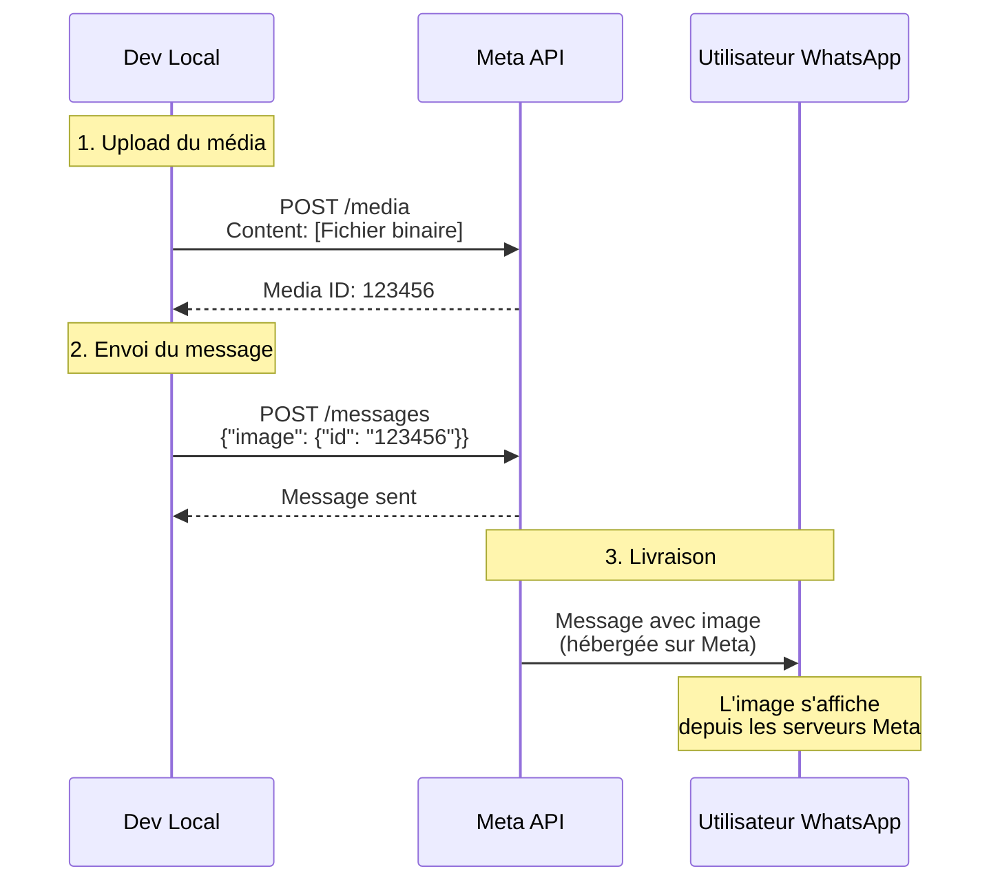

# WhatsApp Media en Développement Local - Comment ça marche vraiment

## Vue d'ensemble

En développement local, l'envoi de médias WhatsApp fonctionne **sans exposer d'URLs locales**. Voici pourquoi et comment.

## Le processus en deux étapes

### Étape 1 : Upload vers les serveurs Meta (✅ Fonctionne en local)

```
Votre serveur local → API WhatsApp Cloud → Serveurs Meta
     (localhost)         (graph.facebook.com)
```

1. Votre application lit le fichier depuis le système local
2. Elle envoie le fichier directement aux serveurs Meta via l'API
3. Meta stocke le fichier sur leurs serveurs
4. Meta retourne un **Media ID** unique

```php
// Ce qui se passe réellement
public function uploadMedia(string $filePath, string $mimeType): string
{
    // Le fichier est lu depuis votre disque local
    $fileContent = fopen($filePath, 'r');
    
    // Puis envoyé directement à Meta
    $response = $this->httpClient->post('https://graph.facebook.com/v17.0/{phone-number-id}/media', [
        'multipart' => [
            [
                'name' => 'file',
                'contents' => $fileContent,  // Contenu binaire du fichier
                'filename' => basename($filePath),
                'headers' => ['Content-Type' => $mimeType]
            ]
        ]
    ]);
    
    // Meta retourne un ID, pas une URL
    return $response['id']; // Ex: "1471650170467450"
}
```

### Étape 2 : Envoi du message avec le Media ID (✅ Fonctionne en local)

```php
// Utilisation du Media ID, pas d'URL
$payload = [
    'messaging_product' => 'whatsapp',
    'to' => '+22501234567',
    'type' => 'image',
    'image' => [
        'id' => '1471650170467450'  // Media ID retourné par Meta
        // PAS 'link' => 'http://localhost:8000/image.jpg' ❌
    ]
];
```

## Pourquoi ça fonctionne en local

### ✅ Ce qui fonctionne
- **Upload direct** : Le fichier est envoyé directement de votre serveur local vers Meta
- **Media ID** : Meta héberge le fichier et vous donne un identifiant
- **Pas d'URL locale** : L'utilisateur final télécharge depuis les serveurs Meta

### ❌ Ce qui ne fonctionnerait PAS
- Envoyer une URL locale comme `http://localhost:8000/image.jpg`
- Utiliser une URL sans HTTPS
- Exposer des fichiers via ngrok/localtunnel pour les médias

## Flux détaillé avec exemple



## Exemple pratique

### Upload réussi (logs)
```log
[2024-05-19 10:05:35] WhatsApp Upload: Starting upload for file: photo.jpg
[2024-05-19 10:05:35] WhatsApp Upload: File size: 250KB
[2024-05-19 10:05:36] WhatsApp API: Média uploadé - Media ID: 1471650170467450
[2024-05-19 10:05:36] WhatsApp Upload: Success!
```

### Message envoyé
```json
{
  "messaging_product": "whatsapp",
  "to": "+2250123456789",
  "type": "image",
  "image": {
    "id": "1471650170467450",
    "caption": "Voici la photo demandée"
  }
}
```

### Ce que voit l'utilisateur
- Une image téléchargée depuis `https://lookaside.fbsbx.com/...`
- PAS depuis `http://localhost:8000/...`

## Alternatives (non recommandées)

### 1. Utiliser ngrok/localtunnel (❌ Complexe)
```php
// Théoriquement possible mais non recommandé
$payload = [
    'image' => [
        'link' => 'https://abc123.ngrok.io/uploads/image.jpg'
    ]
];
```

**Problèmes** :
- Nécessite une exposition publique
- Problèmes de sécurité
- Lenteur et instabilité
- Gestion des certificats SSL

### 2. Hébergement externe (❌ Inutile)
- Upload vers S3, Cloudinary, etc.
- Puis envoi de l'URL

**Pourquoi c'est inutile** :
- Meta offre déjà l'hébergement gratuit
- Double upload = double latence
- Coûts supplémentaires

## Gestion des Media IDs

### Durée de vie
```php
class MediaManager {
    private $cache;
    
    public function getMediaId(string $filePath): string 
    {
        $cacheKey = 'media_' . md5_file($filePath);
        
        // Les Media IDs sont valides 30 jours
        if ($cachedId = $this->cache->get($cacheKey)) {
            return $cachedId;
        }
        
        $mediaId = $this->uploadToMeta($filePath);
        $this->cache->set($cacheKey, $mediaId, 30 * 24 * 3600);
        
        return $mediaId;
    }
}
```

### Réutilisation
```php
// Un même Media ID peut être utilisé plusieurs fois
$mediaId = '1471650170467450';

// Envoi à plusieurs destinataires
foreach ($recipients as $recipient) {
    $this->sendMediaMessage($recipient, 'image', $mediaId);
}
```

## Webhooks et localtunnel

### Différence importante
- **Webhooks** : DOIVENT être exposés publiquement (via localtunnel)
- **Médias** : N'ont PAS besoin d'être exposés

```bash
# Nécessaire pour les webhooks
lt --port 8000 --subdomain whatsapp-webhook

# PAS nécessaire pour les médias
# Les médias sont uploadés directement vers Meta
```

## Vérification et debug

### 1. Vérifier l'upload
```bash
# Test avec curl
curl -X POST https://graph.facebook.com/v17.0/YOUR_PHONE_NUMBER_ID/media \
  -H "Authorization: Bearer YOUR_ACCESS_TOKEN" \
  -F "messaging_product=whatsapp" \
  -F "file=@/path/to/image.jpg;type=image/jpeg"

# Réponse attendue
{
  "id": "1471650170467450"
}
```

### 2. Vérifier le Media ID
```bash
# Obtenir les infos du média
curl -X GET "https://graph.facebook.com/v17.0/1471650170467450" \
  -H "Authorization: Bearer YOUR_ACCESS_TOKEN"

# Réponse
{
  "id": "1471650170467450",
  "mime_type": "image/jpeg",
  "sha256": "...",
  "file_size": 256789,
  "messaging_product": "whatsapp"
}
```

### 3. Logs à surveiller
```php
// Dans votre application
$this->logger->info('WhatsApp Media Upload', [
    'action' => 'upload',
    'file' => $filePath,
    'size' => filesize($filePath),
    'mime_type' => $mimeType,
    'media_id' => $mediaId,
    'duration' => $uploadTime
]);
```

## Checklist de développement

### ✅ Ce qui doit marcher
- [ ] Upload du fichier vers Meta API
- [ ] Réception du Media ID
- [ ] Envoi du message avec le Media ID
- [ ] Logs et gestion d'erreurs

### ❌ Ce qui n'est PAS nécessaire
- [ ] ~~Exposer les médias via ngrok~~
- [ ] ~~Créer des URLs publiques pour les images~~
- [ ] ~~Configurer un CDN local~~
- [ ] ~~Gérer des certificats SSL pour les médias~~

## Problèmes courants et solutions

### "L'image ne s'affiche pas"
**Causes possibles** :
1. Media ID expiré (> 30 jours)
2. Format non supporté
3. Fichier corrompu
4. Erreur d'upload non détectée

**Solution** :
```php
try {
    $mediaId = $this->uploadMedia($filePath, $mimeType);
    $this->verifyMediaId($mediaId); // Vérifier que l'upload est réussi
} catch (\Exception $e) {
    $this->logger->error('Upload failed', ['error' => $e->getMessage()]);
    throw $e;
}
```

### "Network error" lors de l'upload
**Causes** :
1. Fichier trop gros
2. Timeout de connexion
3. Proxy/firewall bloquant

**Solution** :
```php
$this->httpClient = new Client([
    'timeout' => 300, // 5 minutes pour les gros fichiers
    'connect_timeout' => 30,
    'verify' => false // Pour dev local seulement
]);
```

## Conclusion

En développement local, l'envoi de médias WhatsApp :
- ✅ **Fonctionne parfaitement** sans configuration spéciale
- ✅ **N'a pas besoin** d'URLs publiques
- ✅ **Utilise** le système de Media ID de Meta
- ✅ **Est identique** à la production

Les médias sont hébergés sur les serveurs Meta, pas sur votre serveur local, donc tout fonctionne naturellement même en développement local !

## Ressources

- [Documentation officielle Meta - Upload Media](https://developers.facebook.com/docs/whatsapp/cloud-api/reference/media#upload-media)
- [Guide des Media IDs](https://developers.facebook.com/docs/whatsapp/cloud-api/guides/send-messages#media-messages)
- [Limites et formats supportés](https://developers.facebook.com/docs/whatsapp/cloud-api/reference/media#supported-media-types)