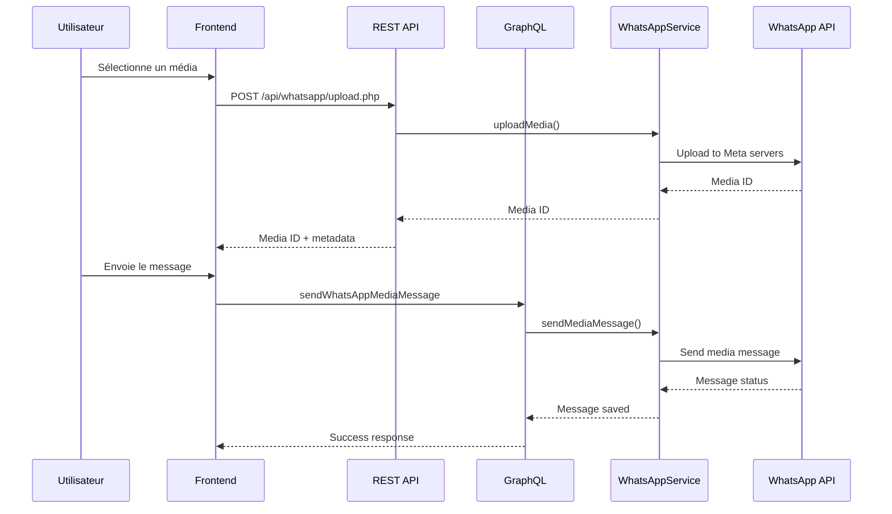

# Guide du Système d'Envoi de Médias WhatsApp

## Vue d'ensemble

Ce document décrit le système complet d'envoi de médias (images, vidéos, documents, audio) via WhatsApp Business API dans le contexte de la fenêtre de conversation de 24 heures.

## Table des matières

1. [Comprendre la fenêtre de 24 heures](#comprendre-la-fenêtre-de-24-heures)
2. [Architecture du système](#architecture-du-système)
3. [Types de médias supportés](#types-de-médias-supportés)
4. [Flux de travail](#flux-de-travail)
5. [Composants techniques](#composants-techniques)
6. [API et endpoints](#api-et-endpoints)
7. [Gestion des erreurs](#gestion-des-erreurs)
8. [Exemples d'utilisation](#exemples-dutilisation)
9. [Limitations et considérations](#limitations-et-considérations)

## Comprendre la fenêtre de 24 heures

### Principe de base
- WhatsApp Business API permet l'envoi gratuit de messages pendant 24 heures après la dernière interaction de l'utilisateur
- Une interaction peut être :
  - Une réponse à un message template envoyé
  - Un message initié par l'utilisateur
  - Une réponse à un message interactif

### Cas d'usage dans notre système
1. **Réponse à un template** : L'utilisateur répond à un message template envoyé par notre système
2. **Contact spontané** : L'utilisateur contacte notre numéro WhatsApp Business de sa propre initiative
3. **Conversation continue** : Messages échangés dans la fenêtre de 24h active

## Architecture du système

### Composants Backend

```
┌─────────────────────┐
│  WhatsApp Cloud API │
└─────────┬───────────┘
          │
┌─────────▼───────────┐
│ WhatsAppApiClient   │
│ (Guzzle HTTP)       │
└─────────┬───────────┘
          │
┌─────────▼───────────┐
│ WhatsAppService     │
│ (Business Logic)    │
└─────────┬───────────┘
          │
┌─────────▼───────────┐
│ GraphQL Resolvers   │
│ & REST Endpoints    │
└─────────┬───────────┘
          │
┌─────────▼───────────┐
│ Frontend Components │
│ (Vue.js)            │
└─────────────────────┘
```

### Flux de données



## Types de médias supportés

### Images
- **Formats** : JPEG, PNG
- **Taille max** : 5 MB
- **Usage** : Photos, captures d'écran, infographies

### Vidéos
- **Formats** : MP4, 3GP
- **Taille max** : 16 MB
- **Codec** : H.264 video, AAC audio recommandés

### Audio
- **Formats** : AAC, MP4, MPEG, AMR, OGG (Opus)
- **Taille max** : 16 MB
- **Usage** : Messages vocaux, notifications audio

### Documents
- **Formats** : PDF, DOC(X), XLS(X), PPT(X), TXT
- **Taille max** : 100 MB
- **Usage** : Factures, rapports, présentations

### Stickers
- **Format** : WEBP (statique ou animé)
- **Taille max** : 500 KB
- **Dimensions** : 512x512 pixels

## Flux de travail

### Expérience utilisateur améliorée

Le nouveau système offre une expérience en deux étapes distinctes avec un feedback visuel clair :

1. **Étape 1 : Upload du fichier**
   - L'utilisateur sélectionne un fichier et clique sur "Upload sur WhatsApp"
   - Une bannière bleue apparaît avec un spinner indiquant l'upload en cours
   - Une fois l'upload terminé, la bannière devient verte avec l'icône "cloud_done"
   - Le bouton "Envoyer le message" devient disponible

2. **Étape 2 : Envoi du message**
   - L'utilisateur peut ajouter une légende (optionnel)
   - Il clique sur "Envoyer le message"
   - Une nouvelle bannière bleue indique l'envoi en cours
   - Une fois envoyé, la bannière devient verte avec l'icône "done"
   - Un bouton "Nouveau message" permet de recommencer

### 1. Détection de la fenêtre de conversation

```php
// WhatsAppService.php
private function isWithin24HourWindow(string $phoneNumber): bool {
    $lastMessage = $this->messageRepository->findLastMessageByPhoneNumber($phoneNumber);
    
    if (!$lastMessage) {
        return false;
    }
    
    $lastInteraction = $lastMessage->getTimestamp();
    $now = new \DateTime();
    $diff = $now->diff($lastInteraction);
    
    return $diff->h < 24 && $diff->days === 0;
}
```

### 2. Upload du média (Étape 1)

```php
// WhatsAppService.php
public function uploadMedia(User $user, string $filePath, string $mimeType): string
{
    try {
        return $this->apiClient->uploadMedia($filePath, $mimeType);
    } catch (\Exception $e) {
        $this->logger->error('Erreur upload média WhatsApp', [
            'user_id' => $user->getId(),
            'file' => $filePath,
            'error' => $e->getMessage()
        ]);
        throw $e;
    }
}
```

### 3. Envoi du message avec média (Étape 2)

```php
// WhatsAppService.php
public function sendMediaMessage(
    User $user,
    string $recipient,
    string $type,
    string $mediaIdOrUrl,
    ?string $caption = null
): array {
    // Vérifier la fenêtre de 24h
    if (!$this->isWithin24HourWindow($recipient)) {
        throw new \Exception("Hors fenêtre de conversation de 24h");
    }
    
    $payload = [
        'messaging_product' => 'whatsapp',
        'recipient_type' => 'individual',
        'to' => $this->normalizePhoneNumber($recipient),
        'type' => $type,
        $type => []
    ];
    
    // Ajouter l'ID ou l'URL du média
    if (strpos($mediaIdOrUrl, 'http') === 0) {
        $payload[$type]['link'] = $mediaIdOrUrl;
    } else {
        $payload[$type]['id'] = $mediaIdOrUrl;
    }
    
    // Ajouter la légende si applicable
    if ($caption !== null && in_array($type, ['image', 'video', 'document'])) {
        $payload[$type]['caption'] = $caption;
    }
    
    $response = $this->apiClient->sendMessage($payload);
    
    // Sauvegarder dans l'historique
    $this->saveMessage(
        $user,
        $recipient,
        WhatsAppMessageHistory::DIRECTION_OUTBOUND,
        $this->mapMediaTypeToHistoryType($type),
        [
            'media_id' => $mediaIdOrUrl,
            'caption' => $caption
        ],
        $response['messages'][0]['id'] ?? null
    );
    
    return $response;
}
```

## Composants techniques

### Frontend - WhatsAppMediaUpload.vue

Le composant a été entièrement refondu pour offrir une expérience utilisateur optimale en deux étapes distinctes : Upload puis Envoi.

```vue
<template>
  <div class="whatsapp-media-upload">
    <!-- Zone de sélection de fichier -->
    <q-file 
      v-model="selectedFile" 
      :accept="acceptedMimeTypes"
      label="Sélectionner un fichier"
      filled
      clearable
      max-file-size="5242880"
      @rejected="onRejected"
    >
      <template v-slot:prepend>
        <q-icon name="attach_file" />
      </template>
    </q-file>
    
    <!-- Type de média -->
    <q-select 
      v-model="mediaType" 
      :options="mediaTypes" 
      label="Type de média"
      filled
    />
    
    <!-- Légende optionnelle -->
    <q-input 
      v-model="caption" 
      label="Légende (optionnel)" 
      filled
      type="textarea"
    />
    
    <!-- Bannière de statut d'upload -->
    <q-banner v-if="uploadState !== 'idle'" 
      :class="{
        'bg-blue-1': uploadState === 'uploading',
        'bg-green-1': uploadState === 'uploaded',
        'bg-red-1': uploadState === 'error'
      }"
      class="q-mt-md"
    >
      <template v-slot:avatar>
        <q-spinner-dots v-if="uploadState === 'uploading'" color="primary" />
        <q-icon v-else-if="uploadState === 'uploaded'" name="cloud_done" color="positive" />
        <q-icon v-else-if="uploadState === 'error'" name="error" color="negative" />
      </template>
      {{ statusMessages[uploadState] }}
    </q-banner>
    
    <!-- Bannière de statut d'envoi -->
    <q-banner v-if="sendState !== 'idle'" 
      :class="{
        'bg-blue-1': sendState === 'sending',
        'bg-green-1': sendState === 'sent',
        'bg-red-1': sendState === 'error'
      }"
      class="q-mt-md"
    >
      <template v-slot:avatar>
        <q-spinner-dots v-if="sendState === 'sending'" color="primary" />
        <q-icon v-else-if="sendState === 'sent'" name="done" color="positive" />
        <q-icon v-else-if="sendState === 'error'" name="error" color="negative" />
      </template>
      {{ statusMessages[sendState] }}
    </q-banner>
    
    <!-- Boutons d'action -->
    <div class="q-mt-md q-gutter-sm">
      <q-btn 
        @click="uploadFile" 
        label="Upload sur WhatsApp" 
        color="primary"
        :disable="!selectedFile || uploadState === 'uploading' || uploadState === 'uploaded'"
        icon="cloud_upload"
      />
      
      <q-btn 
        @click="sendMedia" 
        label="Envoyer le message" 
        color="positive"
        :disable="uploadState !== 'uploaded' || sendState === 'sending'"
        icon="send"
      />
    </div>
    
    <!-- Informations sur l'erreur -->
    <q-card v-if="errorMessage" class="q-mt-md bg-red-1">
      <q-card-section>
        <div class="text-h6">Erreur</div>
        <div>{{ errorMessage }}</div>
      </q-card-section>
    </q-card>
  </div>
</template>

<script>
import { ref, computed } from 'vue'
import { api } from '@/services/api'
import { useQuasar } from 'quasar'

export default {
  name: 'WhatsAppMediaUpload',
  props: {
    recipient: {
      type: String,
      required: true
    }
  },
  setup(props, { emit }) {
    const $q = useQuasar()
    const selectedFile = ref(null)
    const mediaType = ref('image')
    const caption = ref('')
    const mediaId = ref(null)
    
    // États séparés pour l'upload et l'envoi
    const uploadState = ref('idle') // idle, uploading, uploaded, error
    const sendState = ref('idle')   // idle, sending, sent, error
    const errorMessage = ref('')
    
    const statusMessages = {
      idle: '',
      uploading: 'Upload du fichier en cours...',
      uploaded: 'Fichier uploadé avec succès sur WhatsApp',
      sending: 'Envoi du message en cours...',
      sent: 'Message envoyé avec succès',
      error: 'Une erreur est survenue'
    }
    
    const mediaTypes = [
      { label: 'Image', value: 'image' },
      { label: 'Vidéo', value: 'video' },
      { label: 'Document', value: 'document' }
    ]
    
    const acceptedMimeTypes = computed(() => {
      switch (mediaType.value) {
        case 'image':
          return 'image/*'
        case 'video':
          return 'video/*'
        case 'document':
          return '.pdf,.doc,.docx,.xls,.xlsx,.ppt,.pptx'
        default:
          return '*'
      }
    })
    
    const uploadFile = async () => {
      if (!selectedFile.value) return
      
      const formData = new FormData()
      formData.append('file', selectedFile.value)
      formData.append('type', mediaType.value)
      formData.append('caption', caption.value)
      
      uploadState.value = 'uploading'
      errorMessage.value = ''
      
      try {
        const response = await api.post('/api/whatsapp/upload.php', formData, {
          withCredentials: true,
          headers: {
            'Content-Type': 'multipart/form-data'
          }
        })
        
        if (response.data.success) {
          mediaId.value = response.data.media_id
          uploadState.value = 'uploaded'
          $q.notify({
            type: 'positive',
            message: 'Fichier uploadé avec succès'
          })
        } else {
          throw new Error(response.data.error || 'Erreur lors de l\'upload')
        }
      } catch (error) {
        uploadState.value = 'error'
        errorMessage.value = error.message
        $q.notify({
          type: 'negative',
          message: 'Erreur lors de l\'upload: ' + error.message
        })
      }
    }
    
    const sendMedia = async () => {
      if (!mediaId.value) return
      
      sendState.value = 'sending'
      errorMessage.value = ''
      
      const mutation = `
        mutation SendWhatsAppMediaMessage($recipient: String!, $type: String!, $mediaIdOrUrl: String!, $caption: String) {
          sendWhatsAppMediaMessage(
            recipient: $recipient
            type: $type
            mediaIdOrUrl: $mediaIdOrUrl
            caption: $caption
          ) {
            id
            phone_number
            message_type
            content
            media_url
            status
            created_at
          }
        }
      `
      
      try {
        const response = await api.post('/graphql.php', {
          query: mutation,
          variables: {
            recipient: props.recipient,
            type: mediaType.value,
            mediaIdOrUrl: mediaId.value,
            caption: caption.value || null
          }
        }, {
          withCredentials: true
        })
        
        if (response.data.errors) {
          throw new Error(response.data.errors[0].message)
        }
        
        sendState.value = 'sent'
        emit('message-sent', response.data.data.sendWhatsAppMediaMessage)
        
        // Réinitialiser après succès
        setTimeout(() => {
          resetComponent()
        }, 2000)
        
        $q.notify({
          type: 'positive',
          message: 'Message envoyé avec succès'
        })
      } catch (error) {
        sendState.value = 'error'
        errorMessage.value = error.message
        $q.notify({
          type: 'negative',
          message: 'Erreur lors de l\'envoi: ' + error.message
        })
      }
    }
    
    const resetComponent = () => {
      selectedFile.value = null
      mediaType.value = 'image'
      caption.value = ''
      mediaId.value = null
      uploadState.value = 'idle'
      sendState.value = 'idle'
      errorMessage.value = ''
    }
    
    const onRejected = (rejectedEntries) => {
      $q.notify({
        type: 'negative',
        message: 'Fichier rejeté: ' + rejectedEntries[0].failedPropValidation
      })
    }
    
    return {
      selectedFile,
      mediaType,
      caption,
      uploadState,
      sendState,
      errorMessage,
      statusMessages,
      mediaTypes,
      acceptedMimeTypes,
      uploadFile,
      sendMedia,
      onRejected
    }
  }
}
</script>

<style scoped>
.whatsapp-media-upload {
  max-width: 500px;
  margin: 0 auto;
}
</style>
```

### Backend - REST Upload Endpoint

```php
// /public/api/whatsapp/upload.php
<?php

// CORS Headers
header("Access-Control-Allow-Origin: http://localhost:5173");
header("Access-Control-Allow-Credentials: true");
header("Access-Control-Allow-Methods: POST, OPTIONS");

// Créer le conteneur DI
$container = new \App\GraphQL\DIContainer();

try {
    // Vérifier l'authentification
    $contextFactory = $container->get(GraphQLContextFactory::class);
    $context = $contextFactory->create();
    $user = $context->getCurrentUser();
    
    if (!$user) {
        http_response_code(401);
        echo json_encode(['error' => 'Utilisateur non authentifié']);
        exit();
    }
    
    // Vérifier le fichier uploadé
    if (!isset($_FILES['file'])) {
        http_response_code(400);
        echo json_encode(['error' => 'Aucun fichier uploadé']);
        exit();
    }
    
    $uploadedFile = $_FILES['file'];
    $filePath = $uploadedFile['tmp_name'];
    $mimeType = $uploadedFile['type'];
    
    // Valider le type MIME et la taille
    validateFile($mimeType, filesize($filePath));
    
    // Upload via WhatsApp service
    $whatsappService = $container->get(WhatsAppServiceInterface::class);
    $mediaId = $whatsappService->uploadMedia($user, $filePath, $mimeType);
    
    // Retourner la réponse
    echo json_encode([
        'success' => true,
        'mediaId' => $mediaId,
        'fileName' => $uploadedFile['name'],
        'mimeType' => $mimeType,
        'mediaType' => getMediaType($mimeType)
    ]);
    
} catch (\Exception $e) {
    http_response_code(500);
    echo json_encode(['error' => $e->getMessage()]);
}
```

### GraphQL Mutations

```graphql
type Mutation {
  sendWhatsAppMediaMessage(
    recipient: String!
    type: String!
    mediaIdOrUrl: String!
    caption: String
  ): WhatsAppMessageHistory!
}

type WhatsAppMessageHistory {
  id: ID!
  wabaMessageId: String
  phoneNumber: String!
  direction: String!
  type: String!
  content: String
  status: String!
  mediaId: String
  caption: String
  timestamp: String!
}
```

## API et endpoints

### 1. Upload de média

**Endpoint** : `POST /api/whatsapp/upload.php`

**Headers** :
```
Content-Type: multipart/form-data
Authorization: Bearer {token} (ou cookie de session)
```

**Body** :
```
file: [Fichier binaire]
```

**Réponse** :
```json
{
  "success": true,
  "mediaId": "1471650170467450",
  "fileName": "document.pdf",
  "mimeType": "application/pdf",
  "mediaType": "document"
}
```

### 2. Envoi de message avec média

**GraphQL Mutation** :
```graphql
mutation SendMediaMessage {
  sendWhatsAppMediaMessage(
    recipient: "+2250701020304"
    type: "image"
    mediaIdOrUrl: "1471650170467450"
    caption: "Voici l'image demandée"
  ) {
    id
    wabaMessageId
    status
    timestamp
  }
}
```

## Gestion des erreurs

### Erreurs d'upload

```typescript
// Frontend error handling
function handleUploadError(error: any) {
  if (error.response?.status === 413) {
    $q.notify({
      type: 'negative',
      message: 'Fichier trop volumineux'
    });
  } else if (error.response?.status === 415) {
    $q.notify({
      type: 'negative',
      message: 'Type de fichier non supporté'
    });
  } else {
    $q.notify({
      type: 'negative',
      message: error.message || 'Erreur lors de l\'upload'
    });
  }
}
```

### Erreurs de fenêtre de 24h

```php
// Backend validation
if (!$this->isWithin24HourWindow($recipient)) {
    throw new BusinessException(
        "Impossible d'envoyer un message hors de la fenêtre de 24h. " .
        "Utilisez un template pour réinitier la conversation."
    );
}
```

## Exemples d'utilisation

### Cas 1 : Réponse avec image à une demande (Workflow en 2 étapes)

```typescript
// Scénario : L'utilisateur demande une photo de produit
// Dans le composant Vue.js

// Étape 1 : Upload du fichier
async function uploadProductImage() {
  const formData = new FormData();
  formData.append('file', productImageFile.value);
  formData.append('type', 'image');
  
  try {
    const response = await api.post('/api/whatsapp/upload.php', formData, {
      withCredentials: true
    });
    
    if (response.data.success) {
      productMediaId.value = response.data.media_id;
      $q.notify({
        type: 'positive',
        message: 'Image uploadée avec succès'
      });
    }
  } catch (error) {
    $q.notify({
      type: 'negative',
      message: 'Erreur lors de l\'upload'
    });
  }
}

// Étape 2 : Envoi du message
async function sendProductImageMessage() {
  const mutation = `
    mutation SendProductImage($recipient: String!, $mediaId: String!, $caption: String) {
      sendWhatsAppMediaMessage(
        recipient: $recipient
        type: "image"
        mediaIdOrUrl: $mediaId
        caption: $caption
      ) {
        id
        status
      }
    }
  `;
  
  try {
    const response = await api.post('/graphql.php', {
      query: mutation,
      variables: {
        recipient: customerPhone.value,
        mediaId: productMediaId.value,
        caption: `Photo du produit #${productId}\nPrix: 15,000 FCFA`
      }
    });
    
    $q.notify({
      type: 'positive',
      message: 'Message envoyé avec succès'
    });
  } catch (error) {
    $q.notify({
      type: 'negative',
      message: 'Erreur lors de l\'envoi'
    });
  }
}
```

### Cas 2 : Envoi de document avec workflow interactif

```vue
<template>
  <div class="invoice-sender">
    <!-- Status de l'upload -->
    <q-banner v-if="uploadStatus === 'completed'" class="bg-green-1">
      <template v-slot:avatar>
        <q-icon name="cloud_done" color="positive" />
      </template>
      Facture uploadée avec succès !
    </q-banner>
    
    <!-- Status de l'envoi -->
    <q-banner v-if="sendStatus === 'completed'" class="bg-green-1">
      <template v-slot:avatar>
        <q-icon name="done_all" color="positive" />
      </template>
      Facture envoyée au client !
    </q-banner>
    
    <!-- Actions -->
    <q-btn 
      v-if="!invoiceMediaId"
      @click="uploadInvoice" 
      label="1. Uploader la facture"
      color="primary"
      :loading="uploadStatus === 'loading'"
    />
    
    <q-btn 
      v-if="invoiceMediaId && sendStatus !== 'completed'"
      @click="sendInvoice"
      label="2. Envoyer au client"
      color="positive"
      :loading="sendStatus === 'loading'"
    />
  </div>
</template>

<script setup>
import { ref } from 'vue';
import { useQuasar } from 'quasar';
import { api } from '@/services/api';

const $q = useQuasar();
const invoiceMediaId = ref(null);
const uploadStatus = ref('idle');
const sendStatus = ref('idle');

async function uploadInvoice() {
  uploadStatus.value = 'loading';
  
  const formData = new FormData();
  formData.append('file', invoiceFile.value);
  formData.append('type', 'document');
  
  try {
    const response = await api.post('/api/whatsapp/upload.php', formData);
    invoiceMediaId.value = response.data.media_id;
    uploadStatus.value = 'completed';
  } catch (error) {
    uploadStatus.value = 'error';
    $q.notify({
      type: 'negative',
      message: 'Erreur lors de l\'upload de la facture'
    });
  }
}

async function sendInvoice() {
  sendStatus.value = 'loading';
  
  const mutation = `
    mutation SendInvoice($recipient: String!, $mediaId: String!, $caption: String) {
      sendWhatsAppMediaMessage(
        recipient: $recipient
        type: "document"
        mediaIdOrUrl: $mediaId
        caption: $caption
      ) {
        id
        status
      }
    }
  `;
  
  try {
    await api.post('/graphql.php', {
      query: mutation,
      variables: {
        recipient: customerPhone.value,
        mediaId: invoiceMediaId.value,
        caption: `Facture #${orderId}\nMerci pour votre achat!`
      }
    });
    
    sendStatus.value = 'completed';
    $q.notify({
      type: 'positive',
      message: 'Facture envoyée avec succès'
    });
  } catch (error) {
    sendStatus.value = 'error';
    $q.notify({
      type: 'negative',
      message: 'Erreur lors de l\'envoi'
    });
  }
}
</script>
```

### Cas 3 : Workflow complet avec gestion d'erreurs

```typescript
// Composable pour la gestion des médias WhatsApp
export function useWhatsAppMedia() {
  const uploadState = ref<'idle' | 'uploading' | 'uploaded' | 'error'>('idle');
  const sendState = ref<'idle' | 'sending' | 'sent' | 'error'>('idle');
  const mediaId = ref<string | null>(null);
  const error = ref<string>('');
  
  async function uploadMedia(file: File, type: string) {
    uploadState.value = 'uploading';
    error.value = '';
    
    const formData = new FormData();
    formData.append('file', file);
    formData.append('type', type);
    
    try {
      const response = await api.post('/api/whatsapp/upload.php', formData, {
        withCredentials: true,
        onUploadProgress: (progressEvent) => {
          const percentCompleted = Math.round(
            (progressEvent.loaded * 100) / progressEvent.total
          );
          console.log(`Upload: ${percentCompleted}%`);
        }
      });
      
      if (response.data.success) {
        mediaId.value = response.data.media_id;
        uploadState.value = 'uploaded';
        return response.data.media_id;
      } else {
        throw new Error(response.data.error);
      }
    } catch (e) {
      uploadState.value = 'error';
      error.value = e.message;
      throw e;
    }
  }
  
  async function sendMediaMessage(recipient: string, type: string, caption?: string) {
    if (!mediaId.value) {
      throw new Error('Aucun média uploadé');
    }
    
    sendState.value = 'sending';
    error.value = '';
    
    const mutation = `
      mutation SendWhatsAppMedia($recipient: String!, $type: String!, $mediaId: String!, $caption: String) {
        sendWhatsAppMediaMessage(
          recipient: $recipient
          type: $type
          mediaIdOrUrl: $mediaId
          caption: $caption
        ) {
          id
          status
          timestamp
        }
      }
    `;
    
    try {
      const response = await api.post('/graphql.php', {
        query: mutation,
        variables: {
          recipient,
          type,
          mediaId: mediaId.value,
          caption
        }
      });
      
      if (response.data.errors) {
        throw new Error(response.data.errors[0].message);
      }
      
      sendState.value = 'sent';
      return response.data.data.sendWhatsAppMediaMessage;
    } catch (e) {
      sendState.value = 'error';
      error.value = e.message;
      throw e;
    }
  }
  
  function reset() {
    uploadState.value = 'idle';
    sendState.value = 'idle';
    mediaId.value = null;
    error.value = '';
  }
  
  return {
    uploadState,
    sendState,
    mediaId,
    error,
    uploadMedia,
    sendMediaMessage,
    reset
  };
}
```

## Limitations et considérations

### Limitations techniques

1. **Tailles maximales** :
   - Images : 5 MB
   - Vidéos/Audio : 16 MB
   - Documents : 100 MB
   - Stickers : 500 KB

2. **Formats supportés** :
   - Vérifier la liste à jour sur [Meta Developers](https://developers.facebook.com/docs/whatsapp/cloud-api/reference/media)

3. **Durée de vie des médias** :
   - Les media IDs expirent après 30 jours
   - Les URLs de téléchargement expirent après 15 minutes

### Considérations de performance

1. **Upload asynchrone** :
   ```typescript
   // Recommandé : Upload en arrière-plan
   const uploadQueue = new Queue('media-uploads');
   uploadQueue.process(async (job) => {
     const { filePath, mimeType } = job.data;
     return await uploadMedia(filePath, mimeType);
   });
   ```

2. **Mise en cache** :
   ```php
   // Cache des media IDs fréquemment utilisés
   $cacheKey = 'media_' . md5_file($filePath);
   if ($cachedId = $cache->get($cacheKey)) {
       return $cachedId;
   }
   ```

3. **Compression** :
   ```typescript
   // Compression automatique des images
   async function optimizeImage(file: File): Promise<File> {
     if (file.size > 1024 * 1024) { // > 1MB
       return await compressImage(file, { quality: 0.8 });
     }
     return file;
   }
   ```

### Bonnes pratiques

1. **Experience utilisateur en deux étapes** :
   - Séparer clairement l'upload de l'envoi
   - Fournir un feedback visuel pour chaque étape
   - Permettre la modification de la légende entre les deux étapes
   - Offrir un bouton "Nouveau message" après envoi réussi

2. **Validation côté client** :
   - Vérifier le type et la taille avant upload
   - Afficher une prévisualisation
   - Informer l'utilisateur des limitations
   - Utiliser des bannières colorées pour les états (bleu=en cours, vert=succès, rouge=erreur)

3. **Gestion d'erreurs robuste** :
   - Retry automatique en cas d'échec
   - Messages d'erreur clairs et contextuels
   - Conserver l'état pour permettre de réessayer
   - Afficher le Media ID après upload réussi

4. **Interface intuitive** :
   - Désactiver les boutons selon l'état du workflow
   - Utiliser des icônes parlantes (cloud_upload, send, etc.)
   - Afficher des spinners pendant les opérations
   - Réinitialiser automatiquement après succès

5. **Suivi et analyse** :
   - Logger tous les uploads avec leurs Media IDs
   - Mesurer les temps de réponse de chaque étape
   - Monitorer les taux d'échec par type de média
   - Tracer le parcours utilisateur complet

## Webhooks et mises à jour de statut

### Réception des mises à jour

```php
// WhatsAppWebhookService.php
public function handleStatusUpdate(array $status): void
{
    $wabaMessageId = $status['id'];
    $newStatus = $status['status'];
    
    // Mettre à jour le message dans l'historique
    $message = $this->messageRepository->findOneBy([
        'wabaMessageId' => $wabaMessageId
    ]);
    
    if ($message !== null) {
        $message->setStatus($this->mapWhatsAppStatus($newStatus));
        
        // Traiter les erreurs spécifiques aux médias
        if ($newStatus === 'failed' && $message->getType() !== 'text') {
            $this->handleMediaError($message, $status['errors'] ?? []);
        }
        
        $this->messageRepository->save($message);
    }
}
```

### Gestion des erreurs de média

```php
private function handleMediaError(WhatsAppMessageHistory $message, array $errors): void
{
    $errorCode = $errors[0]['code'] ?? null;
    
    switch ($errorCode) {
        case 131051: // Media download failed
            $this->logger->error('Media download failed', [
                'message_id' => $message->getId(),
                'media_id' => $message->getMediaId()
            ]);
            // Tenter de re-uploader le média
            $this->retryMediaUpload($message);
            break;
            
        case 131052: // Media upload failed
            $this->logger->error('Media upload failed', [
                'message_id' => $message->getId()
            ]);
            // Notifier l'utilisateur
            $this->notifyUploadFailure($message);
            break;
    }
}
```

## Sécurité

### Validation des fichiers

```php
function validateFile(string $mimeType, int $size): void
{
    // Liste blanche des types MIME
    $allowedTypes = [
        'image/jpeg', 'image/png',
        'video/mp4', 'video/3gp',
        'audio/aac', 'audio/mp4', 'audio/mpeg',
        'application/pdf',
        // ... autres types
    ];
    
    if (!in_array($mimeType, $allowedTypes)) {
        throw new \Exception('Type de fichier non autorisé');
    }
    
    // Vérifier le contenu réel du fichier
    $finfo = finfo_open(FILEINFO_MIME_TYPE);
    $realMimeType = finfo_file($finfo, $filePath);
    finfo_close($finfo);
    
    if ($realMimeType !== $mimeType) {
        throw new \Exception('Type de fichier incorrect');
    }
    
    // Vérifier la taille
    $maxSizes = [
        'image' => 5 * 1024 * 1024,
        'video' => 16 * 1024 * 1024,
        'audio' => 16 * 1024 * 1024,
        'document' => 100 * 1024 * 1024
    ];
    
    $type = explode('/', $mimeType)[0];
    if ($size > ($maxSizes[$type] ?? 0)) {
        throw new \Exception('Fichier trop volumineux');
    }
}
```

### Authentification et autorisations

```php
// Vérifier les permissions de l'utilisateur
if (!$user->canSendWhatsAppMessages()) {
    throw new UnauthorizedException('Non autorisé à envoyer des messages WhatsApp');
}

// Vérifier les crédits/quotas
if (!$this->quotaService->hasCredits($user, 'whatsapp_media')) {
    throw new QuotaExceededException('Quota de médias dépassé');
}
```

## Conclusion

Le système d'envoi de médias WhatsApp a été conçu et amélioré pour offrir :

1. **Une expérience utilisateur transparente** :
   - Workflow en deux étapes claires (Upload → Envoi)
   - Feedback visuel distinct pour chaque étape
   - Interface intuitive avec états visuels

2. **Robustesse technique** :
   - Gestion d'erreurs complète à chaque étape
   - Validation stricte des fichiers
   - Support de tous les types de médias WhatsApp

3. **Performance optimisée** :
   - Upload asynchrone avec barre de progression
   - Mise en cache des Media IDs
   - Réinitialisation automatique après succès

4. **Sécurité renforcée** :
   - Authentification par session
   - Validation MIME type côté serveur
   - Headers CORS configurés correctement

### Améliorations récentes

- Séparation claire des étapes d'upload et d'envoi
- Bannières de statut avec codes couleur intuitifs
- Gestion d'état granulaire (uploadState vs sendState)
- Boutons d'action contextuels selon l'état
- Notifications Quasar pour un feedback immédiat

### Ressources

- [Documentation WhatsApp Cloud API](https://developers.facebook.com/docs/whatsapp/cloud-api)
- [Guide des médias WhatsApp](https://developers.facebook.com/docs/whatsapp/cloud-api/reference/media)
- [Formats de fichiers supportés](https://developers.facebook.com/docs/whatsapp/cloud-api/reference/media#supported-media-types)

Pour toute question ou suggestion d'amélioration, référez-vous à ce guide ou consultez la documentation officielle de Meta.