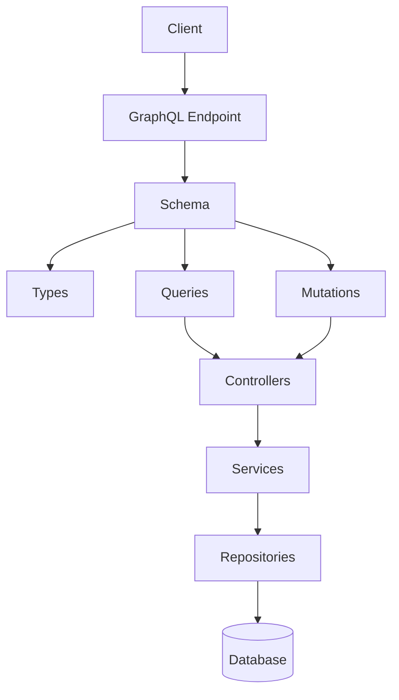

# Intégration GraphQL - Application de Segmentation de Numéros de Téléphone

## Vue d'ensemble

L'intégration GraphQL a été implémentée pour offrir une API moderne et flexible, permettant aux clients de demander exactement les données dont ils ont besoin. Cette approche complète l'API REST existante et offre une alternative plus puissante pour les intégrations complexes.

## Architecture

L'implémentation GraphQL repose sur la bibliothèque **GraphQLite**, qui permet de créer des API GraphQL en utilisant des annotations PHP. L'architecture suit une approche en couches, s'intégrant parfaitement avec l'architecture existante de l'application :



### Composants clés

1. **Point d'entrée GraphQL** (`/graphql.php`)

   - Point d'entrée unique pour toutes les requêtes GraphQL
   - Gestion des requêtes HTTP et des réponses
   - Support CORS pour les requêtes cross-origin

2. **Configuration GraphQLite** (`src/GraphQL/GraphQLiteConfiguration.php`)

   - Configuration du schéma GraphQL
   - Enregistrement des types, requêtes et mutations
   - Injection de dépendances via un conteneur simple

3. **Types GraphQL** (`src/GraphQL/Types/`)

   - `PhoneNumberType` : Représente un numéro de téléphone
   - `SegmentType` : Représente un segment de numéro
   - `CustomSegmentType` : Représente un segment personnalisé

4. **Contrôleurs GraphQL** (`src/GraphQL/Controllers/`)

   - `PhoneNumberController` : Gère les opérations sur les numéros de téléphone
   - `CustomSegmentController` : Gère les opérations sur les segments personnalisés
   - `BatchController` : Gère le traitement par lot
   - `ImportExportController` : Gère l'import et l'export de données

5. **Interface GraphiQL** (`public/graphiql.html`)
   - Interface utilisateur pour explorer et tester l'API GraphQL
   - Exemples de requêtes prédéfinis
   - Documentation interactive du schéma

## Fonctionnalités exposées

### Requêtes (Queries)

| Nom                     | Description                                       | Paramètres                                     |
| ----------------------- | ------------------------------------------------- | ---------------------------------------------- |
| `phoneNumber`           | Récupère un numéro de téléphone par ID            | `id: Int!`                                     |
| `phoneNumberByNumber`   | Récupère un numéro de téléphone par numéro        | `number: String!`                              |
| `phoneNumbers`          | Récupère tous les numéros de téléphone            | `limit: Int`, `offset: Int`                    |
| `searchPhoneNumbers`    | Recherche des numéros de téléphone                | `query: String!`, `limit: Int`, `offset: Int`  |
| `customSegment`         | Récupère un segment personnalisé par ID           | `id: Int!`                                     |
| `customSegments`        | Récupère tous les segments personnalisés          | -                                              |
| `phoneNumbersInSegment` | Récupère les numéros de téléphone dans un segment | `segmentId: Int!`, `limit: Int`, `offset: Int` |

### Mutations

| Nom                            | Description                                                       | Paramètres                                                                                                                       |
| ------------------------------ | ----------------------------------------------------------------- | -------------------------------------------------------------------------------------------------------------------------------- |
| `createPhoneNumber`            | Crée un nouveau numéro de téléphone                               | `number: String!`, `civility: String`, `firstName: String`, `name: String`, `company: String`, `sector: String`, `notes: String` |
| `updatePhoneNumber`            | Met à jour un numéro de téléphone                                 | `id: Int!`, `civility: String`, `firstName: String`, `name: String`, `company: String`, `sector: String`, `notes: String`        |
| `deletePhoneNumber`            | Supprime un numéro de téléphone                                   | `id: Int!`                                                                                                                       |
| `createCustomSegment`          | Crée un nouveau segment personnalisé                              | `name: String!`, `description: String`                                                                                           |
| `updateCustomSegment`          | Met à jour un segment personnalisé                                | `id: Int!`, `name: String!`, `description: String`                                                                               |
| `deleteCustomSegment`          | Supprime un segment personnalisé                                  | `id: Int!`                                                                                                                       |
| `addPhoneNumberToSegment`      | Ajoute un numéro de téléphone à un segment                        | `segmentId: Int!`, `phoneNumberId: Int!`                                                                                         |
| `removePhoneNumberFromSegment` | Retire un numéro de téléphone d'un segment                        | `segmentId: Int!`, `phoneNumberId: Int!`                                                                                         |
| `processPhoneNumbers`          | Traite un lot de numéros de téléphone sans sauvegarder            | `phoneNumbers: [String!]!`                                                                                                       |
| `processAndSavePhoneNumbers`   | Traite et sauvegarde un lot de numéros de téléphone               | `phoneNumbers: [String!]!`                                                                                                       |
| `importPhoneNumbers`           | Importe des numéros de téléphone                                  | `numbers: [String!]!`, `skipInvalid: Boolean`, `segmentImmediately: Boolean`                                                     |
| `importPhoneNumbersWithData`   | Importe des numéros de téléphone avec des données supplémentaires | `phoneData: [PhoneDataInput!]!`, `skipInvalid: Boolean`, `segmentImmediately: Boolean`                                           |

## Exemples d'utilisation

### Récupérer un numéro de téléphone avec ses segments

```graphql
query {
  phoneNumber(id: 1) {
    id
    number
    civility
    firstName
    name
    company
    sector
    notes
    dateAdded
    technicalSegments {
      id
      segmentType
      value
    }
    customSegments {
      id
      name
      description
    }
  }
}
```

### Créer un nouveau numéro de téléphone

```graphql
mutation {
  createPhoneNumber(
    number: "+2250707070707"
    civility: "M."
    firstName: "Jean"
    name: "Dupont"
    company: "ABC Corp"
    sector: "Technologie"
  ) {
    id
    number
    technicalSegments {
      segmentType
      value
    }
  }
}
```

### Traiter un lot de numéros de téléphone

```graphql
mutation {
  processPhoneNumbers(
    phoneNumbers: ["+2250707070707", "+2250505050505", "+2250101010101"]
  ) {
    results {
      phoneNumber {
        id
        number
        technicalSegments {
          segmentType
          value
        }
      }
      success
    }
    errors {
      index
      number
      message
    }
    summary {
      total
      successful
      failed
    }
  }
}
```

## Avantages de l'intégration GraphQL

1. **Réduction du sur-fetching** : Les clients peuvent demander exactement les données dont ils ont besoin, réduisant la quantité de données transférées.

2. **Requêtes flexibles** : Une seule requête peut récupérer des données de plusieurs ressources, réduisant le nombre de requêtes nécessaires.

3. **Documentation intégrée** : Le schéma GraphQL fournit une documentation complète et interactive de l'API.

4. **Évolution progressive** : L'API peut évoluer sans casser les clients existants, en ajoutant de nouveaux champs et types sans modifier les existants.

5. **Validation des types** : GraphQL valide automatiquement les types de données, réduisant les erreurs de développement.

## Considérations techniques

1. **Performance** : Pour les requêtes complexes, il peut être nécessaire d'optimiser les requêtes à la base de données pour éviter le problème N+1.

2. **Sécurité** : GraphQL expose une surface d'attaque différente de REST, nécessitant des considérations de sécurité spécifiques (limitation de la profondeur des requêtes, limitation de la complexité, etc.).

3. **Mise en cache** : La mise en cache des réponses GraphQL est plus complexe que pour REST, car les requêtes peuvent varier considérablement.

## Prochaines étapes

1. **Documentation complète** : Compléter la documentation des requêtes et mutations GraphQL.

2. **Optimisation des performances** : Implémenter des solutions pour le problème N+1 (DataLoader, etc.).

3. **Authentification et autorisation** : Ajouter un système d'authentification et d'autorisation pour l'API GraphQL.

4. **Clients spécifiques** : Développer des clients spécifiques (React, Vue.js) pour consommer l'API GraphQL.

5. **Abonnements GraphQL** : Ajouter le support pour les abonnements GraphQL pour les mises à jour en temps réel.
