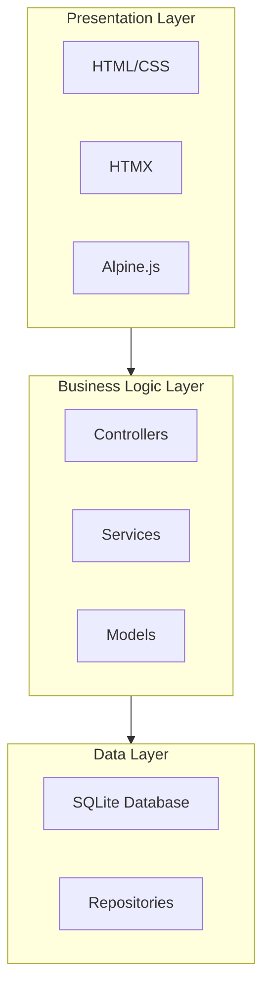
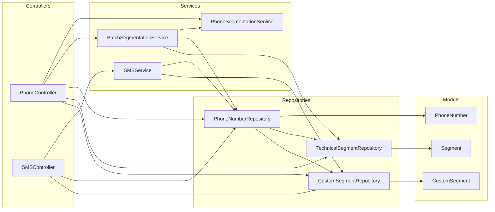

# System Patterns: Phone Numbers Segmentation Web Application

## Architecture Overview

This application follows a three-layer architecture pattern to ensure separation of concerns and maintainability:

1. **Presentation Layer**: Handles user interface and interactions
2. **Business Logic Layer**: Contains the core application logic
3. **Data Layer**: Manages data persistence and retrieval

## Data Layer

The data layer is responsible for storing and retrieving phone numbers and their segments. It consists of:

- **Models**: Represent the data entities in the system.

  - `PhoneNumber`: Represents a phone number with business information and segmentation.
  - `Segment`: Represents a technical segment of a phone number (e.g., country code, operator code).
  - `CustomSegment`: Represents a business-oriented segment for grouping phone numbers.

- **Repositories**: Provide an interface to the database.

  - `PhoneNumberRepository`: Handles CRUD operations for phone numbers.
  - `TechnicalSegmentRepository`: Handles CRUD operations for technical segments.
  - `CustomSegmentRepository`: Handles CRUD operations for business segments.

- **Database**: SQLite database with tables for phone numbers and segments.
  - `phone_numbers`: Stores phone numbers with business information.
  - `technical_segments`: Stores technical segments of phone numbers.
  - `custom_segments`: Stores business-oriented segments.
  - `phone_number_segments`: Stores many-to-many relationships between phone numbers and custom segments.

## Business Logic Layer

The business logic layer contains the core application logic. It consists of:

- **Services**: Implement the business logic.

  - `PhoneSegmentationService`: Handles the segmentation of phone numbers.
  - `BatchSegmentationService`: Handles batch processing of multiple phone numbers.

- **Controllers**: Handle HTTP requests and coordinate between services and repositories.
  - `PhoneController`: Handles phone number operations and segmentation.

## Presentation Layer

The presentation layer is responsible for the user interface and interactions. It consists of:

- **HTML/CSS**: Provides the structure and styling of the UI.
- **HTMX**: Enables AJAX requests without writing JavaScript.
- **Alpine.js**: Provides reactive components for the UI.

## Key Design Patterns

### MVC Pattern

- **Models**: Represent data structures and business entities (PhoneNumber, Segment, CustomSegment)
- **Views**: HTML templates for rendering the UI
- **Controllers**: Handle HTTP requests and coordinate between models and views

### Repository Pattern

- Abstract data access logic
- Provide a clean API for the business layer to interact with the database
- Enable easier testing through dependency injection

### Service Layer Pattern

- Encapsulate business logic in service classes
- Separate business rules from controllers
- Enable reuse of business logic across different controllers

### Dependency Injection

- Inject dependencies rather than creating them directly
- Improve testability by allowing mock objects in tests
- Reduce tight coupling between components

## Component Relationships

## Segmentation Approach

The application supports two types of segmentation:

1. **Technical Segmentation**: Extracts technical information from phone numbers.

   - Country code (e.g., 225 for Côte d'Ivoire)
   - Operator code (e.g., 07 for MTN)
   - Subscriber number
   - Operator name (e.g., MTN, Orange, Moov)

2. **Business Segmentation**: Groups phone numbers by business criteria.
   - By sector (e.g., healthcare, education, finance)
   - By company
   - By client type (e.g., VIP, business, individual)
   - Custom categories defined by the user

This dual approach allows for both technical analysis of phone numbers and business-oriented grouping for SMS campaigns.

## SOLID Principles Implementation

- **Single Responsibility**: Each class has one responsibility (e.g., PhoneSegmentationService handles only segmentation logic)
- **Open/Closed**: Components are open for extension but closed for modification
- **Liskov Substitution**: Subtypes can be substituted for their base types
- **Interface Segregation**: Clients only depend on interfaces they use
- **Dependency Inversion**: High-level modules depend on abstractions, not concrete implementations

## Testing Strategy

- **Unit Tests**: Test individual components in isolation
- **Integration Tests**: Test interactions between components
- **End-to-End Tests**: Test the complete application flow

## Error Handling

- Consistent error handling approach across the application
- Appropriate error messages for different types of errors
- Logging of errors for debugging and monitoring
