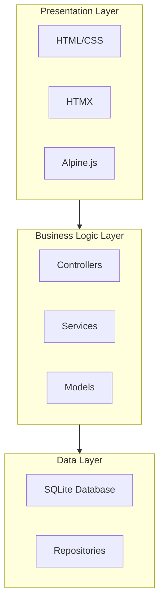
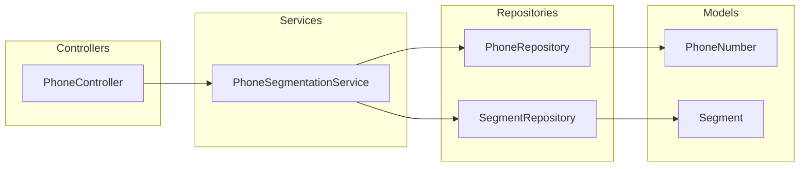

# System Patterns: Phone Numbers Segmentation Web Application

## Architecture Overview

This application follows a three-layer architecture pattern to ensure separation of concerns and maintainability:

1. **Presentation Layer**: Handles user interface and interactions
2. **Business Logic Layer**: Contains the core application logic
3. **Data Layer**: Manages data persistence and retrieval

## Key Design Patterns

### MVC Pattern

- **Models**: Represent data structures and business entities (PhoneNumber, Segment)
- **Views**: HTML templates for rendering the UI
- **Controllers**: Handle HTTP requests and coordinate between models and views

### Repository Pattern

- Abstract data access logic
- Provide a clean API for the business layer to interact with the database
- Enable easier testing through dependency injection

### Service Layer Pattern

- Encapsulate business logic in service classes
- Separate business rules from controllers
- Enable reuse of business logic across different controllers

### Dependency Injection

- Inject dependencies rather than creating them directly
- Improve testability by allowing mock objects in tests
- Reduce tight coupling between components

## Component Relationships

## SOLID Principles Implementation

- **Single Responsibility**: Each class has one responsibility (e.g., PhoneSegmentationService handles only segmentation logic)
- **Open/Closed**: Components are open for extension but closed for modification
- **Liskov Substitution**: Subtypes can be substituted for their base types
- **Interface Segregation**: Clients only depend on interfaces they use
- **Dependency Inversion**: High-level modules depend on abstractions, not concrete implementations

## Testing Strategy

- **Unit Tests**: Test individual components in isolation
- **Integration Tests**: Test interactions between components
- **End-to-End Tests**: Test the complete application flow

## Error Handling

- Consistent error handling approach across the application
- Appropriate error messages for different types of errors
- Logging of errors for debugging and monitoring
