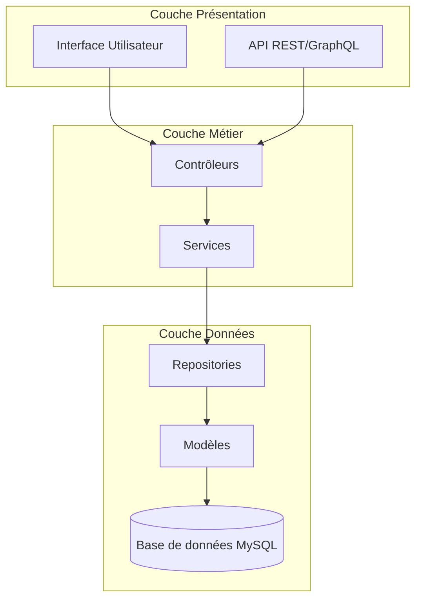
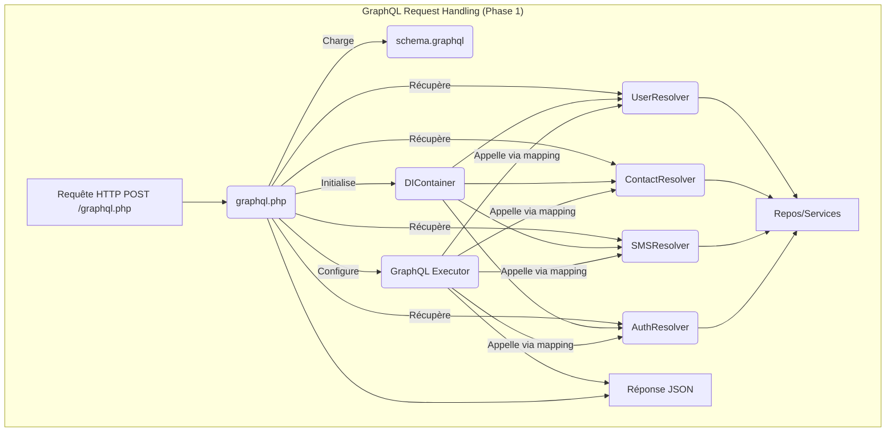
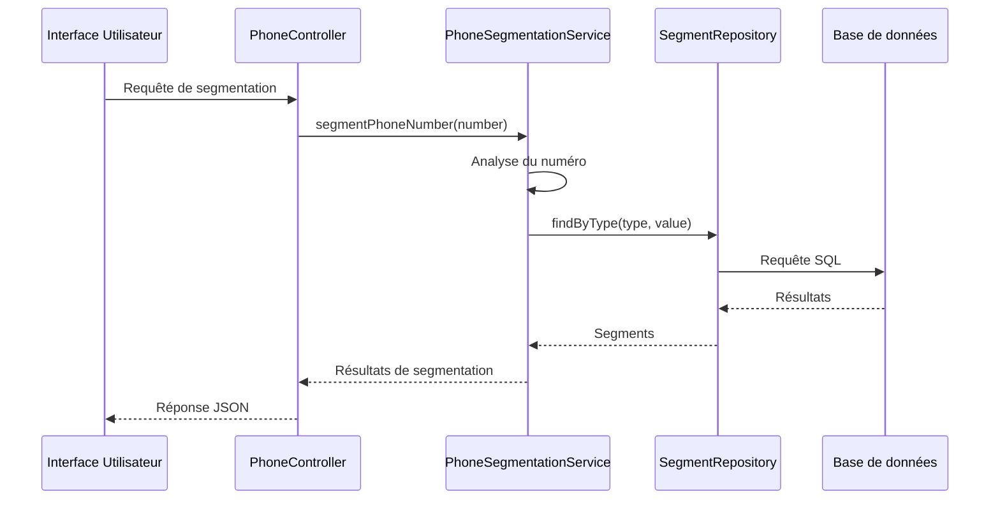
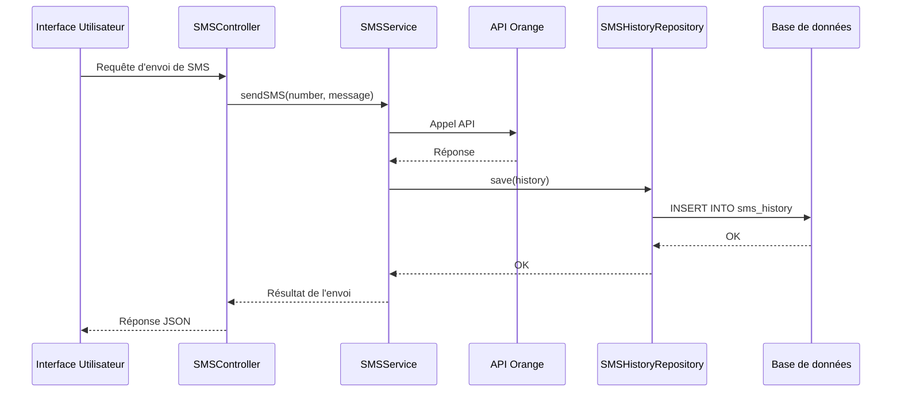
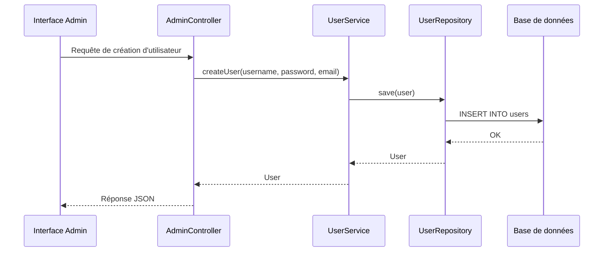

# Architecture Système - Oracle

## Architecture Globale

Oracle est construit selon une architecture en couches clairement séparées, suivant les principes SOLID et le modèle MVC (Modèle-Vue-Contrôleur). Cette architecture permet une séparation claire des responsabilités et facilite la maintenance et l'évolution du système.



### Architecture GraphQL (Refactoring Phase 1)

Pour améliorer la maintenabilité, le point d'entrée GraphQL (`public/graphql.php`) a été refactorisé pour déléguer la résolution des champs à des classes dédiées (`Resolver`) plutôt que d'utiliser un grand tableau de fonctions anonymes.

- **Point d'Entrée (`public/graphql.php`)**:
  - Charge le schéma depuis `src/GraphQL/schema.graphql`.
  - Initialise le conteneur DI (`DIContainer`).
  - Récupère les instances des classes Resolver via le DI.
  - Utilise `GraphQL\Executor\Executor::setDefaultFieldResolver` avec une fonction de mapping qui dirige chaque champ de Query/Mutation vers la méthode appropriée dans la classe Resolver correspondante.
- **Classes Resolver (`src/GraphQL/Resolvers/`)**:
  - Chaque classe regroupe la logique pour un domaine spécifique (ex: `UserResolver`, `ContactResolver`, `SMSResolver`, `AuthResolver`).
  - Les dépendances (Repositories, Services, Logger) sont injectées via le constructeur par le conteneur DI.
  - Chaque méthode publique correspond à un champ du schéma GraphQL (ex: `UserResolver::resolveUsers()`, `ContactResolver::mutateCreateContact()`).
  - La logique métier est contenue dans ces méthodes, appelant les services ou repositories nécessaires.
  - **Note (Phase 4 - Refactoring Terminé):** L'authentification/autorisation est gérée via `AuthServiceInterface` injecté. La conversion Objet -> Tableau est gérée par `GraphQLFormatterInterface` injecté. La configuration sensible (clés API Orange, etc.) est externalisée dans un fichier `.env` et chargée via `phpdotenv`, puis injectée dans les services appropriés (`OrangeAPIClient`, `SMSService`) par le conteneur DI. L'accès direct à `$_SESSION`, les méthodes `format*` locales et les valeurs de configuration codées en dur ont été supprimés des résolveurs et des définitions DI.



## Patterns de Conception

## Couche de Données

### Modèles

Les modèles représentent les entités principales du système et encapsulent la logique métier liée à ces entités.

- **PhoneNumber** : Représente un numéro de téléphone avec ses attributs (numéro, nom, civilité, prénom, etc.).
- **Segment** : Représente un segment technique d'un numéro de téléphone (code pays, opérateur, etc.).
- **CustomSegment** : Représente un segment personnalisé défini par l'utilisateur.
- **SMSHistory** : Représente un enregistrement d'historique d'envoi de SMS.
- **User**: Représente un utilisateur du système avec ses informations d'identification et ses crédits SMS.
- **SenderName**: Représente une demande de nom d'expéditeur par un utilisateur.
- **SMSOrder**: Représente une commande de crédits SMS par un utilisateur.
- **OrangeAPIConfig**: Représente la configuration de l'API Orange pour un utilisateur ou l'administrateur.
- **AdminContact**: Représente un contact de l'administrateur, organisé en segments.

### Repositories

Les repositories fournissent une abstraction pour l'accès aux données, encapsulant la logique d'accès à la base de données et exposant une interface orientée objet.

- **PhoneNumberRepository** : Gère les opérations CRUD pour les numéros de téléphone.
- **SegmentRepository** : Gère les opérations CRUD pour les segments techniques.
- **CustomSegmentRepository** : Gère les opérations CRUD pour les segments personnalisés.
- **TechnicalSegmentRepository** : Gère les opérations spécifiques aux segments techniques.
- **SMSHistoryRepository** : Gère les opérations CRUD pour l'historique des SMS.
- **UserRepository**: Gère les opérations CRUD pour les utilisateurs.
- **SenderNameRepository**: Gère les opérations CRUD pour les demandes de nom d'expéditeur.
- **SMSOrderRepository**: Gère les opérations CRUD pour les commandes de crédits SMS.
- **OrangeAPIConfigRepository**: Gère les opérations CRUD pour les configurations de l'API Orange.
- **AdminContactRepository**: Gère les opérations CRUD pour les contacts de l'administrateur.

### Base de Données

La base de données MySQL stocke toutes les données de l'application. Le schéma est défini par des migrations SQL qui permettent de faire évoluer la structure de la base de données de manière contrôlée.

- **phone_numbers** : Table pour stocker les numéros de téléphone.
- **segments** : Table pour stocker les segments techniques.
- **custom_segments** : Table pour stocker les segments personnalisés.
- **sms_history** : Table pour stocker l'historique des SMS envoyés.
- **users**: Table pour stocker les informations des utilisateurs.
- **sender_names**: Table pour stocker les demandes de nom d'expéditeur.
- **sms_orders**: Table pour stocker les commandes de crédits SMS.
- **orange_api_configs**: Table pour stocker les configurations de l'API Orange.
- **admin_contacts**: Table pour stocker les contacts de l'administrateur.

## Couche Métier

### Services

Les services encapsulent la logique métier complexe et orchestrent les opérations impliquant plusieurs repositories ou entités.

- **PhoneSegmentationService** : Gère la segmentation des numéros de téléphone individuels.
- **BatchSegmentationService** : Gère la segmentation par lot de plusieurs numéros.
- **CSVImportService** : Gère l'import de numéros depuis des fichiers CSV ou du texte brut.
- **ExportService** : Gère l'export des résultats de segmentation dans différents formats.
- **SMSService** : Gère l'envoi de SMS (en utilisant `OrangeAPIClientInterface` injecté) et l'enregistrement dans l'historique.
- **UserService**: Gère la création, l'authentification et la gestion des utilisateurs.
- **SenderNameService**: Gère les demandes de nom d'expéditeur.
- **OrderService**: Gère la création et le traitement des commandes de crédits SMS.
- **AdminService**: Gère les opérations spécifiques à l'administrateur, comme la gestion des utilisateurs et des configurations.
- **APIConfigService**: Gère la configuration de l'API Orange.
- **NotificationService**: Gère l'envoi de notifications par SMS et par email.

### Contrôleurs

Les contrôleurs reçoivent les requêtes HTTP, délèguent le traitement aux services appropriés et renvoient les réponses.

- **PhoneController** : Gère les requêtes liées aux numéros de téléphone.
- **ImportExportController** : Gère les requêtes d'import et d'export.
- **SMSController** : Gère les requêtes d'envoi de SMS.
- **UserController**: Gère les requêtes liées aux utilisateurs.
- **SenderNameController**: Gère les requêtes liées aux noms d'expéditeur.
- **OrderController**: Gère les requêtes liées aux commandes de crédits SMS.
- **AdminController**: Gère les requêtes liées à l'administration.
- **APIConfigController**: Gère les requêtes liées à la configuration de l'API Orange.

## Couche Présentation

### Interface Utilisateur

L'interface utilisateur est en cours de migration de HTMX/Alpine.js vers Vue.js avec Quasar pour les composants UI.

- **Pages HTML** : Pages principales de l'application (segmentation, traitement par lot, envoi de SMS, etc.).
- **Composants Vue.js** : Composants réutilisables (PhoneNumberCard, CustomSegmentForm, etc.).
- **Stores Pinia** : Gestion de l'état global de l'application (phoneStore, segmentStore, etc.).

### API

L'application expose deux types d'API pour l'intégration avec d'autres systèmes :

- **API REST** : API traditionnelle avec des endpoints spécifiques pour chaque opération.
- **API GraphQL** : API moderne permettant aux clients de demander exactement les données dont ils ont besoin.

## Patterns de Conception

### Repository Pattern

Le pattern Repository est utilisé pour abstraire l'accès aux données et fournir une interface orientée objet pour les opérations CRUD.

```php
class PhoneNumberRepository
{
    private $db;

    public function __construct(PDO $db)
    {
        $this->db = $db;
    }

    public function findById(int $id): ?PhoneNumber
    {
        // Logique pour récupérer un numéro par son ID
    }

    public function save(PhoneNumber $phoneNumber): PhoneNumber
    {
        // Logique pour sauvegarder un numéro
    }

    // Autres méthodes CRUD
}
```

### Service Pattern

Le pattern Service est utilisé pour encapsuler la logique métier complexe et orchestrer les opérations impliquant plusieurs repositories.

```php
class PhoneSegmentationService
{
    private $phoneNumberRepository;
    private $segmentRepository;

    public function __construct(
        PhoneNumberRepository $phoneNumberRepository,
        SegmentRepository $segmentRepository
    ) {
        $this->phoneNumberRepository = $phoneNumberRepository;
        $this->segmentRepository = $segmentRepository;
    }

    public function segmentPhoneNumber(string $phoneNumber): array
    {
        // Logique pour segmenter un numéro de téléphone
    }

    // Autres méthodes de service
}
```

### Dependency Injection

L'injection de dépendances est utilisée pour fournir les dépendances aux classes plutôt que de les créer en interne, ce qui facilite les tests et la maintenance.

```php
// Exemple d'injection de dépendances dans un contrôleur
class PhoneController
{
    private $phoneSegmentationService;

    public function __construct(PhoneSegmentationService $phoneSegmentationService)
    {
        $this->phoneSegmentationService = $phoneSegmentationService;
    }

    public function segmentAction(Request $request): Response
    {
        $phoneNumber = $request->get('phoneNumber');
        $segments = $this->phoneSegmentationService->segmentPhoneNumber($phoneNumber);
        return new JsonResponse($segments);
    }
}
```

### Factory Pattern

Le pattern Factory est utilisé pour créer des objets complexes sans exposer la logique de création.

```php
class SegmentFactory
{
    public static function createFromData(array $data): Segment
    {
        $segment = new Segment();
        $segment->setType($data['type']);
        $segment->setValue($data['value']);
        return $segment;
    }
}
```

### Observer Pattern (via les événements)

Le pattern Observer est utilisé pour notifier les composants intéressés lorsqu'un événement se produit, comme l'envoi d'un SMS.

```php
// Dans SMSService
public function sendSMS(string $phoneNumber, string $message): bool
{
    $result = $this->apiClient->send($phoneNumber, $message);

    // Notifier les observateurs
    $this->eventDispatcher->dispatch(new SMSSentEvent($phoneNumber, $message, $result));

    return $result->isSuccess();
}

// Un observateur
class SMSHistoryObserver
{
    private $smsHistoryRepository;

    public function __construct(SMSHistoryRepository $smsHistoryRepository)
    {
        $this->smsHistoryRepository = $smsHistoryRepository;
    }

    public function onSMSSent(SMSSentEvent $event): void
    {
        $history = new SMSHistory();
        $history->setPhoneNumber($event->getPhoneNumber());
        $history->setMessage($event->getMessage());
        $history->setStatus($event->getResult()->getStatus());
        $history->setTimestamp(new DateTime());

        $this->smsHistoryRepository->save($history);
    }
}
```

### Strategy Pattern

Le pattern Strategy est utilisé pour encapsuler différentes stratégies de segmentation des numéros de téléphone.

```php
interface SegmentationStrategy
{
    public function segment(string $phoneNumber): array;
}

class DefaultSegmentationStrategy implements SegmentationStrategy
{
    public function segment(string $phoneNumber): array
    {
        // Logique de segmentation par défaut
    }
}

class InternationalSegmentationStrategy implements SegmentationStrategy
{
    public function segment(string $phoneNumber): array
    {
        // Logique de segmentation pour les numéros internationaux
    }
}
```

## Flux de Données

### Segmentation d'un Numéro



### Envoi de SMS



### Création d'un Utilisateur (Administrateur)



## Intégration Frontend-Backend

### API REST

L'API REST expose des endpoints spécifiques pour chaque opération, suivant les conventions RESTful.

```
GET /api/phone/{id} - Récupérer un numéro par son ID
POST /api/phone - Créer un nouveau numéro
POST /api/phone/segment - Segmenter un numéro
POST /api/batch/segment - Segmenter un lot de numéros
POST /api/sms/send - Envoyer un SMS
GET /api/sms/history - Récupérer l'historique des SMS
```

### API GraphQL

L'API GraphQL permet aux clients de demander exactement les données dont ils ont besoin, réduisant ainsi la quantité de données transférées.

```graphql
type Query {
  phoneNumber(id: ID!): PhoneNumber
  phoneNumbers(limit: Int, offset: Int): [PhoneNumber]
  segments(phoneNumberId: ID!): [Segment]
  smsHistory(limit: Int, offset: Int): [SMSHistory]
}

type Mutation {
  segmentPhoneNumber(number: String!): [Segment]
  sendSMS(phoneNumber: String!, message: String!): SMSResult
}

type PhoneNumber {
  id: ID!
  number: String!
  name: String
  civility: String
  firstName: String
  segments: [Segment]
}

type Segment {
  id: ID!
  type: String!
  value: String!
}

type SMSHistory {
  id: ID!
  phoneNumber: String!
  message: String!
  status: String!
  timestamp: String!
}

type SMSResult {
  success: Boolean!
  message: String
  historyId: ID
}
```

## Déploiement

### Serveur Web

L'application est conçue pour être déployée sur un serveur web Apache ou Nginx avec PHP 8.1+ et MySQL.

### Environnements

L'application prend en charge plusieurs environnements :

- **Développement** : Pour le développement local
- **Test** : Pour les tests automatisés et manuels
- **Production** : Pour le déploiement en production

### Configuration

La configuration de l'application (base de données, clés API, etc.) est gérée via un fichier `.env` à la racine du projet, chargé par la bibliothèque `vlucas/phpdotenv`. Les valeurs sont ensuite lues via `getenv()` dans la configuration du conteneur DI (`src/config/di.php`) pour injecter les paramètres nécessaires dans les services.

- **Fichier `.env`** : Contient les variables spécifiques à l'environnement (ex: `DB_DRIVER`, `MYSQL_HOST`, `ORANGE_API_CLIENT_ID`, etc.). Ce fichier ne doit pas être versionné (présent dans `.gitignore`).
- **Chargement** : Le fichier `.env` est chargé explicitement au début du script `public/graphql.php`.
- **Utilisation** : Les définitions dans `src/config/di.php` utilisent `getenv('VARIABLE_NAME')` pour récupérer les valeurs et les passer aux constructeurs des services.

## Outils et Pratiques de Développement

### Contrôle de Version

Git est utilisé pour le contrôle de version, avec les pratiques suivantes :

- Branches fonctionnelles pour les nouvelles fonctionnalités
- Pull requests pour la revue de code
- Commits atomiques avec messages descriptifs
- Tags pour les versions

### Tests Automatisés

Les tests automatisés sont implémentés à plusieurs niveaux :

- **Tests unitaires** : Pour tester les composants individuels
- **Tests d'intégration** : Pour tester les interactions entre composants
- **Tests fonctionnels** : Pour tester les fonctionnalités de bout en bout

### Documentation

La documentation est maintenue à plusieurs niveaux :

- **Documentation du code** : Commentaires et annotations dans le code
- **Documentation API** : Documentation des endpoints REST et du schéma GraphQL
- **Documentation utilisateur** : Guides et tutoriels pour les utilisateurs
- **Documentation technique** : Architecture, déploiement et maintenance

## Considérations Techniques

### Performance

La performance est optimisée à plusieurs niveaux :

- **Backend** : Requêtes SQL optimisées, mise en cache des résultats fréquents
- **Frontend** : Lazy loading, code splitting, optimisation des assets
- **API** : Requêtes GraphQL précises, pagination pour les grandes collections

### Sécurité

La sécurité est assurée par plusieurs mesures :

- **Validation des entrées** : Toutes les entrées utilisateur sont validées
- **Préparation des requêtes SQL** : Protection contre les injections SQL
- **Gestion des erreurs** : Messages d'erreur génériques pour l'utilisateur
- **HTTPS** : Communication chiffrée

### Évolutivité

L'architecture est conçue pour être évolutive :

- **Architecture modulaire** : Composants indépendants et réutilisables
- **API flexible** : GraphQL pour des requêtes précises et évolutives
- **Tests automatisés** : Pour faciliter les modifications sans régressions
- **Documentation** : Pour faciliter l'onboarding des nouveaux développeurs

## Déploiement sur cPanel/LWS

### Configuration du Serveur

- **PHP 8.1+** : Assurez-vous que la version de PHP est à jour.
- **MySQL** : Créez une base de données MySQL via cPanel.
- **Composer** : Utilisez Composer pour gérer les dépendances PHP.

### Déploiement des Fichiers

- **Téléchargez les fichiers** : Utilisez FTP ou l'interface de cPanel pour télécharger les fichiers de l'application.
- **Configurez le serveur web** : Modifiez le fichier `.htaccess` pour rediriger les requêtes vers le point d'entrée principal (`public/index.php`).

### Configuration de la Base de Données

- **Importez le schéma** : Utilisez phpMyAdmin pour importer le schéma de la base de données MySQL.
- **Configurez les informations de connexion** : Modifiez le fichier de configuration de la base de données pour utiliser les informations de connexion MySQL.

### Tests et Validation

- **Testez l'application** : Assurez-vous que toutes les fonctionnalités fonctionnent correctement.
- **Vérifiez les performances** : Surveillez l'utilisation des ressources du serveur pour identifier les problèmes potentiels.

## Surveillance des Performances

Pour garantir des performances optimales avec environ 100 utilisateurs simultanés, les mesures suivantes seront mises en œuvre :

1. **Mise en Cache des Données**

   - Utilisation de Redis ou Memcached pour mettre en cache les données fréquemment consultées (informations utilisateur, configurations, etc.).
   - Configuration de TTL (Time To Live) appropriés pour éviter les données obsolètes.

2. **Optimisation des Requêtes SQL**

   - Analyse des requêtes SQL les plus lentes et optimisation des index.
   - Utilisation de requêtes préparées pour éviter les injections SQL et améliorer les performances.

3. **Compression des Données**

   - Activation de la compression Gzip pour réduire la taille des réponses HTTP.
   - Utilisation de formats de données efficaces (par exemple, JSON compacté).

4. **Optimisation du Frontend**

   - Minification et concaténation des fichiers CSS et JavaScript.
   - Utilisation de CDN pour les ressources statiques (images, polices, etc.).
   - Lazy loading des images et des composants non critiques.

5. **Surveillance Continue**
   - Utilisation d'outils de surveillance des performances (par exemple, New Relic, cPanel Metrics) pour suivre les temps de réponse, l'utilisation du CPU et de la mémoire, et les erreurs.
   - Configuration d'alertes pour détecter les problèmes de performance et les erreurs critiques.

## Plan d'Implémentation Révisé (avec Exigences de Performance et Déploiement cPanel/LWS)

### Phase 1: Configuration de l'Environnement cPanel et Migration MySQL (2 semaines)

1. **Semaine 1**

   - Configuration de l'environnement cPanel
   - Création de la base de données MySQL
   - Adaptation des repositories pour MySQL
   - Tests de connexion et de requêtes
   - **Implémentation de la journalisation des requêtes SQL pour identifier les goulots d'étranglement**
   - **Configuration des variables d'environnement cPanel pour les informations de connexion à la base de données**

2. **Semaine 2**
   - Développement des scripts de migration
   - Migration des données de test
   - Tests d'intégration
   - Documentation du processus de migration
   - **Optimisation des requêtes SQL pour les opérations courantes**
   - **Mise en place d'un système de sauvegarde et de restauration de la base de données via cPanel**

### Phase 2: Système d'Authentification et Gestion des Utilisateurs (3 semaines)

1. **Semaine 1**

   - Implémentation du système JWT
   - Modèles et repositories utilisateur
   - Tests unitaires
   - **Implémentation d'un système de cache pour les informations utilisateur fréquemment consultées**
   - **Configuration des en-têtes HTTP pour la mise en cache des ressources statiques**

2. **Semaine 2**

   - Interface d'authentification Vue.js
   - Tableau de bord utilisateur
   - Gestion des crédits SMS
   - **Optimisation des composants Vue.js pour réduire le temps de chargement**
   - **Utilisation de CDN pour les bibliothèques JavaScript courantes**

3. **Semaine 3**
   - Système de commande de crédits
   - Gestion des noms d'expéditeur
   - Tests d'intégration
   - **Implémentation de la pagination pour les listes d'utilisateurs et de commandes**
   - **Configuration des redirections HTTP vers HTTPS via .htaccess**

### Phase 3: Administration et Notifications (2 semaines)

1. **Semaine 1**

   - Interface administrateur
   - Gestion des utilisateurs
   - Configuration de l'API Orange
   - **Implémentation de la mise en cache des données de configuration de l'API Orange**
   - **Restriction de l'accès à l'interface d'administration via .htaccess**

2. **Semaine 2**
   - Intégration AWS SES pour les emails
   - Système de notification SMS
   - Tests et finalisation
   - **Optimisation des templates d'email pour réduire la taille des messages**
   - **Configuration des alertes de surveillance des performances via cPanel**

### Phase 4: Déploiement et Tests sur cPanel (1 semaine)

1. **Jours 1-3**

   - Déploiement sur environnement de staging cPanel
   - Tests de performance et de sécurité
   - Correction des problèmes spécifiques à cPanel
   - **Configuration de l'OPcache pour PHP**
   - **Test de la configuration SSL/TLS**

2. **Jours 4-5**
   - Migration finale des données
   - Déploiement en production
   - Documentation utilisateur
   - **Surveillance des performances en temps réel via cPanel**
   - **Optimisation continue des performances en fonction des données de surveillance**

Je suis prêt à affiner davantage ce plan en fonction de vos réponses et à commencer l'implémentation dès que vous serez satisfait de l'approche proposée.
