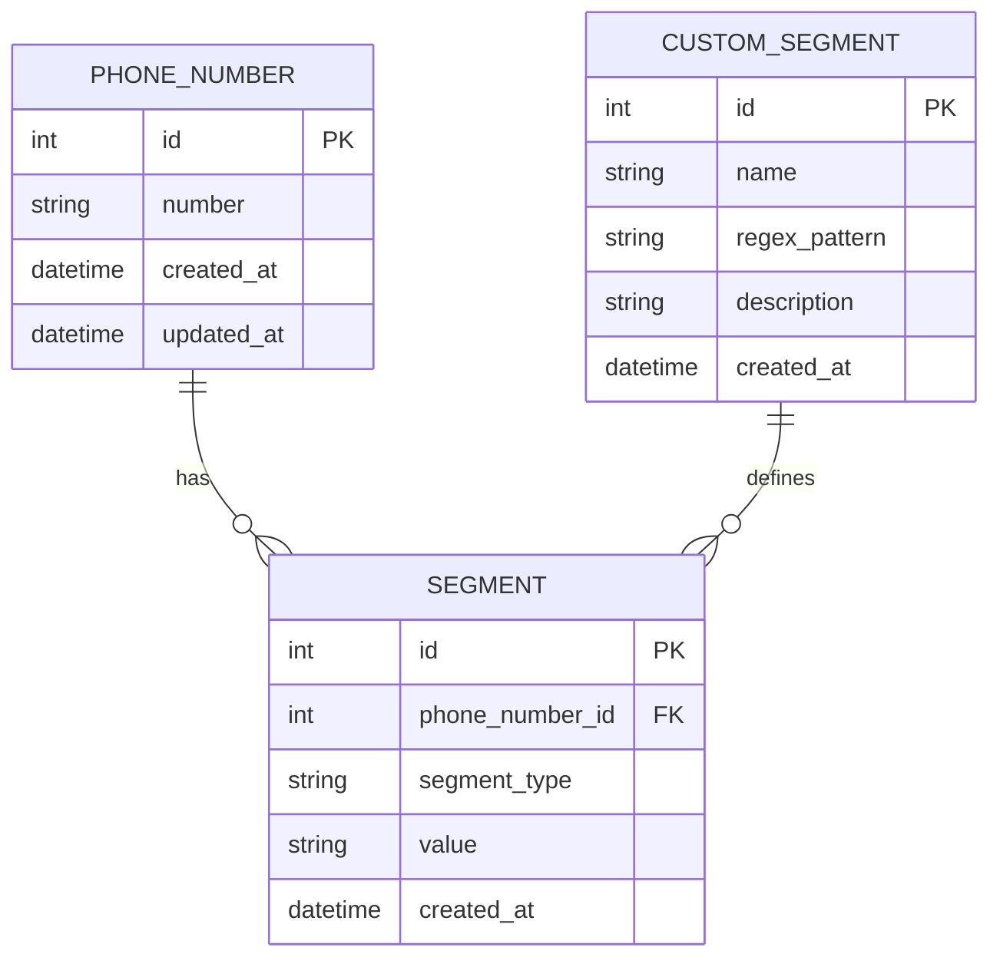
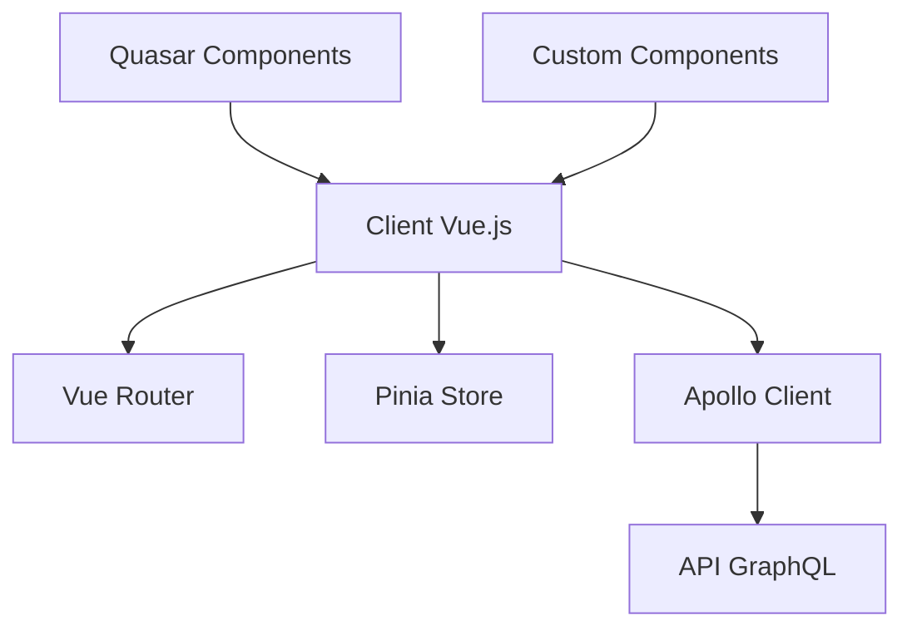

# Contexte Technique - Application de Segmentation de Numéros de Téléphone

## Technologies Utilisées

### Backend

- **PHP 8.1+** : Langage de programmation principal, utilisant les fonctionnalités modernes comme les types de retour, les propriétés typées et les attributs.
- **SQLite** : Base de données légère et sans serveur, idéale pour cette application qui ne nécessite pas de gestion complexe de données concurrentes.
- **Composer** : Gestionnaire de dépendances PHP pour l'installation et la gestion des bibliothèques tierces.
- **GraphQLite** : Bibliothèque PHP pour créer des API GraphQL en utilisant des annotations PHP.

### Frontend Actuel

- **HTML5/CSS3** : Structure et style de l'interface utilisateur.
- **HTMX** : Bibliothèque permettant d'accéder aux fonctionnalités AJAX, WebSockets et Server-Sent Events directement dans le HTML, sans écrire de JavaScript.
- **Alpine.js** : Framework JavaScript léger qui offre une réactivité déclarative et des comportements dynamiques avec une syntaxe minimale.
- **Bootstrap** : Framework CSS pour un design responsive et moderne.

### Frontend Planifié (Migration en cours)

- **Vue.js 3** : Framework JavaScript progressif pour la construction d'interfaces utilisateur, utilisant la Composition API pour une meilleure organisation du code et une réutilisation plus facile de la logique.
- **Quasar** : Framework UI basé sur Vue.js, offrant plus de 100 composants Material Design, un support mobile natif, et d'excellentes performances.
- **Pinia** : Bibliothèque de gestion d'état pour Vue.js, plus simple et plus flexible que Vuex, avec un meilleur support TypeScript.
- **Apollo Client** : Client GraphQL pour Vue.js, permettant d'intégrer facilement l'API GraphQL avec une gestion avancée du cache.
- **Vite** : Outil de build moderne pour le développement frontend, offrant des temps de compilation très rapides et une expérience de développement optimale.

### Tests

- **PHPUnit** : Framework de test pour PHP, utilisé pour les tests unitaires et d'intégration.
- **Mockery** : Bibliothèque de mock pour simuler des objets dans les tests.
- **Vitest** (planifié) : Framework de test rapide pour Vue.js, compatible avec Vite.
- **Cypress** (planifié) : Framework de test end-to-end pour les applications web.

### Outils de Développement

- **Git** : Système de contrôle de version pour le suivi des modifications du code.
- **PHP_CodeSniffer** : Outil d'analyse statique pour vérifier la conformité du code aux standards PSR.
- **PHP-CS-Fixer** : Outil pour corriger automatiquement les problèmes de style de code.
- **ESLint** (planifié) : Outil d'analyse statique pour JavaScript et Vue.js.
- **Prettier** (planifié) : Formateur de code pour JavaScript, Vue.js et CSS.
- **Storybook** (planifié) : Outil pour développer et documenter les composants UI de manière isolée.

## Configuration de l'Environnement de Développement

### Prérequis Actuels

- PHP 8.1 ou supérieur
- Extension PDO SQLite activée
- Composer installé
- Serveur web local (Apache, Nginx) ou serveur PHP intégré

### Prérequis Planifiés (pour Vue.js)

- Node.js 16 ou supérieur
- npm ou yarn
- Vue CLI ou Vite

### Installation Actuelle

```bash
# Cloner le dépôt
git clone [url-du-repo]
cd phone-numbers-seg

# Installer les dépendances PHP
composer install

# Initialiser la base de données
php src/database/init_db.php

# Lancer le serveur de développement
php -S localhost:8000 -t public/
```

### Installation Planifiée (avec Vue.js)

```bash
# Cloner le dépôt
git clone [url-du-repo]
cd phone-numbers-seg

# Installer les dépendances PHP
composer install

# Installer les dépendances JavaScript
npm install

# Initialiser la base de données
php src/database/init_db.php

# Lancer le serveur de développement PHP
php -S localhost:8000 -t public/

# Lancer le serveur de développement Vue.js (dans un autre terminal)
npm run dev
```

## Structure de la Base de Données

### Schéma



### Tables Principales

1. **phone_numbers** : Stocke les numéros de téléphone normalisés.

   - `id` : Identifiant unique
   - `number` : Numéro de téléphone au format international
   - `created_at` : Date de création
   - `updated_at` : Date de dernière mise à jour

2. **segments** : Stocke les segments de numéros de téléphone.

   - `id` : Identifiant unique
   - `phone_number_id` : Référence au numéro de téléphone
   - `segment_type` : Type de segment (country_code, operator_code, subscriber_number, operator_name)
   - `value` : Valeur du segment
   - `created_at` : Date de création

3. **custom_segments** : Stocke les définitions de segments personnalisés.
   - `id` : Identifiant unique
   - `name` : Nom du segment personnalisé
   - `regex_pattern` : Expression régulière pour extraire le segment
   - `description` : Description du segment
   - `created_at` : Date de création

## Architecture Frontend Planifiée



### Structure du Projet Vue.js

```
frontend/
  ├── public/            # Fichiers statiques
  ├── src/
  │   ├── assets/        # Images, fonts, etc.
  │   ├── components/    # Composants réutilisables
  │   │   ├── ui/        # Composants UI génériques
  │   │   └── domain/    # Composants spécifiques au domaine
  │   ├── composables/   # Composition API hooks
  │   ├── layouts/       # Layouts de page
  │   ├── pages/         # Composants de page
  │   ├── router/        # Configuration Vue Router
  │   ├── stores/        # Stores Pinia
  │   ├── services/      # Services (API, validation, etc.)
  │   ├── graphql/       # Requêtes et mutations GraphQL
  │   └── App.vue        # Composant racine
  ├── tests/             # Tests unitaires et e2e
  ├── .eslintrc.js       # Configuration ESLint
  ├── .prettierrc.js     # Configuration Prettier
  ├── vite.config.js     # Configuration Vite
  └── package.json       # Dépendances npm
```

## API et Points d'Entrée

### API REST

L'application expose une API REST pour permettre l'intégration avec d'autres systèmes :

| Endpoint                            | Méthode | Description                              |
| ----------------------------------- | ------- | ---------------------------------------- |
| `/api.php?endpoint=segment`         | POST    | Segmente un numéro de téléphone          |
| `/api.php?endpoint=batch-segment`   | POST    | Segmente plusieurs numéros de téléphone  |
| `/api.php?endpoint=segments`        | GET     | Récupère tous les segments disponibles   |
| `/api.php?endpoint=custom-segments` | GET     | Récupère tous les segments personnalisés |
| `/api.php?endpoint=custom-segments` | POST    | Crée un nouveau segment personnalisé     |
| `/api.php?endpoint=sms/send`        | POST    | Envoie un SMS à un numéro                |
| `/api.php?endpoint=sms/batch`       | POST    | Envoie des SMS à plusieurs numéros       |

### API GraphQL

L'application expose également une API GraphQL pour une intégration plus flexible :

| Endpoint       | Méthode | Description                                            |
| -------------- | ------- | ------------------------------------------------------ |
| `/graphql.php` | POST    | Point d'entrée unique pour toutes les requêtes GraphQL |

#### Requêtes GraphQL Principales

```graphql
# Récupérer un numéro de téléphone par ID
query {
  phoneNumber(id: 1) {
    id
    number
    technicalSegments {
      segmentType
      value
    }
  }
}

# Récupérer tous les numéros de téléphone
query {
  phoneNumbers(limit: 10, offset: 0) {
    id
    number
    name
    company
  }
}

# Créer un nouveau numéro de téléphone
mutation {
  createPhoneNumber(
    number: "+2250707070707"
    civility: "M."
    firstName: "Jean"
    name: "Dupont"
  ) {
    id
    number
  }
}
```

### Pages Web Actuelles

| URL              | Description                                  |
| ---------------- | -------------------------------------------- |
| `/index.php`     | Page d'accueil                               |
| `/segment.html`  | Interface de segmentation individuelle       |
| `/batch.html`    | Interface de traitement par lot              |
| `/segments.html` | Gestion des segments personnalisés           |
| `/sms.html`      | Interface d'envoi de SMS                     |
| `/import.html`   | Interface d'import/export                    |
| `/graphiql.html` | Interface GraphiQL pour tester l'API GraphQL |

### Routes Vue.js Planifiées

| Route           | Description                                |
| --------------- | ------------------------------------------ |
| `/`             | Page d'accueil avec dashboard              |
| `/segment`      | Interface de segmentation individuelle     |
| `/batch`        | Interface de traitement par lot            |
| `/segments`     | Gestion des segments personnalisés         |
| `/segments/new` | Création d'un nouveau segment personnalisé |
| `/segments/:id` | Détails d'un segment personnalisé          |
| `/sms`          | Interface d'envoi de SMS                   |
| `/sms/batch`    | Interface d'envoi de SMS par lot           |
| `/import`       | Interface d'import de numéros              |
| `/export`       | Interface d'export de résultats            |
| `/settings`     | Paramètres de l'application                |

## Dépendances Externes

### API SMS

L'application s'intègre avec des API SMS tierces pour l'envoi de messages :

- **Orange SMS API** : Utilisée pour l'envoi de SMS aux numéros Orange
- **API SMS générique** : Pour les autres opérateurs

### Bases de Données d'Opérateurs

L'application utilise une base de données interne d'opérateurs téléphoniques pour identifier l'opérateur associé à un numéro de téléphone. Cette base de données contient :

- Codes pays
- Préfixes d'opérateurs
- Noms d'opérateurs

## Contraintes Techniques

1. **Performance** : L'application doit pouvoir traiter efficacement des lots de plusieurs milliers de numéros.
2. **Sécurité** : Protection contre les injections SQL et les attaques XSS.
3. **Extensibilité** : Architecture permettant l'ajout facile de nouveaux types de segments et de nouvelles API SMS.
4. **Compatibilité** : Support des principaux navigateurs modernes (Chrome, Firefox, Safari, Edge).
5. **Offline** : Possibilité de fonctionner sans connexion internet pour les fonctionnalités de base (segmentation).
6. **Responsive** : L'interface utilisateur doit s'adapter à différentes tailles d'écran, des smartphones aux grands écrans.
7. **Performance Frontend** : Temps de chargement initial < 2s, temps de réponse pour les actions utilisateur < 300ms.

## Monitoring et Logging

- **Logs d'application** : Enregistrement des opérations importantes dans des fichiers de log.
- **Logs d'erreurs** : Capture et enregistrement des exceptions et erreurs.
- **Métriques de performance** : Suivi des temps de traitement pour les opérations critiques.

## Déploiement

L'application est conçue pour être déployée facilement sur différents environnements :

- **Développement** : Serveur PHP intégré
- **Test** : Environnement de test automatisé
- **Production** : Serveur web Apache ou Nginx avec PHP-FPM

Le déploiement peut être effectué via Git ou par transfert direct des fichiers.
