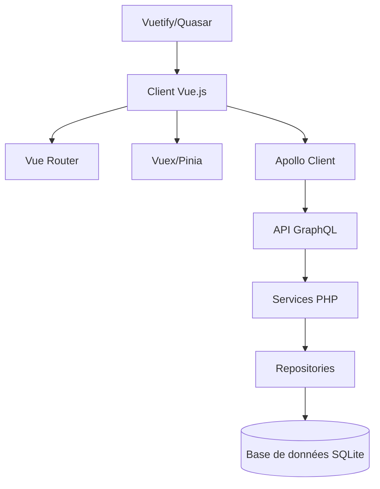
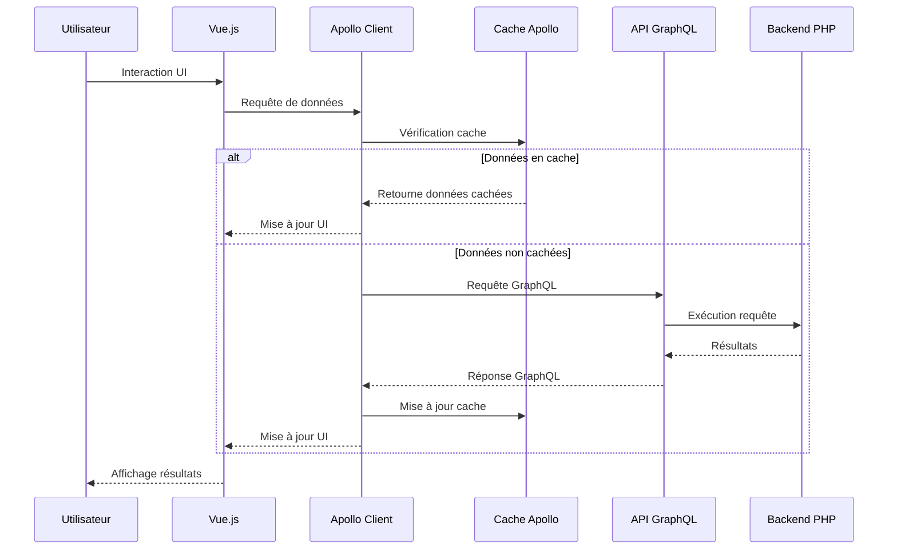

# Plan d'Intégration Vue.js - Application de Segmentation de Numéros de Téléphone

## Vue d'ensemble

Ce document présente le plan détaillé pour l'intégration de Vue.js en tant que framework frontend principal de l'application de segmentation de numéros de téléphone. Cette migration vise à améliorer l'expérience utilisateur, optimiser les performances et exploiter pleinement l'API GraphQL récemment implémentée.

## Objectifs stratégiques

1. **Moderniser l'interface utilisateur** en remplaçant progressivement HTMX et Alpine.js par Vue.js
2. **Améliorer l'expérience utilisateur** avec des interfaces plus réactives et intuitives
3. **Optimiser les performances** pour le traitement de grands volumes de données
4. **Exploiter pleinement l'API GraphQL** pour des requêtes optimisées et flexibles
5. **Faciliter la maintenance** grâce à une architecture basée sur des composants réutilisables
6. **Standardiser l'UI** en migrant vers Vuetify/Quasar pour un design system cohérent

## Architecture cible

### Composants clés

1. **Vue.js** : Framework progressif pour la construction d'interfaces utilisateur
2. **Vue Router** : Routage côté client pour les applications à page unique (SPA)
3. **Vuex/Pinia** : Gestion d'état centralisée
4. **Apollo Client** : Client GraphQL pour Vue.js
5. **Vuetify/Quasar** : Framework de composants UI basé sur Material Design

## Plan de migration en 4 phases

### Phase 1 : Préparation et configuration (2 semaines)

#### Objectifs

- Mettre en place l'environnement de développement Vue.js
- Définir l'architecture et les standards de code
- Créer la structure de base du projet Vue.js

#### Tâches

1. **Configuration de l'environnement**

   - Installation de Vue CLI ou Vite
   - Configuration de ESLint, Prettier
   - Mise en place de TypeScript (optionnel mais recommandé)
   - Configuration du build system

2. **Choix et configuration du framework UI**

   - Évaluation approfondie de Vuetify vs Quasar
   - Installation et configuration du framework choisi
   - Définition des thèmes et variables globales

3. **Mise en place d'Apollo Client**

   - Installation et configuration d'Apollo Client
   - Création des premiers fragments GraphQL
   - Tests de connexion avec l'API GraphQL existante

4. **Définition des standards**
   - Structure des composants
   - Conventions de nommage
   - Patterns de communication entre composants
   - Documentation des composants (Storybook)

#### Livrables

- Projet Vue.js configuré avec toutes les dépendances
- Documentation des standards et conventions
- Preuve de concept de connexion à l'API GraphQL

### Phase 2 : Développement des composants de base (4 semaines)

#### Objectifs

- Créer une bibliothèque de composants réutilisables
- Implémenter les fonctionnalités de base en Vue.js
- Mettre en place la gestion d'état centralisée

#### Tâches

1. **Création des composants atomiques**

   - Boutons, champs de formulaire, alertes
   - Composants spécifiques à l'application (affichage de numéro, segment, etc.)
   - Tests unitaires pour chaque composant

2. **Développement des composants composites**

   - Formulaires de saisie de numéros
   - Affichage des résultats de segmentation
   - Tableaux de données avec filtrage et pagination

3. **Mise en place de Vuex/Pinia**

   - Définition des stores pour les entités principales
   - Implémentation des actions et mutations
   - Intégration avec Apollo Client

4. **Création des services partagés**
   - Service de validation des numéros
   - Service de formatage
   - Service de notification

#### Livrables

- Bibliothèque de composants documentée
- Stores Vuex/Pinia fonctionnels
- Services partagés testés

### Phase 3 : Implémentation des pages principales (6 semaines)

#### Objectifs

- Recréer les interfaces principales en Vue.js
- Intégrer complètement avec l'API GraphQL
- Assurer la compatibilité avec le backend existant

#### Tâches

1. **Développement de la page d'accueil**

   - Dashboard avec statistiques
   - Navigation principale
   - Accès rapide aux fonctionnalités

2. **Implémentation de l'interface de segmentation individuelle**

   - Formulaire de saisie avec validation en temps réel
   - Affichage des résultats de segmentation
   - Historique des numéros traités

3. **Développement de l'interface de traitement par lot**

   - Upload de fichiers avec drag & drop
   - Prévisualisation des données
   - Traitement asynchrone avec barre de progression
   - Affichage des résultats avec options de filtrage et export

4. **Création de l'interface de gestion des segments**

   - CRUD pour les segments personnalisés
   - Visualisation des segments existants
   - Association de numéros aux segments

5. **Implémentation de l'interface d'envoi de SMS**
   - Sélection des destinataires
   - Composition du message
   - Suivi d'envoi

#### Livrables

- Interfaces principales fonctionnelles en Vue.js
- Intégration complète avec l'API GraphQL
- Tests d'intégration

### Phase 4 : Finalisation et déploiement (4 semaines)

#### Objectifs

- Optimiser les performances
- Finaliser la migration
- Déployer la nouvelle version

#### Tâches

1. **Optimisation des performances**

   - Lazy loading des composants
   - Mise en cache des requêtes GraphQL
   - Optimisation du bundle size
   - Code splitting

2. **Tests et assurance qualité**

   - Tests end-to-end avec Cypress
   - Tests de performance
   - Revue de code
   - Correction des bugs

3. **Documentation**

   - Documentation technique
   - Guide utilisateur
   - Documentation des API

4. **Déploiement**
   - Configuration du serveur de production
   - Mise en place de CI/CD
   - Déploiement progressif

#### Livrables

- Application Vue.js optimisée et testée
- Documentation complète
- Application déployée en production

## Stratégie de coexistence et migration

Pour assurer une transition en douceur, nous adopterons une approche de migration progressive :

1. **Coexistence initiale**

   - Les nouvelles fonctionnalités seront développées en Vue.js
   - Les fonctionnalités existantes resteront en HTMX/Alpine.js temporairement
   - Mise en place d'un système de routing hybride

2. **Migration page par page**

   - Priorisation des pages à migrer selon leur complexité et utilisation
   - Développement parallèle des nouvelles versions
   - Tests A/B pour certaines interfaces

3. **Basculement progressif**
   - Redirection graduelle des utilisateurs vers les nouvelles interfaces
   - Période de transition avec option de revenir à l'ancienne interface
   - Collecte de feedback utilisateur

## Intégration avec GraphQL

L'intégration avec GraphQL sera un élément central de cette migration :

### Optimisations GraphQL

1. **Fragments réutilisables**

   - Définition de fragments pour les entités principales
   - Réutilisation dans différentes requêtes

2. **Requêtes optimisées**

   - Demande uniquement des champs nécessaires
   - Utilisation de variables pour les requêtes paramétrées

3. **Mutations avec optimistic UI**

   - Mise à jour immédiate de l'UI avant confirmation serveur
   - Rollback en cas d'erreur

4. **Gestion avancée du cache**
   - Politique de cache personnalisée par type de données
   - Invalidation sélective du cache

## Choix technologiques détaillés

### Vue.js vs Vue 3 Options API vs Composition API

Nous recommandons l'utilisation de Vue 3 avec la Composition API pour :

- Une meilleure organisation du code
- Une réutilisation plus facile de la logique
- Un meilleur support de TypeScript
- Des performances améliorées

### Vuetify vs Quasar

Comparaison détaillée :

| Critère          | Vuetify        | Quasar          |
| ---------------- | -------------- | --------------- |
| Maturité         | Très mature    | Mature          |
| Composants       | >80 composants | >100 composants |
| Performance      | Bonne          | Excellente      |
| Personnalisation | Moyenne        | Élevée          |
| Support mobile   | Via plugins    | Natif           |
| Build system     | Vue CLI        | Propre CLI      |
| SSR              | Supporté       | Natif           |
| Taille           | Plus lourd     | Plus léger      |

**Recommandation** : Quasar pour sa performance, sa légèreté et son support natif des applications mobiles.

### Vuex vs Pinia

Comparaison :

| Critère    | Vuex           | Pinia               |
| ---------- | -------------- | ------------------- |
| Syntaxe    | Plus verbeuse  | Plus concise        |
| TypeScript | Support limité | Support natif       |
| Modularité | Via modules    | Native              |
| Complexité | Plus complexe  | Plus simple         |
| Maturité   | Très mature    | Relativement récent |

**Recommandation** : Pinia pour sa simplicité, son support TypeScript et sa meilleure intégration avec Vue 3.

## Estimation des ressources

### Équipe recommandée

- 1 Lead Developer Vue.js
- 2 Développeurs Frontend Vue.js
- 1 Développeur Backend (pour ajustements API GraphQL)
- 1 Designer UI/UX
- 1 QA Engineer

### Timeline globale

- **Durée totale** : 16 semaines (4 mois)
- **Phase 1** : Semaines 1-2
- **Phase 2** : Semaines 3-6
- **Phase 3** : Semaines 7-12
- **Phase 4** : Semaines 13-16

### Jalons clés

| Jalon                                    | Date           |
| ---------------------------------------- | -------------- |
| Environnement de développement configuré | Fin semaine 1  |
| Bibliothèque de composants de base       | Fin semaine 6  |
| Interface de segmentation individuelle   | Fin semaine 9  |
| Interface de traitement par lot          | Fin semaine 11 |
| Toutes les interfaces migrées            | Fin semaine 14 |
| Application déployée en production       | Fin semaine 16 |

## Risques et mitigations

| Risque                          | Impact | Probabilité | Mitigation                                          |
| ------------------------------- | ------ | ----------- | --------------------------------------------------- |
| Courbe d'apprentissage Vue.js   | Moyen  | Moyenne     | Formation, documentation, mentorat                  |
| Incompatibilité avec le backend | Élevé  | Faible      | Tests d'intégration précoces, API versioning        |
| Performance insuffisante        | Élevé  | Faible      | Benchmarking, optimisations précoces                |
| Résistance utilisateur          | Moyen  | Moyenne     | Tests utilisateurs, migration progressive, feedback |
| Dépassement de délai            | Moyen  | Moyenne     | Planification agile, priorisation, MVP              |

## Métriques de succès

1. **Performance**

   - Temps de chargement initial < 2s
   - Temps de réponse pour les actions utilisateur < 300ms
   - Score Lighthouse > 90

2. **Expérience utilisateur**

   - Taux de satisfaction utilisateur > 85%
   - Réduction du temps nécessaire pour les tâches courantes de 30%
   - Taux d'erreur utilisateur réduit de 50%

3. **Qualité du code**

   - Couverture de tests > 80%
   - Dette technique réduite
   - Maintenabilité améliorée

4. **Business**
   - Augmentation de l'utilisation des fonctionnalités avancées
   - Réduction des coûts de maintenance
   - Capacité accrue à implémenter de nouvelles fonctionnalités

## Conclusion

L'intégration de Vue.js, couplée à GraphQL et à un framework UI moderne comme Vuetify ou Quasar, représente une évolution significative pour l'application de segmentation de numéros de téléphone. Cette migration permettra d'améliorer considérablement l'expérience utilisateur, d'optimiser les performances et de faciliter les développements futurs.

L'approche progressive proposée minimise les risques tout en permettant de livrer rapidement de la valeur. Le plan détaillé en 4 phases offre une feuille de route claire pour guider cette transformation.

## Prochaines étapes immédiates

1. Validation finale du plan par les parties prenantes
2. Constitution de l'équipe de développement
3. Mise en place de l'environnement de développement
4. Formation de l'équipe sur Vue.js, GraphQL et le framework UI choisi
5. Démarrage de la Phase 1
